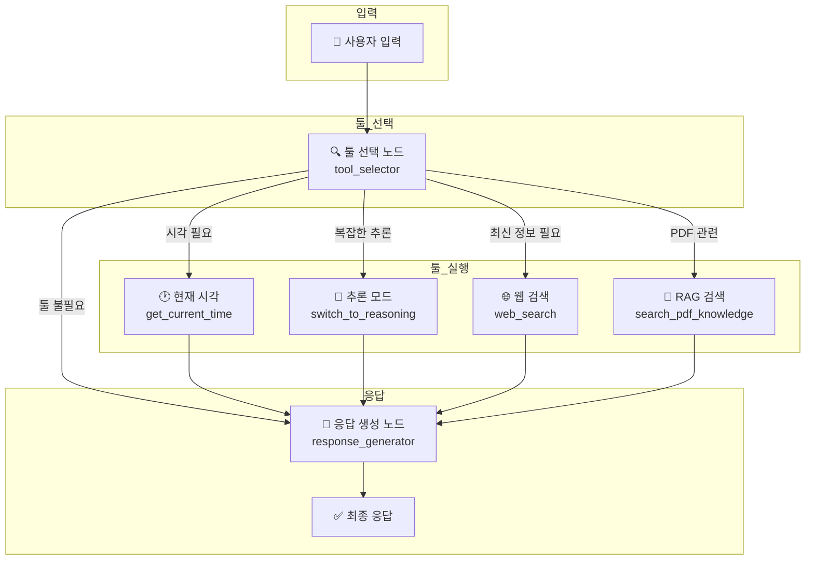
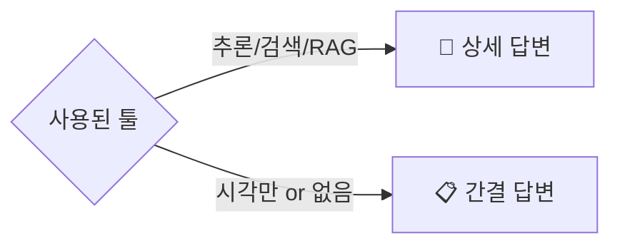

# Phase 02 - LangGraph 기반 아키텍처 전환

이 문서는 기존 Streamlit 챗봇을 LangChain/LangGraph 기반으로 재구성하는 계획을 정의합니다.

---

## 1. 현재 시각 툴 추가

### 1.1 요구사항
- 툴 콜링 목록에 현재 시각(UTC+9, 한국 시간) 조회 기능 추가
- 사용자가 "지금 몇 시야?", "오늘 날짜가 뭐야?" 등의 질문 시 활용

### 1.2 구현 방안
- **툴 이름**: `get_current_time`
- **반환 형식**: `YYYY-MM-DD HH:MM:SS (KST)`
- **등록 위치**: `ToolManager`에 새 툴 등록

### 1.3 툴 목록 (Phase 02 기준)
| 툴 이름 | 설명 |
|--------|------|
| `get_current_time` | 현재 시각 조회 (KST) |
| `switch_to_reasoning` | 추론 모드 전환 (gemini-2.5-pro) |
| `web_search` | Tavily 외부 검색 |
| `search_pdf_knowledge` | PDF RAG 검색 |

---

## 2. LangChain/LangGraph 전환

### 2.1 전환 목적
- 기존 수동 구현된 대화 흐름을 LangGraph 그래프 기반으로 재구성
- 노드 기반 워크플로우로 가독성 및 유지보수성 향상
- 상태 관리 및 체크포인팅 기능 활용

### 2.2 주요 변경 사항
- `app.py`의 `handle_chat_message()` 로직 → LangGraph 그래프로 이전
- 툴 실행 로직 → LangGraph 노드로 분리
- 프롬프트 조합 로직 → 별도 노드로 모듈화

---

## 3. 메모리/Saver 선택

### 3.1 현재 세션 관리 방식
- 최근 3턴은 원문 유지
- 3턴 초과 시 이전 대화는 요약문으로 압축
- 요약문 + 최근 3턴 원문을 컨텍스트로 사용

### 3.2 LangGraph Saver 옵션 비교
| Saver | 특징 | 적합 환경 |
|-------|------|----------|
| `MemorySaver` | 인메모리, 프로세스 종료 시 소멸 | 개발/테스트 |
| `SqliteSaver` | SQLite 파일 기반, 간단한 영속화 | **단일 인스턴스 (현재 적합)** |
| `PostgresSaver` | PostgreSQL 기반 | 멀티 인스턴스 운영 |
| `Redis` | 빠른 읽기/쓰기 | 대규모 트래픽 |

### 3.3 권장 선택
- **개발/테스트**: `MemorySaver`
- **운영 (현재 구조)**: `SqliteSaver`
  - 현재 `data/sessions/` 구조와 유사하게 로컬 파일로 영속화
  - 단일 Streamlit 인스턴스 환경에 적합

---

## 4. LangGraph 노드 구조 설계

### 4.1 전체 흐름
```
사용자 입력
    ↓
┌─────────────────┐
│  툴 선택 노드   │ ← 어떤 툴을 사용할지 결정
└─────────────────┘
    ↓
┌─────────────────────────────────────┐
│        병렬 툴 실행 노드들          │
│  ┌──────┐ ┌──────┐ ┌──────┐ ┌──────┐│
│  │ 시각 │ │ 추론 │ │ 검색 │ │ RAG  ││
│  └──────┘ └──────┘ └──────┘ └──────┘│
└─────────────────────────────────────┘
    ↓ (0~4개 툴 결과)
┌─────────────────┐
│  응답 생성 노드  │ ← 툴 결과를 컨텍스트에 추가하여 최종 응답
└─────────────────┘
    ↓
최종 응답 출력
```

### 4.2 노드 상세

#### 4.2.1 툴 선택 노드 (`tool_selector`)
- **입력**: 사용자 메시지, 대화 컨텍스트
- **출력**: 사용할 툴 목록 (0~4개)
- **로직**: LLM이 질문을 분석하여 필요한 툴 결정

#### 4.2.2 툴 실행 노드들
- `time_tool`: 현재 시각 조회
- `reasoning_tool`: 추론 모드 프롬프트 적용
- `search_tool`: Tavily 웹 검색 실행
- `rag_tool`: PDF 벡터 검색 실행

#### 4.2.3 응답 생성 노드 (`response_generator`)
- **입력**: 툴 결과들, 대화 컨텍스트
- **출력**: 최종 응답
- **응답 길이 규칙**:
  - 추론/검색/RAG 중 1개 이상 사용 → **상세한 답변**
  - 툴 미사용 또는 시각만 사용 → **간결한 답변**

### 4.3 상태 스키마
```python
class ChatState(TypedDict):
    messages: list[Message]           # 대화 히스토리
    summary: str                      # 누적 요약문
    selected_tools: list[str]         # 선택된 툴 목록
    tool_results: dict[str, Any]      # 툴 실행 결과
    final_response: str               # 최종 응답
```

---

## 5. 툴 사용 정보 표시 (Expander)

### 5.1 목적
- 사용자가 자신의 질문에 **어떤 툴이 사용되었고, 그 결과가 무엇인지** 확인 가능
- 중간 과정은 숨김 처리하되, 원하면 펼쳐서 확인
- 투명한 AI 동작 과정 제공

### 5.2 UI 표시 순서

> **핵심**: 툴 정보 Expander가 **먼저**, 최종 답변이 **그 아래**에 표시

```
┌─────────────────────────────────────────────────┐
│ 👤 User                                         │
│ "Python 최신 버전이 뭐야? PDF에서 관련 내용 찾아줘" │
└─────────────────────────────────────────────────┘

┌─────────────────────────────────────────────────┐
│ 🤖 Assistant                                    │
│                                                 │
│ ▶ 🔧 툴 사용 정보 (클릭하여 펼치기)              │ ← 기본: 접힘
│ ┌─────────────────────────────────────────────┐ │
│ │ 선택된 툴: web_search, search_pdf_knowledge │ │
│ │                                             │ │
│ │ 📌 [web_search]                             │ │
│ │ - 검색어: "Python latest version 2026"      │ │
│ │ - 결과: Python 3.13이 최신 버전...          │ │
│ │                                             │ │
│ │ 📌 [search_pdf_knowledge]                   │ │
│ │ - 쿼리: "Python 버전"                       │ │
│ │ - 매칭 청크: 3개                            │ │
│ │ - 상위 결과: "문서에서 Python 3.12를..."    │ │
│ └─────────────────────────────────────────────┘ │
│                                                 │
│ ─────────────────────────────────────────────── │
│                                                 │
│ 📝 최종 답변:                                   │
│ Python의 최신 버전은 3.13입니다. 웹 검색 결과와  │
│ 업로드하신 PDF 문서를 종합하면...               │
│                                                 │
└─────────────────────────────────────────────────┘
```

### 5.3 사용자 경험
1. 사용자가 질문을 입력
2. 시스템이 툴을 선택하고 실행 (내부 처리)
3. 화면에 표시:
   - **툴 사용 정보 Expander** (접힌 상태) → 클릭하면 어떤 툴이 사용되었고 결과가 뭔지 확인
   - **최종 답변** → 사용자가 바로 볼 수 있는 답변
4. 사용자는 답변만 봐도 되고, 궁금하면 Expander를 펼쳐서 과정 확인

### 5.4 저장할 데이터
```python
# Message 도메인 확장 (Phase 01에서 function_calls 이미 추가됨)
@dataclass
class Message:
    # ... 기존 필드
    function_calls: list[dict]  # 호출된 툴 목록
    tool_results: dict[str, Any]  # 각 툴의 실행 결과 (신규)
```

### 5.5 구현 위치
- `component/chat_tab.py`의 메시지 렌더링 부분
- `st.expander("🔧 툴 사용 정보", expanded=False)` 사용
- 최종 답변은 Expander 바깥에 표시

---

## 6. 요약문 실시간 표시 (2-Column 레이아웃)

### 6.1 턴(Turn) 개념 정의

> **중요**: 턴은 사용자 입력부터 다음 사용자 입력 직전까지의 전체 흐름을 의미합니다.

```
[턴 1]
User: "A를 알려줘"
  ↓ (내부적으로 B, C, D, E 툴 실행)
Assistant: "F 입니다"

[턴 2]
User: "A'를 알려줘"
  ↓
Assistant: "..."
```

- 사용자가 A를 물어봄 → 시스템이 B, C, D, E를 거쳐 F 답변 생성 → **이 전체가 1턴**
- 중간에 몇 개의 툴이 호출되든, 사용자 입력 ~ 다음 사용자 입력 전까지가 1턴

### 6.2 요약 생성 시점
- **턴 4 시작 시**: 턴 1~3 대화를 요약 → 요약문 #1 생성
- **턴 7 시작 시**: 턴 4~6 대화를 요약 → 요약문 #2 생성
- **턴 10 시작 시**: 턴 7~9 대화를 요약 → 요약문 #3 생성
- 이하 3턴마다 반복

### 6.3 요구사항
- 채팅 탭을 2컬럼으로 분할 (3:1 비율)
- 왼쪽(3): 채팅 메시지
- 오른쪽(1): 생성된 요약문 히스토리
- 사용자가 전체 대화를 스크롤하지 않아도 요약을 통해 맥락 파악 가능

### 6.4 UI 구성
```
┌──────────────────────────────┬──────────────┐
│                              │ 📋 Summary   │
│      💬 Chat Messages        │              │
│                              │ ┌──────────┐ │
│  [Turn 1] User: A를 알려줘   │ │ Turn 1-3 │ │
│  [Turn 1] Assistant: F입니다 │ │ 요약문 #1 │ │
│  [Turn 2] User: ...          │ │ "사용자가 │ │
│  [Turn 2] Assistant: ...     │ │  A를 물어 │ │
│  ...                         │ │  봤고..." │ │
│  [Turn 4] User: ...          │ └──────────┘ │
│  [Turn 4] Assistant: ...     │              │
│  ...                         │ ┌──────────┐ │
│  [Turn 7] User: ...          │ │ Turn 4-6 │ │
│  [Turn 7] Assistant: ...     │ │ 요약문 #2 │ │
│                              │ │ "이후..."│ │
│  [입력창]                    │ └──────────┘ │
└──────────────────────────────┴──────────────┘
```

### 6.5 구현 방안
- `st.columns([3, 1])` 사용
- 왼쪽 컬럼: 기존 채팅 UI
- 오른쪽 컬럼: 요약문 히스토리 카드 형태로 표시
- 새 요약이 생성될 때마다 오른쪽 컬럼에 카드 추가

### 6.6 요약 히스토리 저장 구조
```python
# 기존: 단일 누적 요약문
summary: str = "..."

# 개선: 턴별 요약 히스토리 (UI 표시용)
summary_history: list[dict] = [
    {"created_at_turn": 4, "covers_turns": "1-3", "summary": "사용자가 A를 물어봤고..."},
    {"created_at_turn": 7, "covers_turns": "4-6", "summary": "이후 B에 대해 논의..."},
    {"created_at_turn": 10, "covers_turns": "7-9", "summary": "C 주제로 전환..."},
]
```

### 6.7 사용자 경험 개선 효과
- 긴 대화에서도 맥락을 빠르게 파악 가능
- 전체 히스토리를 읽지 않아도 요약 카드로 흐름 이해
- 어떤 시점에 요약이 생성되었는지 명확히 표시

---

## 7. Overview 탭 확장

### 7.1 요구사항
- LangGraph 노드 구성도 추가
- 툴 콜링 구성 정보 추가
- 사용자가 채팅 흐름을 시각적으로 이해할 수 있도록

### 7.2 다이어그램 렌더링: streamlit-mermaid

#### 7.2.1 의존성 추가
```
streamlit-mermaid
```

#### 7.2.2 사용 방법
```python
from streamlit_mermaid import st_mermaid

# Mermaid 코드를 직접 렌더링
st_mermaid("""
graph TD
    A[사용자 입력] --> B[툴 선택 노드]
    B --> C{선택된 툴}
    C -->|시각| D[get_current_time]
    C -->|추론| E[switch_to_reasoning]
    C -->|검색| F[web_search]
    C -->|RAG| G[search_pdf_knowledge]
    D --> H[응답 생성 노드]
    E --> H
    F --> H
    G --> H
    H --> I[최종 응답]
""")
```

#### 7.2.3 LangGraph 워크플로우 다이어그램 (Mermaid 코드)


### 7.3 툴 콜링 정보 표시

#### 7.3.1 툴 목록 테이블
| 툴 | 설명 | 호출 조건 |
|----|------|----------|
| `get_current_time` | 현재 시각 (KST) | "지금 몇 시", "오늘 날짜" 등 |
| `switch_to_reasoning` | 추론 모드 전환 | 복잡한 분석, 비교, 수학 계산 |
| `web_search` | Tavily 웹 검색 | 최신 정보, 실시간 데이터 필요 |
| `search_pdf_knowledge` | PDF RAG 검색 | 업로드된 PDF 관련 질문 |

#### 7.3.2 응답 길이 규칙 다이어그램


### 7.4 구현 위치
- `component/overview_tab.py` 수정
- 새로운 섹션 추가:
  - "LangGraph 워크플로우" (Mermaid 다이어그램)
  - "툴 콜링 구성" (테이블 + 다이어그램)
  - "응답 생성 규칙"

---

## 8. Prompts 탭 완전성 확보

### 8.1 요구사항
- `prompt/` 디렉토리의 **모든** 프롬프트가 Prompts 탭에 표시되어야 함
- 새 프롬프트 추가 시 자동으로 반영되는 구조 고려

### 8.2 현재 상태 (Phase 01 완료 후)
- 7개 프롬프트 등록 완료:
  - `system/base.txt`
  - `system/pdf_extension.txt`
  - `system/chain_of_thought.txt`
  - `search/tavily_instruction.txt`
  - `summary/summary.txt`
  - `pdf/normalization.txt`
  - `pdf/description.txt`

### 8.3 Phase 02 추가 예정 프롬프트
- `system/tool_selector.txt`: 툴 선택 노드용 프롬프트
- `system/response_length.txt`: 응답 길이 조절 프롬프트 (선택적)

### 8.4 자동화 고려
- `prompt/` 디렉토리를 스캔하여 자동으로 프롬프트 목록 생성
- 하드코딩 대신 동적 로딩 방식으로 전환 (선택적)

---

## 구현 우선순위

1. **높음** (핵심 기능):
   - LangGraph 전환 및 노드 구조 설계 (항목 2, 4)
   - 메모리/Saver 선택 및 적용 (항목 3)
   - 현재 시각 툴 추가 (항목 1)

2. **중간** (사용자 경험):
   - 툴 사용 정보 Expander 표시 (항목 5)
   - 요약문 2-Column 레이아웃 (항목 6)

3. **낮음** (문서화/UI):
   - Overview 탭 LangGraph 다이어그램 추가 (항목 7)
   - Prompts 탭 완전성 확보 (항목 8)

---

## 기술 스택

### 신규 의존성
```
langchain
langgraph
streamlit-mermaid
```

### 기존 유지
- Streamlit (UI)
- Google Generative AI (LLM)
- Tavily (검색)
- FAISS (벡터 DB)

---

## 참고사항

- Phase 01의 기존 기능(세션 관리, CSV 다운로드, PDF 전처리 등)은 그대로 유지
- LangGraph 전환 시 기존 테스트 코드도 함께 업데이트 필요
- 점진적 마이그레이션 권장: 먼저 단순 그래프로 시작 → 복잡한 분기 추가
