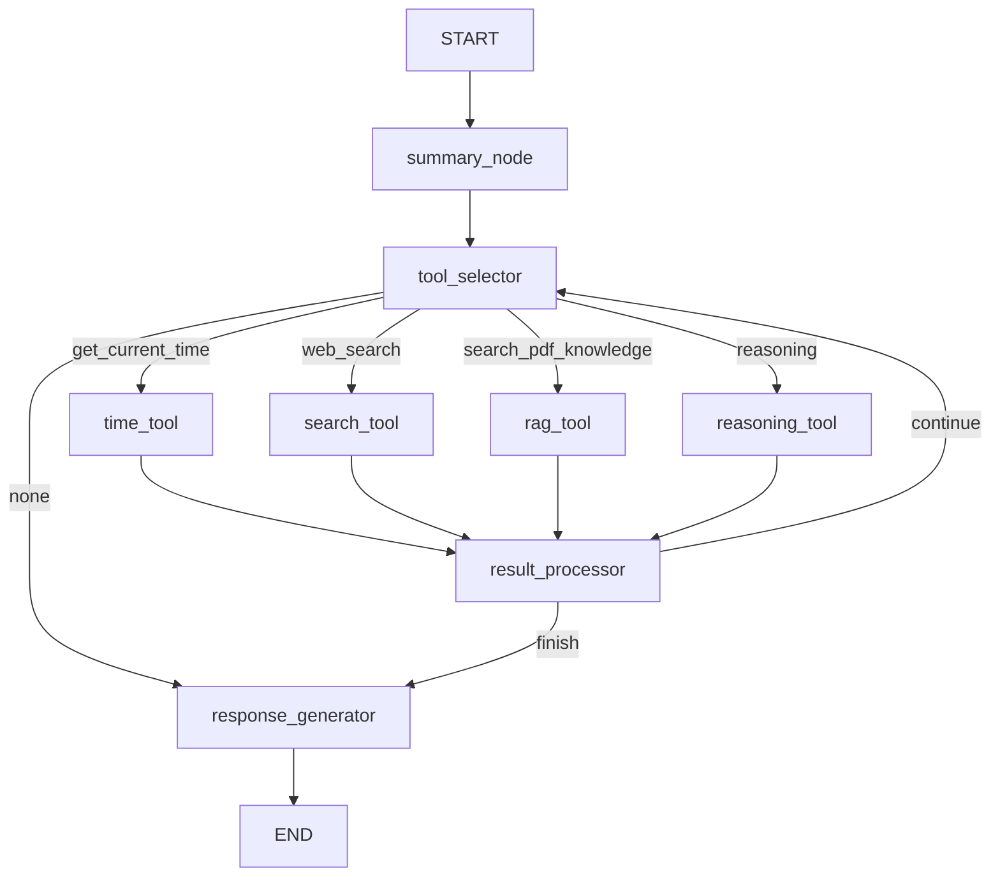
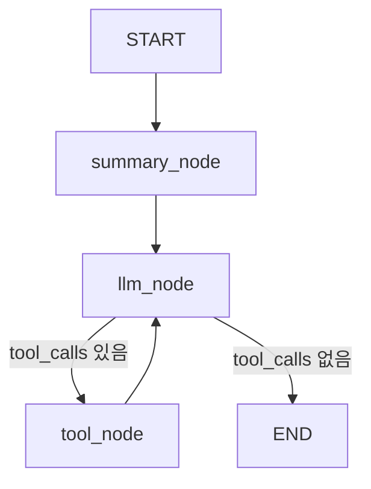

# Phase 03-3: Tool Calling 리팩토링

## 목표

현재 수동 도구 선택 방식(LLM이 도구명 문자열 출력 → 조건 분기)을 LangChain 표준 Tool Calling 패턴(`@tool` + `bind_tools()` + `ToolNode`)으로 변경한다.

---

## 1. 현재 구조 vs 목표 구조

### 1.1 현재 구조 (수동 방식)

```
User Input
    ↓
Tool Selector Node (LLM이 도구명 문자열 출력)
    ↓
route_to_selected_tool() (문자열 매칭)
    ↓
[time_tool / search_tool / rag_tool / reasoning_tool / response_generator]
```

**문제점**:
- LLM이 잘못된 도구명 출력 가능
- 도구별 인자 전달 불가 (모두 user_input만 사용)
- LangChain 생태계와 분리됨

### 1.2 목표 구조 (LangChain 표준)

```
User Input
    ↓
LLM Node (bind_tools 된 LLM)
    ↓
tools_condition (tool_calls 있으면 → ToolNode, 없으면 → END)
    ↓
ToolNode (자동 도구 실행)
    ↓
LLM Node (결과 반영하여 재호출)
    ↓
... (반복)
```

---

## 2. 도구 정의 변경

### 2.1 새 파일 생성

**파일**: `service/tools.py` (신규)

```python
"""LangChain @tool 데코레이터 기반 도구 정의"""
from datetime import datetime
from typing import Optional
import pytz

from langchain_core.tools import tool
from pydantic import Field


@tool
def get_current_time() -> str:
    """현재 시각을 반환합니다. 시간, 날짜, 요일 관련 질문에 사용하세요."""
    kst = pytz.timezone("Asia/Seoul")
    now = datetime.now(kst)
    return now.strftime("%Y-%m-%d %H:%M:%S") + " (KST)"


@tool
def web_search(
    query: str = Field(description="검색할 쿼리")
) -> str:
    """웹에서 최신 정보를 검색합니다. 실시간 뉴스, 최신 동향, 현재 상황에 대한 질문에 사용하세요."""
    # search_service는 외부에서 주입받아야 함
    # 이 함수는 ToolNode에서 호출될 때 config를 통해 서비스 접근
    return "웹 검색 서비스가 설정되지 않았습니다."


@tool
def search_pdf_knowledge(
    query: str = Field(description="PDF에서 검색할 내용")
) -> str:
    """업로드된 PDF 문서에서 관련 내용을 검색합니다. 문서 기반 질문에 사용하세요."""
    return "PDF 검색 서비스가 설정되지 않았습니다."


@tool
def reasoning(
    question: str = Field(description="분석할 질문"),
    context: str = Field(default="", description="참고할 맥락 정보")
) -> str:
    """복잡한 문제를 단계별로 분석합니다. 비교, 분석, 추론이 필요한 질문에 사용하세요."""
    return "추론 도구가 설정되지 않았습니다."


def create_tools_with_services(
    search_service=None,
    embedding_service=None,
    embedding_repo=None,
    session_id: str = "",
):
    """서비스가 주입된 도구 목록 생성

    Args:
        search_service: Tavily 검색 서비스
        embedding_service: 임베딩 서비스
        embedding_repo: 임베딩 저장소
        session_id: 세션 ID

    Returns:
        list: 서비스가 주입된 도구 목록
    """

    @tool
    def get_current_time_impl() -> str:
        """현재 시각을 반환합니다."""
        kst = pytz.timezone("Asia/Seoul")
        now = datetime.now(kst)
        return now.strftime("%Y-%m-%d %H:%M:%S") + " (KST)"

    @tool
    def web_search_impl(query: str) -> str:
        """웹에서 최신 정보를 검색합니다."""
        if search_service:
            results = search_service.search(query)
            return search_service.format_for_llm(results)
        return "웹 검색 서비스가 설정되지 않았습니다."

    @tool
    def search_pdf_knowledge_impl(query: str) -> str:
        """업로드된 PDF 문서에서 관련 내용을 검색합니다."""
        if embedding_service and embedding_repo:
            query_embedding = embedding_service.embed_query(query)
            results = embedding_repo.search_similar(session_id, query_embedding, top_k=5)

            if results:
                formatted = []
                for i, r in enumerate(results, 1):
                    formatted.append(f"[{i}] (유사도: {r['score']:.2f})\n{r['chunk'].normalized_text}")
                return "\n\n".join(formatted)
            return "PDF에서 관련 내용을 찾을 수 없습니다."
        return "PDF 검색 서비스가 설정되지 않았습니다."

    return [
        get_current_time_impl,
        web_search_impl,
        search_pdf_knowledge_impl,
    ]
```

---

## 3. react_graph.py 대폭 수정

### 3.1 import 변경

**삭제**:
```python
# 삭제
from prompt.selector.tool_selector import get_prompt as get_tool_selector_prompt
```

**추가**:
```python
# 추가
from langgraph.prebuilt import ToolNode, tools_condition
from service.tools import create_tools_with_services
```

### 3.2 ChatState 단순화

```python
class ChatState(TypedDict):
    """ReAct 루프 전체에서 공유되는 상태"""

    # === 메시지 (LangGraph 표준) ===
    messages: list[BaseMessage]

    # === 세션 정보 ===
    session_id: str

    # === 요약 관련 ===
    summary: str
    summary_history: list[dict]
    turn_count: int

    # === PDF 컨텍스트 ===
    pdf_description: str

    # === 메타데이터 ===
    input_tokens: int
    output_tokens: int
    model_used: str
```

**삭제되는 필드**:
- `user_input` (messages에서 추출)
- `current_tool`, `tool_history` (ToolNode가 관리)
- `tool_results` (messages에 ToolMessage로 포함)
- `iteration`, `max_iterations` (LangGraph가 관리)
- `needs_more_tools`, `processor_summary` (불필요)
- `final_response` (messages[-1]에서 추출)
- `messages_for_context` (불필요)

### 3.3 그래프 구조 재설계

**기존 노드 (삭제)**:
- `tool_selector` → 삭제 (bind_tools로 대체)
- `time_tool`, `search_tool`, `rag_tool`, `reasoning_tool` → 삭제 (ToolNode로 대체)
- `result_processor` → 삭제 (tools_condition으로 대체)

**새 노드**:
- `summary_node` (유지)
- `llm_node` (LLM 호출)
- `tool_node` (ToolNode 사용)
- 조건부 엣지: `tools_condition`

### 3.4 새로운 build 메서드

```python
def build(self):
    """그래프 빌드 및 컴파일 (Tool Calling 패턴)"""

    # 서비스가 주입된 도구 생성
    tools = create_tools_with_services(
        search_service=self.search_service,
        embedding_service=self.embedding_service,
        embedding_repo=self.embedding_repo,
        session_id="",  # invoke 시점에 동적으로 설정
    )

    # LLM에 도구 바인딩
    self._llm_with_tools = self._llm.bind_tools(tools)

    # ToolNode 생성
    tool_node = ToolNode(tools)

    # 그래프 빌더
    builder = StateGraph(ChatState)

    # 노드 추가
    builder.add_node("summary_node", self._summary_node)
    builder.add_node("llm_node", self._llm_node)
    builder.add_node("tool_node", tool_node)

    # 엣지 정의
    builder.add_edge(START, "summary_node")
    builder.add_edge("summary_node", "llm_node")

    # 조건부 엣지: LLM이 도구 호출했으면 tool_node로, 아니면 END
    builder.add_conditional_edges(
        "llm_node",
        tools_condition,  # LangGraph 내장 함수
        {
            "tools": "tool_node",
            END: END,
        }
    )

    # tool_node 실행 후 다시 llm_node로
    builder.add_edge("tool_node", "llm_node")

    self._graph = builder.compile(checkpointer=self._checkpointer)
    return self._graph


def _llm_node(self, state: ChatState) -> dict:
    """LLM 노드: 도구 호출 또는 최종 응답 생성"""
    messages = state.get("messages", [])

    # System prompt 추가 (요약 포함)
    system_content = self._build_system_prompt(state)
    all_messages = [SystemMessage(content=system_content)] + messages

    # LLM 호출 (bind_tools 된 LLM)
    response = self._llm_with_tools.invoke(all_messages)

    # 토큰 추적
    in_tokens, out_tokens = 0, 0
    if hasattr(response, "usage_metadata") and response.usage_metadata:
        in_tokens = response.usage_metadata.get("input_tokens", 0)
        out_tokens = response.usage_metadata.get("output_tokens", 0)

    return {
        "messages": [response],  # AIMessage 추가 (tool_calls 포함 가능)
        "input_tokens": state.get("input_tokens", 0) + in_tokens,
        "output_tokens": state.get("output_tokens", 0) + out_tokens,
    }


def _build_system_prompt(self, state: ChatState) -> str:
    """System prompt 구성"""
    parts = ["당신은 유용한 AI 어시스턴트입니다."]

    if state.get("summary"):
        parts.append(f"\n[이전 대화 요약]\n{state['summary']}")

    if state.get("pdf_description"):
        parts.append(f"\n[업로드된 PDF]\n{state['pdf_description']}")

    return "\n".join(parts)
```

---

## 4. invoke 메서드 수정

```python
def invoke(
    self,
    user_input: str,
    session_id: str,
    messages: list = None,
    summary: str = "",
    pdf_description: str = "",
    turn_count: int = 0,
    summary_history: list = None,
) -> dict:
    """그래프 실행"""

    # Fast-path: 일상적 대화
    from service.reasoning_detector import detect_reasoning_need
    mode = detect_reasoning_need(user_input)
    if mode == "casual":
        # 기존 casual 처리 유지
        ...

    if self._graph is None:
        self.build()

    # 사용자 메시지 추가
    user_message = HumanMessage(content=user_input)
    all_messages = (messages or []) + [user_message]

    initial_state: ChatState = {
        "messages": all_messages,
        "session_id": session_id,
        "summary": summary,
        "summary_history": summary_history or [],
        "turn_count": turn_count,
        "pdf_description": pdf_description,
        "input_tokens": 0,
        "output_tokens": 0,
        "model_used": self.model_name,
    }

    config = {"configurable": {"thread_id": session_id}}
    result = self._graph.invoke(initial_state, config)

    # 결과 추출
    messages = result.get("messages", [])
    final_message = messages[-1] if messages else None
    final_text = final_message.content if final_message else ""

    # tool_calls 추출 (히스토리용)
    tool_history = []
    tool_results = {}
    for msg in messages:
        if hasattr(msg, "tool_calls") and msg.tool_calls:
            for tc in msg.tool_calls:
                tool_history.append(tc["name"])
        if msg.type == "tool":
            tool_results[msg.name] = msg.content

    return {
        "text": final_text,
        "tool_history": tool_history,
        "tool_results": tool_results,
        "model_used": self.model_name,
        "summary": result.get("summary", ""),
        "summary_history": result.get("summary_history", []),
        "input_tokens": result.get("input_tokens", 0),
        "output_tokens": result.get("output_tokens", 0),
        "total_tokens": result.get("input_tokens", 0) + result.get("output_tokens", 0),
        "error": None,
    }
```

---

## 5. 변경 파일 요약

| 파일 | 변경 유형 | 내용 |
|------|----------|------|
| `service/tools.py` | **신규** | @tool 데코레이터 기반 도구 정의 |
| `service/react_graph.py` | **대폭 수정** | bind_tools, ToolNode, tools_condition 적용 |
| `prompt/selector/tool_selector.py` | **삭제** | 더 이상 사용 안 함 |

---

## 6. 삭제되는 코드

### 6.1 react_graph.py에서 삭제

```python
# 삭제되는 함수들 (약 150줄)
def route_to_selected_tool(state: ChatState) -> str:
    ...

def should_continue_loop(state: ChatState) -> Literal["continue", "finish"]:
    ...

def _tool_selector_node(self, state: ChatState) -> dict:
    ...

def _time_tool_node(self, state: ChatState) -> dict:
    ...

def _search_tool_node(self, state: ChatState) -> dict:
    ...

def _rag_tool_node(self, state: ChatState) -> dict:
    ...

def _reasoning_tool_node(self, state: ChatState) -> dict:
    ...

def _result_processor_node(self, state: ChatState) -> dict:
    ...

def _response_generator_node(self, state: ChatState) -> dict:
    ...
```

### 6.2 삭제되는 파일

```
prompt/selector/tool_selector.py  (도구 선택 프롬프트)
prompt/processor/result_processor.py  (결과 처리 프롬프트) - 선택적
prompt/response/response_generator.py  (응답 생성 프롬프트) - 선택적
```

---

## 7. 그래프 비교

### 7.1 기존 그래프 (복잡)



### 7.2 새 그래프 (단순)



---

## 8. 테스트 계획

### 8.1 도구 단위 테스트

```python
def test_get_current_time_tool():
    from service.tools import create_tools_with_services
    tools = create_tools_with_services()
    time_tool = tools[0]
    result = time_tool.invoke({})
    assert "KST" in result


def test_web_search_tool_no_service():
    from service.tools import create_tools_with_services
    tools = create_tools_with_services(search_service=None)
    search_tool = tools[1]
    result = search_tool.invoke({"query": "test"})
    assert "설정되지 않았습니다" in result
```

### 8.2 통합 테스트

```python
def test_tool_calling_flow():
    graph = ReactGraphBuilder(api_key=os.getenv("GEMINI_API_KEY"))
    graph.build()

    # 시간 질문 → get_current_time 호출 확인
    result = graph.invoke("지금 몇 시야?", session_id="test")
    assert "get_current_time" in result["tool_history"]
```

---

## 9. 참고: tools_condition

```python
from langgraph.prebuilt import tools_condition

# tools_condition은 다음과 같이 동작:
# - messages[-1]에 tool_calls가 있으면 "tools" 반환
# - 없으면 END 반환

# 사용 예:
builder.add_conditional_edges(
    "llm_node",
    tools_condition,
    {
        "tools": "tool_node",
        END: END,
    }
)
```
