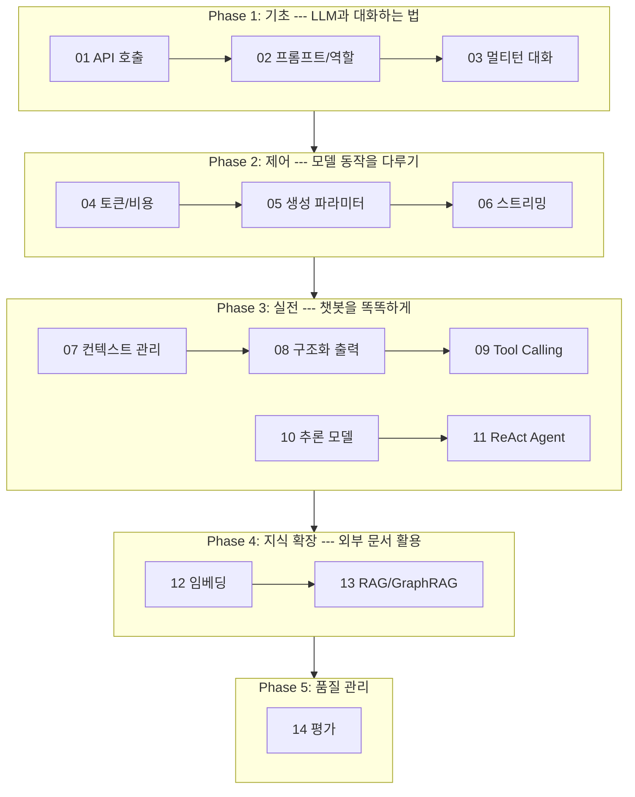

# LLM Application 개발 개념 가이드

> 이 교안은 note_01 ~ note_14 주피터 노트북의 이론적 배경을 정리한 문서입니다.
> 노트북에서 코드를 실행하면서, 이 문서에서 개념을 확인하는 방식으로 학습합니다.

## 커리큘럼 흐름

## 노트별 요약

| # | 제목 | Phase | 핵심 키워드 |
|---|------|-------|------------|
| 01 | Gemini 직접 호출 vs LangChain | 기초 | google-genai, ChatGoogleGenerativeAI |
| 02 | System/User Prompt + LangSmith | 기초 | role, system_instruction, tracing |
| 03 | Single-turn vs Multi-turn | 기초 | stateless, 대화 저장, 메모리 |
| 04 | 토큰과 컨텍스트 윈도우 | 제어 | subword, count_tokens, 비용 계산 |
| 05 | 생성 파라미터 | 제어 | temperature, top_p, top_k |
| 06 | Streaming | 제어 | SSE, TTFT, 청크 |
| 07 | 컨텍스트 매니지먼트 | 실전 | 슬라이딩 윈도우, 요약, 토큰 절감 |
| 08 | Structured Output | 실전 | JSON schema, Pydantic, with_structured_output |
| 09 | Tool Calling | 실전 | function_call, 4단계 루프 |
| 10 | Thinking / 추론 모델 | 실전 | CoT, thinking tokens, budget |
| 11 | ReAct Agent | 실전 | LangGraph, StateGraph, 조건부 엣지 |
| 12 | Embedding | 지식 확장 | 벡터, 코사인 유사도, 차원 |
| 13 | RAG + GraphRAG | 지식 확장 | 인덱싱, 청크, 벡터 스토어, 지식 그래프 |
| 14 | 챗봇 평가 | 품질 관리 | 정확성, 관련성, LLM-as-Judge |
