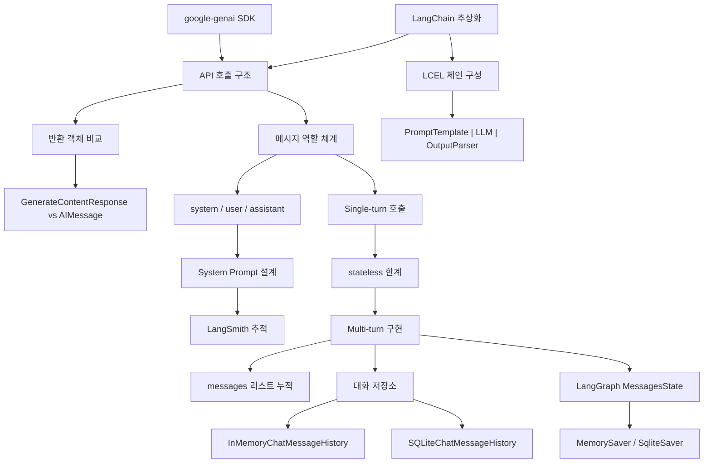

# Phase 1: 기초 --- LLM과 대화하는 법

> SDK 호출, 역할 체계, 멀티턴 구조를 익힌다

## 목표

이 Phase를 마치면 다음을 할 수 있다:

- google-genai SDK와 LangChain 두 가지 방식으로 Gemini API를 호출할 수 있다
- 메시지 역할 체계(system / user / assistant)를 이해하고, System Prompt를 설계하여 모델 동작을 제어할 수 있다
- Single-turn과 Multi-turn 대화의 차이를 이해하고, 대화 저장소를 활용한 멀티턴 챗봇을 구현할 수 있다

## 개념 관계도

## 포함된 노트

| # | 제목 | 핵심 개념 |
|---|------|-----------|
| 01 | Gemini 직접 호출 vs LangChain | google-genai SDK, LangChain 래핑, 메시지 타입, invoke/stream/batch, 반환 객체 비교, LCEL 체인, StrOutputParser |
| 02 | System/User Prompt + LangSmith | 메시지 역할 체계, system_instruction, SystemMessage, System Prompt 설계 원칙, LangSmith 연동, 트레이싱 |
| 03 | Single-turn vs Multi-turn | stateless 한계, messages 리스트 누적, 대화 저장소(InMemory/SQLite), LangGraph MessagesState, MemorySaver, thread_id 세션 분리 |
