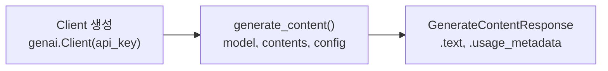
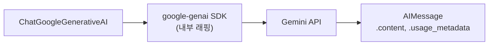
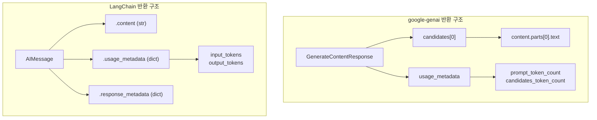
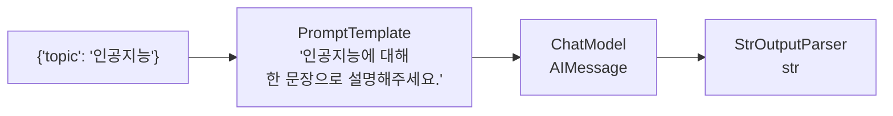

# Note 01. Gemini 직접 호출 vs LangChain

> 대응 노트북: `note_01_api_call.ipynb`
> Phase 1 — 기초: LLM과 대화하는 법

---

## 학습 목표

- google-genai SDK로 Gemini API를 직접 호출할 수 있다
- LangChain을 통해 동일한 Gemini 모델을 호출할 수 있다
- 두 방식의 반환 객체(`GenerateContentResponse` vs `AIMessage`)와 사용 패턴 차이를 설명할 수 있다
- LCEL(LangChain Expression Language) 체인의 기본 구조를 이해하고 구성할 수 있다

---

## 핵심 개념

### 1.1 google-genai SDK 소개

**한 줄 요약**: Google이 공식 제공하는 Python SDK로, Gemini API를 가장 직접적으로 호출하는 방법이다.

google-genai SDK는 `Client` 객체를 생성한 뒤, `client.models.generate_content()`를 호출하는 구조를 따른다. 2025년 11월부터 기존 `google-generativeai` 패키지는 지원 종료(EOL)되었으며, 현재 공식 SDK는 `google-genai`이다.

이 SDK는 Google이 제공하는 1차 인터페이스이므로, Gemini의 모든 기능(Live API, 이미지 생성 등)에 가장 먼저 접근할 수 있다는 것이 핵심 장점이다.

반환 객체는 `GenerateContentResponse`이며, `.text`로 생성된 텍스트를, `.usage_metadata`로 토큰 사용량(Token Usage) 정보를 확인할 수 있다.

```python
from google import genai

# 클라이언트 생성
client = genai.Client(api_key="YOUR_API_KEY")

# 기본 호출
response = client.models.generate_content(
    model="gemini-2.5-flash",
    contents="대한민국의 수도는 어디인가요?",
)
print(response.text)
```

`generate_content()`에는 `config` 딕셔너리를 전달하여 모델의 동작을 제어할 수 있다. `temperature`(온도 파라미터)는 응답의 무작위성을, `max_output_tokens`(최대 출력 토큰 수)는 출력 길이를 제한한다.

```python
# config로 생성 파라미터 제어
response = client.models.generate_content(
    model="gemini-2.5-flash",
    contents="인공지능의 미래를 한 문장으로 예측해주세요.",
    config={
        "temperature": 0.0,
        "max_output_tokens": 1024,
    },
)
```



### 1.2 LangChain 래핑

**한 줄 요약**: LangChain은 다양한 LLM 제공자를 통일된 인터페이스로 다루는 프레임워크이며, `ChatGoogleGenerativeAI` 클래스로 Gemini를 호출한다.

LangChain을 통해 Gemini를 호출하면 `.invoke()`, `.stream()`, `.batch()` 같은 통일된 메서드를 사용할 수 있다. 가장 큰 가치는 모델 교체 용이성이다. Google에서 OpenAI로 바꿔도 나머지 코드가 동일하게 동작한다.

`langchain-google-genai` 4.x부터 내부적으로 `google-genai` SDK를 사용한다. 즉 LangChain은 google-genai SDK를 한 번 더 감싼 래퍼(Wrapper)이다.

```python
from langchain_google_genai import ChatGoogleGenerativeAI

model = ChatGoogleGenerativeAI(
    model="gemini-2.5-flash",
    api_key="YOUR_API_KEY",
)

# 통일된 인터페이스: invoke, stream, batch
response = model.invoke("대한민국의 수도는 어디인가요?")
print(response.content)
```



### 1.3 LangChain 메시지 타입

**한 줄 요약**: LangChain은 LLM과의 대화를 `HumanMessage`, `AIMessage`, `SystemMessage` 세 가지 메시지 객체로 관리한다.

| 타입 | 역할 | 설명 |
|------|------|------|
| `HumanMessage` | 사용자 | 사용자가 보내는 메시지 |
| `AIMessage` | AI | 모델이 생성한 응답 |
| `SystemMessage` | 시스템 | 모델의 행동 규칙 설정 |

`.invoke()`에 문자열을 전달하면 내부적으로 `HumanMessage`로 변환된다. 메시지 객체를 직접 생성하여 리스트로 전달하는 것도 가능하다.

```python
from langchain_core.messages import HumanMessage, SystemMessage

messages = [
    SystemMessage(content="당신은 친절한 한국어 도우미입니다."),
    HumanMessage(content="파이썬이란 무엇인가요?"),
]

response = model.invoke(messages)
print(response.content)
```

### 1.4 LangChain 호출 메서드: invoke, stream, batch

**한 줄 요약**: LangChain의 모든 Chat Model은 `.invoke()`(단일 호출), `.stream()`(스트리밍 호출), `.batch()`(일괄 호출) 세 가지 메서드를 제공한다.

`.invoke()`는 응답 전체를 한 번에 반환한다. `.stream()`은 Token(토큰)이 생성되는 즉시 `AIMessageChunk` 단위로 하나씩 받아보는 방식이다. `.batch()`는 여러 입력을 리스트로 전달하여 내부적으로 병렬 호출을 시도하므로, 순차 호출보다 효율적이다.

이 인터페이스는 모든 LangChain 모델에서 동일하므로, 모델을 교체해도 호출 방식을 바꿀 필요가 없다.

```python
# 스트리밍 호출 — 각 chunk는 AIMessageChunk 타입
for chunk in model.stream("파이썬의 장점을 3가지 알려주세요"):
    print(chunk.content, end="", flush=True)

# 일괄 호출 — 여러 질문을 한 번에 처리
questions = ["대한민국의 수도는?", "일본의 수도는?", "프랑스의 수도는?"]
responses = model.batch(questions)
```

### 1.5 반환 객체 비교: GenerateContentResponse vs AIMessage

**한 줄 요약**: google-genai는 `GenerateContentResponse`를, LangChain은 `AIMessage`를 반환하며, 텍스트 접근과 메타데이터 구조가 다르다.

| 구분 | google-genai | LangChain |
|------|-------------|----------|
| 반환 타입 | `GenerateContentResponse` | `AIMessage` |
| 텍스트 접근 | `.text` | `.content` |
| 토큰 정보 | `.usage_metadata` (속성 접근) | `.usage_metadata` (딕셔너리 접근) |
| 스트리밍 반환 | chunk별 `GenerateContentResponse` | `AIMessageChunk` |

`GenerateContentResponse`에는 `candidates` 리스트가 포함되어 있으며, 각 Candidate(후보)는 모델이 생성한 하나의 응답 후보이다. 일반적으로 1개의 candidate만 반환된다.

`AIMessage`에는 `response_metadata` 딕셔너리와 `usage_metadata` 딕셔너리가 포함되어 있으며, 토큰 사용량, 모델 정보, 안전 필터 등의 정보가 들어있다.

```python
# google-genai: 속성 접근
print(response_genai.usage_metadata.prompt_token_count)
print(response_genai.usage_metadata.candidates_token_count)

# LangChain: 딕셔너리 접근
print(response_lc.usage_metadata["input_tokens"])
print(response_lc.usage_metadata["output_tokens"])
```



### 1.6 google-genai vs LangChain: 선택 기준

**한 줄 요약**: Gemini 고유 기능이나 빠른 프로토타이핑에는 google-genai를, 체이닝/모델 교체/프로덕션 에이전트에는 LangChain을 사용한다.

| 상황 | 권장 방식 | 이유 |
|------|----------|------|
| Gemini 고유 기능 (Live API, 이미지 생성 등) | google-genai | LangChain이 아직 래핑하지 않은 기능 |
| 빠른 프로토타이핑 | google-genai | 의존성 적고 직관적 |
| 체이닝, 메모리, 도구 등 조합 | LangChain | 오케스트레이션 기능 풍부 |
| 모델 교체 가능성 있음 | LangChain | 인터페이스 통일 |
| 프로덕션 에이전트 | LangChain + LangGraph | 상태 관리, 조건 분기 지원 |

실무에서는 LangChain/LangGraph를 메인으로 사용하되, 특수 기능이 필요할 때 google-genai를 직접 사용하는 패턴이 일반적이다.

### 1.7 LCEL 기본 구조

**한 줄 요약**: LCEL(LangChain Expression Language)은 여러 컴포넌트를 `|` 연산자(파이프)로 연결하여 하나의 체인(Chain)을 구성하는 LangChain의 핵심 패턴이다.

가장 기본적인 체인 구조는 `PromptTemplate | ChatModel | OutputParser`이다. 각 단계가 이전 단계의 출력을 받아 다음 단계의 입력으로 전달한다.

- **PromptTemplate**: 입력 변수를 받아 프롬프트(Prompt)를 생성한다
- **ChatModel**: 프롬프트를 LLM에 전달하고 응답을 받는다
- **OutputParser**: 응답에서 필요한 부분만 추출한다

`|` 연산자는 LangChain의 Runnable(실행 가능 객체) 인터페이스에 정의된 `__or__`로, Runnable끼리 연결하면 `RunnableSequence`가 된다.

```python
from langchain_core.prompts import ChatPromptTemplate
from langchain_core.output_parsers import StrOutputParser

# 프롬프트 템플릿 정의 — {topic}은 실행 시 대체될 변수
prompt = ChatPromptTemplate.from_template(
    "{topic}에 대해 한 문장으로 설명해주세요."
)
output_parser = StrOutputParser()

# 체인 구성: prompt -> model -> parser
chain = prompt | model | output_parser

# 체인 실행
result = chain.invoke({"topic": "인공지능"})
```



### 1.8 StrOutputParser의 역할

**한 줄 요약**: `StrOutputParser`는 `AIMessage`에서 `.content`를 추출하여 순수 문자열(`str`)을 반환하는 출력 파서이다.

파서가 없으면 체인의 결과는 `AIMessage` 객체 그대로 반환된다. 후속 코드에서 문자열로 바로 사용해야 할 때는 `StrOutputParser`를 사용하고, 메타데이터(토큰 수 등)가 필요하면 파서를 빼고 `AIMessage`를 직접 다루면 된다.

LangChain의 주요 Output Parser(출력 파서)는 다음과 같다:

| Parser | 용도 | 출력 타입 |
|--------|------|----------|
| `StrOutputParser` | AIMessage에서 문자열 추출 | `str` |
| `JsonOutputParser` | JSON 문자열 파싱 | `dict` 또는 `BaseModel` |
| `PydanticOutputParser` | Pydantic 모델로 강제 파싱 | `BaseModel` |
| `CommaSeparatedListOutputParser` | 쉼표 구분 텍스트를 리스트로 변환 | `list[str]` |

```python
# 파서 있는 체인: str 반환
chain_with_parser = prompt | model | output_parser
result = chain_with_parser.invoke({"topic": "딥러닝"})  # type: str

# 파서 없는 체인: AIMessage 반환
chain_without_parser = prompt | model
result = chain_without_parser.invoke({"topic": "딥러닝"})  # type: AIMessage
```

### 1.9 체인 활용: 스트리밍, 재사용, batch

**한 줄 요약**: LCEL 체인은 개별 모델과 동일하게 `.stream()`, `.batch()`를 지원하며, 템플릿 변수만 바꿔 재사용할 수 있다.

체인도 `.stream()`을 지원하므로 토큰 단위로 결과를 받아볼 수 있다. 한 번 정의한 체인은 다양한 입력으로 재사용할 수 있으며, `.batch()`로 여러 입력을 한 번에 처리하는 것도 가능하다.

```python
# 체인 스트리밍
for token in chain.stream({"topic": "머신러닝"}):
    print(token, end="", flush=True)

# 체인 batch
inputs = [{"term": "API"}, {"term": "SDK"}, {"term": "REST"}]
results = chain_system.batch(inputs)
```

### 1.10 from_messages로 역할별 프롬프트 구성

**한 줄 요약**: `ChatPromptTemplate.from_messages()`를 사용하면 system/human/ai 역할별로 메시지를 구성할 수 있다.

`from_template()`은 단순 문자열 템플릿으로 기본적으로 `HumanMessage`가 된다. 반면 `from_messages()`는 튜플 리스트로 역할과 내용을 지정하여 `SystemMessage`와 `HumanMessage`를 함께 구성할 수 있다.

```python
# from_messages로 역할별 프롬프트 구성
prompt_with_system = ChatPromptTemplate.from_messages([
    ("system", "당신은 IT 용어를 쉽게 설명하는 도우미입니다."),
    ("human", "{term}이(가) 무엇인지 설명해주세요."),
])

chain = prompt_with_system | model | output_parser
result = chain.invoke({"term": "API"})
```

---

## 장단점

| 구분 | google-genai SDK | LangChain (ChatGoogleGenerativeAI) |
|------|-----------------|-----------------------------------|
| 장점 | Gemini 최신 기능에 가장 빠르게 접근 | 모델 교체 용이 (통일 인터페이스) |
| 장점 | 의존성이 적고 직관적 | LCEL 체인, 메모리, 도구 등 오케스트레이션 풍부 |
| 장점 | 공식 SDK이므로 안정적 | `.invoke()`, `.stream()`, `.batch()` 통일 메서드 |
| 단점 | Gemini 전용이므로 모델 교체 시 코드 변경 필요 | 래핑 레이어로 인한 미세한 오버헤드 |
| 단점 | 체이닝, 메모리 등 고수준 기능 직접 구현 필요 | 새 Gemini 기능 지원이 SDK 대비 느릴 수 있음 |

---

## 핵심 정리

| 개념 | 핵심 포인트 |
|------|------------|
| google-genai SDK | `Client` 생성 후 `client.models.generate_content()`로 호출. 반환: `GenerateContentResponse` |
| LangChain 래핑 | `ChatGoogleGenerativeAI`로 Gemini 호출. 반환: `AIMessage`. 내부적으로 google-genai SDK 사용 |
| 메시지 타입 | `HumanMessage`(사용자), `AIMessage`(AI), `SystemMessage`(시스템) |
| 호출 메서드 | `.invoke()`(단일), `.stream()`(스트리밍), `.batch()`(일괄) — 모든 LangChain 모델 동일 |
| 반환 객체 차이 | google-genai: `.text`, `.usage_metadata.prompt_token_count`. LangChain: `.content`, `.usage_metadata["input_tokens"]` |
| LCEL 체인 | `PromptTemplate \| ChatModel \| OutputParser` 구조. `\|` 연산자로 Runnable 연결 |
| StrOutputParser | `AIMessage`에서 `.content`를 추출하여 `str` 반환 |
| from_messages | `ChatPromptTemplate.from_messages()`로 system/human 역할별 프롬프트 구성 |
| 선택 기준 | 프로토타이핑/고유 기능: google-genai. 체이닝/프로덕션: LangChain |

---

## 참고 자료

- [Gemini API Quickstart (Google 공식)](https://ai.google.dev/gemini-api/docs/quickstart) — Gemini API 시작 가이드. API 키 설정부터 첫 호출까지의 과정을 다룬다.
- [Google Gen AI Python SDK 공식 문서](https://googleapis.github.io/python-genai/) — google-genai SDK의 API 레퍼런스. `Client`, `generate_content`, `GenerateContentResponse` 등의 상세 명세를 확인할 수 있다.
- [Google Gen AI Python SDK GitHub](https://github.com/googleapis/python-genai) — SDK 소스코드와 README. 설치 방법, Client 설정, 코드 예제를 포함한다.
- [ChatGoogleGenerativeAI 통합 문서 (LangChain 공식)](https://docs.langchain.com/oss/python/integrations/chat/google_generative_ai) — LangChain에서 Gemini를 사용하는 방법을 다룬 공식 통합 가이드.
- [LangChain LCEL 원리 이해와 파이프라인 구축 가이드 (테디노트)](https://teddylee777.github.io/langchain/langchain-lcel/) — LCEL의 `|` 연산자 동작 원리와 체인 구성 방법을 한국어로 설명한 블로그 글.
- [LangChain 한국어 튜토리얼 (위키독스)](https://wikidocs.net/book/14314) — LangChain 공식 문서와 Cookbook을 바탕으로 작성된 한국어 튜토리얼. LCEL, 프롬프트, 체인 등을 다룬다.
