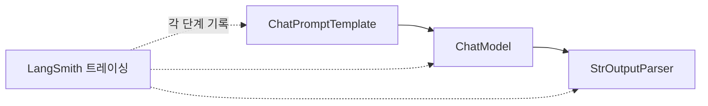

# Note 02. System/User Prompt + LangSmith

> 대응 노트북: `note_02_prompt_and_langsmith.ipynb`
> Phase 1 — 기초: LLM과 대화하는 법

## 학습 목표

- 메시지 역할 체계(system / user / assistant)를 이해한다
- google-genai의 `system_instruction`과 LangChain의 `SystemMessage`를 사용할 수 있다
- 효과적인 System Prompt(시스템 프롬프트)를 설계하는 3가지 원칙을 적용할 수 있다
- LangSmith를 연동하여 LLM 호출을 추적하고 분석할 수 있다

---

## 핵심 개념

### 2.1 메시지 역할 체계

**한 줄 요약**: LLM API는 역할(role)이 부여된 메시지 리스트를 입력으로 받으며, system / user / assistant 세 가지 역할이 있다.

LLM API는 단순한 "질문 -> 답변" 구조가 아니다. 각 메시지에 "이 메시지가 누구의 것인지"를 나타내는 역할이 부여된 메시지 리스트를 입력으로 받는다.

| 역할 | 설명 |
|------|------|
| **system** | 모델의 행동 규칙을 정의. 사용자에게는 보이지 않는 지시 |
| **user** (human) | 실제 사용자가 보내는 입력 |
| **assistant** (model/AI) | 모델이 이전에 생성한 응답 |

system 메시지는 모델의 "성격"과 "능력 범위"를 결정한다. 같은 모델이라도 system 메시지를 바꾸면 완전히 다른 챗봇이 된다.

google-genai SDK에서는 역할을 다음과 같이 표현한다. system은 `system_instruction` 파라미터로 별도 전달하고, user와 model은 `contents` 리스트에 배치한다.

```python
# google-genai에서 역할이 부여된 메시지 구조
response = client.models.generate_content(
    model="gemini-2.5-flash",
    config={"system_instruction": "당신은 친절한 한국어 도우미입니다."},
    contents=[
        Content(role="user", parts=[Part(text="안녕하세요?")]),
    ],
)
```

LangChain은 역할별로 전용 메시지 클래스를 제공한다.

| 역할 | LangChain 클래스 | google-genai 대응 |
|------|-----------------|------------------|
| system | `SystemMessage` | `system_instruction` |
| user | `HumanMessage` | `role="user"` |
| assistant | `AIMessage` | `role="model"` |

```python
# LangChain에서 역할별 메시지 구성
messages = [
    SystemMessage(content="당신은 친절한 한국어 도우미입니다."),
    HumanMessage(content="안녕하세요?"),
]
response = model.invoke(messages)
```

이전 대화 맥락을 전달하려면 `AIMessage`도 리스트에 포함한다. 3개 역할이 모두 포함된 메시지 리스트의 예시는 다음과 같다.

```python
# 3개 역할이 모두 포함된 대화 이력
messages_with_history = [
    SystemMessage(content="당신은 수학 교사입니다. 풀이 과정을 보여주세요."),
    HumanMessage(content="3 + 5는?"),
    AIMessage(content="3 + 5 = 8입니다."),         # 이전 모델 응답
    HumanMessage(content="거기에 2를 곱하면?"),     # 현재 질문
]
```

### 2.2 System Prompt: google-genai vs LangChain

**한 줄 요약**: System Prompt는 모델에게 역할과 행동 규칙을 지시하는 메시지이며, google-genai는 `system_instruction` 파라미터로, LangChain은 `SystemMessage` 클래스로 전달한다.

System Prompt(시스템 프롬프트)는 모델에게 "너는 이런 존재이고, 이렇게 행동해라"를 지시하는 메시지다. 사용자에게는 보이지 않지만 모델의 모든 응답에 영향을 미친다.

google-genai에서는 `config` 딕셔너리의 `system_instruction` 키로 전달한다.

```python
# google-genai: system_instruction으로 역할 부여
response = client.models.generate_content(
    model="gemini-2.5-flash",
    config={
        "system_instruction": "당신은 시인입니다. 모든 답변을 시 형태로 작성하세요.",
    },
    contents="봄에 대해 알려주세요.",
)
```

LangChain에서는 두 가지 방법으로 System Prompt를 설정할 수 있다. `SystemMessage` 객체를 직접 사용하거나, `ChatPromptTemplate.from_messages()`에서 튜플(Tuple)로 정의한다.

```python
# 방법 1: SystemMessage 객체 직접 사용
messages = [
    SystemMessage(content="당신은 시인입니다. 모든 답변을 시 형태로 작성하세요."),
    HumanMessage(content="봄에 대해 알려주세요."),
]
response = model.invoke(messages)
```

```python
# 방법 2: ChatPromptTemplate에서 튜플로 정의
prompt = ChatPromptTemplate.from_messages([
    ("system", "당신은 시인입니다. 모든 답변을 시 형태로 작성하세요."),
    ("human", "{question}"),
])
chain = prompt | model | StrOutputParser()
result = chain.invoke({"question": "봄에 대해 알려주세요."})
```

두 방식 모두 모델에게 "이렇게 행동하라"는 동일한 지시를 전달한다. 동작에 차이는 없다.

### 2.3 System Prompt의 효과 확인

**한 줄 요약**: 동일한 질문이라도 System Prompt를 바꾸면 응답의 관점, 톤, 길이, 포맷이 완전히 달라진다.

System Prompt만 변경해도 같은 모델이 같은 질문에 대해 전혀 다른 응답을 생성한다. 이것이 System Prompt의 핵심 가치다.

```python
# 동일 질문, 3가지 다른 system prompt
question = "인공지능이 일자리에 미치는 영향은?"

system_prompts = {
    "낙관론자": "당신은 기술 낙관론자입니다. 기술 발전의 긍정적 측면을 강조하세요.",
    "비관론자": "당신은 기술 비관론자입니다. 기술 발전의 위험성을 경고하세요.",
    "중립 분석가": "당신은 중립적인 분석가입니다. 양쪽 관점을 균형 있게 제시하세요.",
}
```

같은 모델, 같은 질문인데 System Prompt에 따라 관점이 완전히 달라진다.

### 2.4 System Prompt 설계 원칙

**한 줄 요약**: 좋은 System Prompt는 페르소나(Persona), 제약 조건(Constraints), 출력 포맷(Format) 세 가지 요소로 구성된다.

#### 페르소나 정의

"너는 ~이다"로 시작하는 역할 정의다. 모델은 이 정의에 맞춰 어휘, 톤, 지식 범위를 조절한다. 페르소나가 구체적일수록 응답이 일관된다.

```python
# 페르소나에 따른 응답 차이 — 동일 질문에 다른 역할
# 초등학교 교사: 쉽게 설명
config_teacher = {"system_instruction": "당신은 초등학교 3학년 담임 선생님입니다. 아이들이 이해할 수 있도록 쉽게 설명하세요."}
# 물리학 교수: 학술적으로 설명
config_professor = {"system_instruction": "당신은 서울대학교 물리학과 교수입니다. 학술적으로 정확하게 설명하세요."}
```

#### 제약 조건

"반드시 ~해야 한다", "절대 ~하지 마라" 형태의 규칙이다. 모델의 행동 범위를 좁혀서 예측 가능한 응답을 만든다.

```python
# 제약 조건 예시
system_with_constraints = """
당신은 고객 상담 챗봇입니다.

규칙:
- 반드시 존댓말을 사용하세요.
- 모든 답변은 3문장 이내로 작성하세요.
- 가격이나 할인에 대한 질문에는 "담당자에게 연결해드리겠습니다"로 답변하세요.
- 경쟁사 제품에 대한 비교 질문에는 답변을 거절하세요.
"""
```

#### 출력 포맷 지정

"JSON으로 응답", "3문장 이내", "번호를 매겨서" 등 출력 형태를 명시한다. 후속 코드에서 응답을 파싱(Parsing)해야 할 때 특히 중요하다.

```python
# 포맷을 명시적으로 지정
config_with_format = {
    "system_instruction": (
        "다음 규칙에 따라 답변하세요:\n"
        "1. 번호를 매겨서 나열할 것\n"
        "2. 각 항목은 한 줄로 작성할 것\n"
        "3. 부연 설명 없이 핵심만 작성할 것"
    ),
}
```

### 2.5 좋은 System Prompt vs 나쁜 System Prompt

**한 줄 요약**: 좋은 System Prompt는 페르소나 + 제약 조건 + 출력 포맷이 구체적이고, 나쁜 System Prompt는 모호하거나 모순된다.

나쁜 System Prompt는 모호하고 구체성이 없다.

```python
# 나쁜 예: 모호하고 구체성 없음
bad_prompt = "좋은 상담사가 되어줘."
```

좋은 System Prompt는 페르소나, 제약 조건, 출력 포맷을 모두 명확하게 포함한다.

```python
# 좋은 예: 페르소나 + 제약 + 포맷이 명확
good_prompt = """
당신은 10년 경력의 조직심리학 전문 상담사입니다.

규칙:
- 먼저 상대방의 감정을 인정하는 문장으로 시작하세요.
- 구체적인 행동 단계를 3가지 제안하세요.
- 각 단계를 번호로 매기고 한 줄로 작성하세요.
- 마지막에 격려 문장을 추가하세요.
- 전체 답변은 200자 이내로 작성하세요.
"""
```

이 세 가지가 구체적일수록 모델의 응답이 예측 가능하고 일관된다.

### 2.6 LangChain에서 System Prompt 변수화 패턴

**한 줄 요약**: `ChatPromptTemplate.from_messages()`를 사용하면 System Prompt에 변수를 넣어 하나의 템플릿으로 다양한 페르소나를 구현할 수 있다.

LangChain의 `ChatPromptTemplate.from_messages()`는 System Prompt에도 변수 플레이스홀더(Placeholder)를 넣을 수 있다. 이를 통해 하나의 템플릿으로 다양한 페르소나를 구현할 수 있다.

```python
# system prompt에 변수를 넣는 패턴
prompt_template = ChatPromptTemplate.from_messages([
    ("system", "당신은 {specialty} 전문가입니다. {style}으로 답변하세요."),
    ("human", "{question}"),
])

chain = prompt_template | model | StrOutputParser()

# 동일 체인, 다른 변수 — 요리 전문가
result1 = chain.invoke({
    "specialty": "한식 요리",
    "style": "레시피 단계별 형태",
    "question": "김치찌개 만드는 법을 알려주세요.",
})

# 동일 체인, 다른 변수 — 법률 전문가
result2 = chain.invoke({
    "specialty": "노동법",
    "style": "법률 용어를 쉽게 풀어서",
    "question": "퇴사할 때 연차 수당은 어떻게 계산하나요?",
})
```

같은 체인 구조를 재사용하면서 변수만 바꿔 다양한 전문가 챗봇을 만들 수 있다.

### 2.7 LangSmith 연동

**한 줄 요약**: LangSmith(랭스미스)는 LangChain 팀이 만든 LLM 개발 플랫폼으로, 환경변수 설정만으로 모든 LangChain 호출을 자동 트레이싱(Tracing)한다.

LangSmith는 LLM 호출을 자동으로 트레이싱하여, 실제로 어떤 프롬프트가 전송되었고 어떤 응답이 돌아왔는지를 대시보드에서 확인할 수 있는 플랫폼이다.

트레이싱이 중요한 이유는 다음과 같다.

- System Prompt를 바꿨을 때 "정말 의도대로 동작하는지"를 데이터로 확인할 수 있다
- "느낌"이 아니라 "근거"로 프롬프트를 개선할 수 있다
- 토큰(Token) 사용량, 응답 시간, 비용 추정을 자동으로 기록한다

### 2.8 LangSmith 환경변수 설정

**한 줄 요약**: LangSmith를 활성화하려면 `LANGSMITH_TRACING`, `LANGSMITH_API_KEY`, `LANGSMITH_PROJECT` 3개의 환경변수를 설정하면 된다.

환경변수 3개를 설정하면 모든 LangChain 호출이 자동으로 트레이싱된다. 별도의 코드 변경이 필요 없다.

```python
import os

os.environ["LANGSMITH_TRACING"] = "true"
os.environ["LANGSMITH_API_KEY"] = "발급받은 API 키"
os.environ["LANGSMITH_PROJECT"] = "note-02-prompt"  # 프로젝트 이름
```

LangSmith 계정은 https://smith.langchain.com 에서 무료로 가입할 수 있으며, 가입 후 API 키를 발급받는다.

### 2.9 트레이싱 확인

**한 줄 요약**: 환경변수 설정 후 LangChain으로 호출하면 해당 호출이 LangSmith 대시보드에 자동 기록되며, 체인 호출 시 각 단계가 개별적으로 트레이싱된다.

환경변수를 설정한 후 LangChain 호출을 실행하면, LangSmith 대시보드에서 해당 호출의 상세 내역을 확인할 수 있다.

```python
# LangSmith에 트레이싱될 호출
traced_response = model.invoke([
    SystemMessage(content="당신은 파이썬 전문가입니다. 간결하게 답변하세요."),
    HumanMessage(content="리스트 컴프리헨션이란 무엇인가요?"),
])
```

LangSmith 대시보드에서 확인할 수 있는 항목은 다음과 같다.

| 항목 | 설명 |
|------|------|
| Input | 실제 전송된 프롬프트 전문 (system + user 메시지) |
| Output | 모델의 응답 전문 |
| Tokens | 입력/출력 토큰 수 |
| Latency | 응답 시간 (ms) |
| Cost | 비용 추정 |
| Model | 사용된 모델명과 버전 |

LCEL(LangChain Expression Language) 체인을 실행하면 체인 내부의 각 단계(prompt -> model -> parser)가 개별적으로 트레이싱된다. 체인의 어느 단계에서 시간이 걸리는지 파악할 수 있다.

```python
# 체인 호출 — LangSmith에서 각 단계별 트레이싱 확인 가능
tracing_chain = ChatPromptTemplate.from_messages([
    ("system", "당신은 {role}입니다. 한 문장으로 답변하세요."),
    ("human", "{question}"),
]) | model | StrOutputParser()

result = tracing_chain.invoke({
    "role": "역사학자",
    "question": "한글은 누가 만들었나요?",
})
```



---

## 장단점

| 장점 | 단점 |
|------|------|
| System Prompt로 동일 모델의 행동을 다양하게 제어 가능 | System Prompt의 지시를 모델이 100% 준수한다는 보장이 없음 |
| google-genai와 LangChain 모두 System Prompt를 지원 | 두 방식 간 API 인터페이스가 달라 학습 비용 발생 |
| LangChain의 `ChatPromptTemplate`으로 변수화된 템플릿 재사용 가능 | 프롬프트 변수가 많아지면 관리가 복잡해질 수 있음 |
| LangSmith 연동으로 프롬프트 변경 효과를 데이터로 검증 가능 | LangSmith 트레이싱은 LangChain 호출에만 자동 적용됨 |
| 환경변수 3개만 설정하면 자동 트레이싱 | LangSmith는 외부 서비스이므로 네트워크 연결 필요 |

---

## 핵심 정리

| 개념 | 핵심 포인트 |
|------|------------|
| 메시지 역할 체계 | system(행동 규칙), user(사용자 입력), assistant(모델 응답) 3가지 역할로 구분 |
| google-genai System Prompt | `config`의 `system_instruction` 키로 전달 |
| LangChain System Prompt | `SystemMessage` 객체 또는 `ChatPromptTemplate`의 `("system", "...")` 튜플로 전달 |
| System Prompt 3요소 | 페르소나(역할 정의) + 제약 조건(행동 범위 제한) + 출력 포맷(응답 구조 지정) |
| System Prompt 품질 | 구체적이고 명확할수록 예측 가능한 응답 생성, 모호하면 일관성 저하 |
| ChatPromptTemplate 변수화 | `{변수명}` 플레이스홀더로 하나의 체인으로 다양한 페르소나 구현 |
| LangSmith 연동 | `LANGSMITH_TRACING`, `LANGSMITH_API_KEY`, `LANGSMITH_PROJECT` 환경변수 3개 설정 |
| LangSmith 트레이싱 | Input/Output 전문, 토큰 수, 응답 시간, 비용 추정을 대시보드에서 확인 |
| 체인 트레이싱 | LCEL 체인의 각 단계(prompt -> model -> parser)가 개별 트레이싱됨 |

---

## 참고 자료

- [Google Gen AI SDK 공식 문서](https://googleapis.github.io/python-genai/) — `system_instruction` 파라미터를 포함한 `generate_content()` API 레퍼런스
- [Google Cloud: Use system instructions](https://docs.cloud.google.com/vertex-ai/generative-ai/docs/learn/prompts/system-instructions) — Gemini 모델에서 시스템 지시를 활용하는 공식 가이드
- [LangChain ChatPromptTemplate API 레퍼런스](https://python.langchain.com/api_reference/core/prompts/langchain_core.prompts.chat.ChatPromptTemplate.html) — `from_messages()`, 메시지 타입, 변수 플레이스홀더 사용법
- [LangChain Prompts 레퍼런스](https://reference.langchain.com/python/langchain_core/prompts/) — LangChain Core의 프롬프트 모듈 전체 레퍼런스
- [LangSmith Tracing Quickstart](https://docs.langchain.com/langsmith/observability-quickstart) — LangSmith 환경변수 설정 및 트레이싱 시작 가이드
- [LangSmith: Prompt Engineering Concepts](https://docs.langchain.com/langsmith/prompt-engineering-concepts) — LangSmith에서의 프롬프트 엔지니어링 개념 설명
