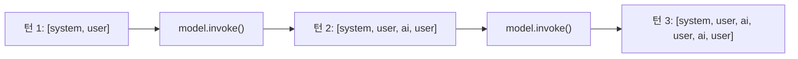
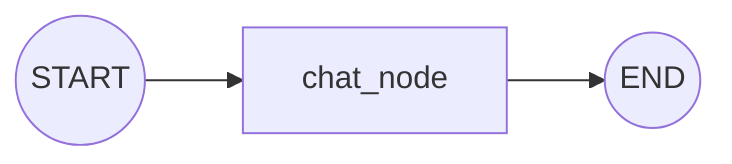

# Note 03. Single-turn vs Multi-turn

> 대응 노트북: `note_03_multi_turn.ipynb`
> Phase 1 — 기초: LLM과 대화하는 법

---

## 학습 목표

- Single-turn 호출의 한계를 이해한다
- Multi-turn 대화의 작동 원리(messages 리스트 누적)를 설명할 수 있다
- google-genai와 LangChain에서 멀티턴 대화를 구현할 수 있다
- 대화 저장소(InMemory / SQLite)의 특성과 선택 기준을 이해한다
- LangGraph의 MessagesState를 활용한 상태 관리 패턴을 익힌다

---

## 핵심 개념

### 3.1 Single-turn의 한계

**한 줄 요약**: LLM API 호출은 stateless(상태 없음)이며, 매 호출은 독립적이다.

LLM API 호출은 본질적으로 stateless(상태 없음)하다. 매 호출은 독립적이며, 이전 호출의 내용을 전혀 기억하지 못한다. 이것을 Single-turn(단일 턴) 호출이라 한다. 한 번 질문하고 한 번 답변을 받으면 끝이다.

첫 번째 호출에서 이름을 알려주고, 두 번째 호출에서 이름을 물어보면 모델은 답하지 못한다. 두 번째 호출은 첫 번째 호출과 완전히 별개의 요청이기 때문이다.

```
호출 1: "제 이름은 김철수입니다"  →  "반갑습니다, 김철수님!"     (독립 요청)
호출 2: "제 이름이 뭐라고 했죠?"  →  "이름을 알려주시겠어요?"   (독립 요청)
```

```python
# google-genai: 각 호출은 독립적
resp1 = client.models.generate_content(
    model="gemini-2.5-flash",
    contents="제 이름은 김철수입니다. 반갑습니다!",
)

# 이전 호출을 기억하지 못함
resp2 = client.models.generate_content(
    model="gemini-2.5-flash",
    contents="제 이름이 뭐라고 했죠?",
)
```

LangChain에서도 동일하다. `model.invoke()`는 매번 독립적인 호출이다.

```python
# LangChain에서도 동일한 한계
resp1 = model.invoke("제 이름은 김철수입니다. 반갑습니다!")
resp2 = model.invoke("제 이름이 뭐라고 했죠?")  # 기억하지 못함
```

### 3.2 Multi-turn의 작동 원리

**한 줄 요약**: 클라이언트에서 messages 리스트를 누적 관리하고, 매 호출 시 전체 대화 이력을 통째로 전송한다.

Multi-turn(멀티턴) 대화의 핵심 원리는 단순하다. 클라이언트(개발자 코드)에서 messages 리스트를 누적 관리하고, 매 호출 시 전체 대화 이력을 통째로 전송하는 것이다.

```
턴 1 전송: [user: "이름은 김철수"]
턴 1 응답:               → [assistant: "반갑습니다"]

턴 2 전송: [user: "이름은 김철수", assistant: "반갑습니다", user: "내 이름이 뭐였죠?"]
턴 2 응답:               → [assistant: "김철수님이시죠"]
```

모델이 기억하는 것이 아니다. 개발자가 매번 전체 대화를 다시 보내주는 것이다. 멀티턴 대화는 모델의 능력이 아니라 클라이언트의 책임이다.

가장 기본적인 방법은 파이썬 리스트로 메시지를 직접 관리하는 것이다.

```python
from langchain_core.messages import HumanMessage, AIMessage, SystemMessage

# 대화 이력을 담을 리스트
conversation = [
    SystemMessage(content="당신은 친절한 도우미입니다. 간결하게 답변하세요."),
]

# 턴 1: 사용자 메시지 추가 → 전체 이력으로 호출 → AI 응답 추가
conversation.append(HumanMessage(content="제 이름은 김철수입니다."))
resp1 = model.invoke(conversation)
conversation.append(resp1)

# 턴 2: 전체 이력을 함께 전송하므로 이름을 기억함
conversation.append(HumanMessage(content="제 이름이 뭐라고 했죠?"))
resp2 = model.invoke(conversation)
conversation.append(resp2)
```



### 3.3 멀티턴의 비용 문제

**한 줄 요약**: 대화가 길어질수록 매 호출의 입력 토큰 수가 누적되어 비용이 증가한다.

멀티턴 대화에서는 매 호출마다 전체 이력을 전송한다. 대화가 길어질수록 입력 토큰 수가 누적된다.

```
턴 1: system(50) + user(20)                     = 70 토큰
턴 2: system(50) + user(20) + ai(30) + user(15) = 115 토큰
턴 3: 위 전체 + ai(25) + user(20)               = 160 토큰
...
턴 20: 수천 토큰
```

이 비용 문제를 해결하는 전략(슬라이딩 윈도우, 요약 등)은 노트북 7(컨텍스트 매니지먼트)에서 다룬다.

```python
# 턴이 진행될수록 입력 토큰이 증가하는 것을 확인
conv = [SystemMessage(content="간결하게 답변하세요.")]

for i, q in enumerate(questions, 1):
    conv.append(HumanMessage(content=q))
    resp = model.invoke(conv)
    conv.append(resp)
    tokens = resp.usage_metadata
    print(f"턴 {i}: 입력 {tokens['input_tokens']}토큰 / 출력 {tokens['output_tokens']}토큰")
```

### 3.4 google-genai에서의 멀티턴

**한 줄 요약**: google-genai SDK는 contents 리스트 수동 관리와 `client.chats.create()` 세션 두 가지 방법을 제공한다.

#### 방법 1: contents 리스트 수동 관리

google-genai에서는 `contents`에 `Content` 객체 리스트를 전달한다. 각 메시지에 `role="user"` 또는 `role="model"`을 지정한다.

```python
from google.genai.types import Content, Part

contents = []

# 턴 1: user 메시지 추가
contents.append(Content(role="user", parts=[Part(text="제 이름은 이영희입니다.")]))
resp1 = client.models.generate_content(
    model="gemini-2.5-flash",
    config={"system_instruction": "친절하게 답변하세요."},
    contents=contents,
)
# model 응답도 contents에 추가
contents.append(Content(role="model", parts=[Part(text=resp1.text)]))

# 턴 2: 전체 이력을 함께 전송
contents.append(Content(role="user", parts=[Part(text="제 이름이 뭐였죠?")]))
resp2 = client.models.generate_content(
    model="gemini-2.5-flash",
    config={"system_instruction": "친절하게 답변하세요."},
    contents=contents,
)
```

#### 방법 2: client.chats.create() 세션

`client.chats.create()`로 채팅 세션을 생성하면, 세션 객체가 내부적으로 대화 이력을 관리한다. 개발자가 직접 리스트를 관리할 필요가 없다.

```python
# 채팅 세션 생성
chat = client.chats.create(
    model="gemini-2.5-flash",
    config={"system_instruction": "친절하게 답변하세요."},
)

# 세션이 이전 대화를 자동으로 포함
resp1 = chat.send_message("제 이름은 박민수입니다.")
resp2 = chat.send_message("제 이름이 뭐였죠?")
resp3 = chat.send_message("제 이름의 성(姓)은 뭔가요?")
```

`client.chats.create()`는 편리하지만, 내부적으로 하는 일은 동일하다. 대화 이력을 리스트에 쌓고, 매 호출 시 전체를 전송한다. 프로세스가 종료되면 세션도 사라진다(InMemory).

세션에 쌓인 이력은 `chat._curated_history`에서 확인할 수 있다. 또한 `chat.get_history()`로 대화 이력에 접근할 수 있다.

### 3.5 LangChain에서의 멀티턴

**한 줄 요약**: LangChain은 `List[BaseMessage]` 수동 관리와 `InMemoryChatMessageHistory` 클래스 두 가지 방법을 제공한다.

#### List[BaseMessage] 수동 관리

앞서 3.2에서 본 것처럼 `HumanMessage`, `AIMessage`, `SystemMessage` 리스트를 직접 관리하는 방법이다. LangChain의 메시지 타입은 각각 역할이 정해져 있다.

| 메시지 타입 | 역할 | 설명 |
|------------|------|------|
| `SystemMessage` | system | 모델의 동작 지침 설정 |
| `HumanMessage` | user | 사용자 입력 |
| `AIMessage` | assistant | 모델 응답 |

메시지 순서는 항상 시간순으로 유지한다: SystemMessage -> HumanMessage -> AIMessage -> HumanMessage -> AIMessage -> ...

#### InMemoryChatMessageHistory

`InMemoryChatMessageHistory`는 대화 이력을 메모리에 저장하는 클래스다. `add_message()`, `clear()` 등 이력 관리에 필요한 메서드를 제공한다.

```python
from langchain_core.chat_history import InMemoryChatMessageHistory

# 대화 이력 저장소 생성
history = InMemoryChatMessageHistory()
history.add_message(SystemMessage(content="당신은 친절한 도우미입니다."))

# 턴 1
history.add_message(HumanMessage(content="제 이름은 정수진입니다."))
resp = model.invoke(history.messages)
history.add_message(resp)

# 턴 2
history.add_message(HumanMessage(content="제 이름이 뭐였죠?"))
resp = model.invoke(history.messages)
history.add_message(resp)
```

매번 `history.add_message()`를 호출하는 것이 번거로우면, 대화 함수로 감싸서 사용할 수 있다.

```python
def chat_turn(user_input: str, history: InMemoryChatMessageHistory) -> str:
    """한 턴의 대화를 처리하고 응답을 반환"""
    history.add_message(HumanMessage(content=user_input))
    response = model.invoke(history.messages)
    history.add_message(response)
    return response.content
```

### 3.6 대화 저장소 비교

**한 줄 요약**: 저장소 선택은 영속성, 속도, 서버 규모에 따라 결정한다.

지금까지의 모든 방법은 InMemory(메모리 내) 저장 방식이다. 프로세스가 종료되면 대화 이력이 사라진다. 실제 서비스에서는 대화를 영구적으로 저장해야 할 수 있다.

| 저장소 | 영속성 | 속도 | 용도 |
|--------|--------|------|------|
| InMemory | 프로세스 종료 시 소멸 | 가장 빠름 | 프로토타입, 테스트 |
| SQLite | 파일로 영구 저장 | 빠름 | 단일 서버, 소규모 |
| Redis | TTL로 자동 만료 가능 | 매우 빠름 | 다중 서버, 세션 관리 |
| PostgreSQL | 영구 보존 + 검색/분석 | 보통 | 운영 환경, 대규모 |

선택 기준은 다음과 같다: 대화를 얼마나 오래 보관해야 하는가? 서버가 몇 대인가? 대화 이력을 나중에 분석해야 하는가?

### 3.7 LangGraph의 MessagesState와 add_messages

**한 줄 요약**: LangGraph는 MessagesState, add_messages reducer(리듀서), Checkpointer(체크포인터)로 멀티턴 대화를 그래프의 상태로 관리한다.

LangGraph는 LangChain 팀이 만든 에이전트 프레임워크다. 그래프 기반으로 LLM 애플리케이션의 흐름을 정의한다. LangGraph에서 멀티턴 대화를 관리하는 핵심 개념은 세 가지다.

1. **MessagesState**: 메시지 리스트를 상태로 관리하는 미리 정의된 타입
2. **add_messages**: 새 메시지를 기존 이력에 추가하는 reducer(리듀서). reducer란 새로운 값이 들어왔을 때 기존 상태와 어떻게 합칠지를 결정하는 함수다.
3. **Checkpointer(체크포인터)**: 상태를 저장하는 백엔드 (MemorySaver, SqliteSaver 등)

`MessagesState`의 내부 구조는 다음과 같다.

```python
from typing import Annotated
from langchain_core.messages import AnyMessage
from langgraph.graph.message import add_messages

class MessagesState(TypedDict):
    messages: Annotated[list[AnyMessage], add_messages]
```

`Annotated[list[AnyMessage], add_messages]`는 `messages` 필드에 새 값이 들어오면 `add_messages` reducer를 사용하여 기존 리스트에 append한다는 의미다.

#### 기본 구조: StateGraph + MessagesState

```python
from langgraph.graph import StateGraph, START, END
from langgraph.graph.message import MessagesState

# 노드 함수: LLM을 호출하고 응답을 상태에 추가
def chat_node(state: MessagesState):
    response = model.invoke(state["messages"])
    return {"messages": [response]}  # add_messages reducer가 기존 이력에 append

# 그래프 정의: START -> chat -> END
graph_builder = StateGraph(MessagesState)
graph_builder.add_node("chat", chat_node)
graph_builder.add_edge(START, "chat")
graph_builder.add_edge("chat", END)
```



### 3.8 MemorySaver로 상태 유지

**한 줄 요약**: 그래프를 컴파일할 때 Checkpointer를 지정하면, 호출 간에 상태가 유지된다.

`MemorySaver`는 메모리에 상태를 저장하는 가장 간단한 Checkpointer다. 그래프를 컴파일할 때 `checkpointer` 파라미터로 전달한다.

```python
from langgraph.checkpoint.memory import MemorySaver

memory_saver = MemorySaver()
graph = graph_builder.compile(checkpointer=memory_saver)

# thread_id로 대화 세션을 구분
config = {"configurable": {"thread_id": "session-1"}}

# 턴 1
result1 = graph.invoke(
    {"messages": [HumanMessage(content="제 이름은 홍길동입니다.")]},
    config=config,
)

# 턴 2 — 같은 thread_id로 호출하면 이전 대화가 자동으로 포함됨
result2 = graph.invoke(
    {"messages": [HumanMessage(content="제 이름이 뭐였죠?")]},
    config=config,
)
```

### 3.9 thread_id로 세션 분리

**한 줄 요약**: `thread_id`를 다르게 하면 별도의 대화 세션으로 취급되어, 여러 사용자의 대화를 동시에 관리할 수 있다.

`thread_id`는 `config`의 `configurable` 딕셔너리에 포함된다. 같은 `thread_id`로 호출하면 이전 대화를 이어가고, 다른 `thread_id`로 호출하면 새로운 세션이 된다.

```python
# 세션 1
config1 = {"configurable": {"thread_id": "session-1"}}
graph.invoke({"messages": [HumanMessage(content="제 이름은 홍길동입니다.")]}, config=config1)

# 세션 2 — 별도의 대화
config2 = {"configurable": {"thread_id": "session-2"}}
graph.invoke({"messages": [HumanMessage(content="제 이름은 김영희입니다.")]}, config=config2)

# 세션 1에서 이름 확인 — 홍길동
graph.invoke({"messages": [HumanMessage(content="제 이름이 뭐였죠?")]}, config=config1)

# 세션 2에서 이름 확인 — 김영희
graph.invoke({"messages": [HumanMessage(content="제 이름이 뭐였죠?")]}, config=config2)
```

### 3.10 SqliteSaver로 영구 저장

**한 줄 요약**: `SqliteSaver`를 사용하면 대화 상태를 SQLite 파일에 영구 저장하여, 프로세스를 재시작해도 대화 이력이 유지된다.

`MemorySaver`는 프로세스 종료 시 사라진다. `SqliteSaver`를 사용하면 대화 상태를 SQLite 파일에 영구 저장할 수 있다. LangGraph는 Checkpointer만 교체하면 저장소를 바꿀 수 있으며, 그래프 코드는 동일하게 유지된다.

```python
from langgraph.checkpoint.sqlite import SqliteSaver
import sqlite3

# SQLite 파일에 상태 저장
sqlite_conn = sqlite3.connect("chat_history.db", check_same_thread=False)
sqlite_saver = SqliteSaver(sqlite_conn)

# 같은 그래프를 SqliteSaver로 컴파일
graph_sqlite = graph_builder.compile(checkpointer=sqlite_saver)

config = {"configurable": {"thread_id": "sqlite-session-1"}}
result = graph_sqlite.invoke(
    {"messages": [HumanMessage(content="제 이름은 최민준입니다.")]},
    config=config,
)
```

| 구분 | MemorySaver | SqliteSaver |
|------|------------|-------------|
| 저장 위치 | 메모리 (RAM) | SQLite 파일 |
| 영속성 | 프로세스 종료 시 소멸 | 파일로 영구 저장 |
| 속도 | 매우 빠름 | 빠름 |
| 용도 | 프로토타입, 테스트 | 단일 서버 운영 |
| 설정 복잡도 | 없음 | DB 연결 설정 필요 |

---

## 장단점

| 장점 | 단점 |
|------|------|
| 멀티턴 대화로 맥락을 유지한 자연스러운 대화 가능 | 매 호출마다 전체 이력 전송으로 입력 토큰 비용 누적 |
| LangGraph Checkpointer로 저장소 교체가 용이 | InMemory 방식은 프로세스 종료 시 데이터 소멸 |
| thread_id로 다중 세션을 간단하게 관리 | 대화가 길어지면 컨텍스트 윈도우 한계에 도달 |
| google-genai, LangChain 모두 멀티턴 지원 | 리스트 수동 관리 시 코드 복잡도 증가 |
| SqliteSaver로 별도 인프라 없이 영구 저장 가능 | SQLite는 다중 서버 환경에 부적합 |

---

## 핵심 정리

| 개념 | 핵심 포인트 |
|------|------------|
| Single-turn | LLM API는 stateless. 매 호출은 독립적이며 이전 대화를 기억하지 못함 |
| Multi-turn | 클라이언트에서 messages 리스트를 누적하고, 매 호출 시 전체 이력을 전송 |
| 토큰 누적 | 턴이 진행될수록 입력 토큰이 증가. 컨텍스트 관리 전략이 필요 |
| google-genai 멀티턴 | `contents` 리스트 수동 관리 또는 `client.chats.create()` 세션 사용 |
| LangChain 멀티턴 | `List[BaseMessage]` 수동 관리 또는 `InMemoryChatMessageHistory` 사용 |
| 대화 저장소 | InMemory(휘발), SQLite(파일), Redis(세션), PostgreSQL(운영) |
| MessagesState | LangGraph에서 메시지 리스트를 상태로 관리하는 타입. `add_messages` reducer 사용 |
| Checkpointer | 그래프 상태를 저장하는 백엔드. MemorySaver(메모리), SqliteSaver(파일) |
| thread_id | Checkpointer에서 대화 세션을 구분하는 식별자. 다중 세션 관리에 사용 |

---

## 참고 자료

- [Messages - LangChain 공식 문서](https://docs.langchain.com/oss/python/langchain/messages) — HumanMessage, AIMessage, SystemMessage 등 메시지 타입 가이드
- [InMemoryChatMessageHistory - LangChain API Reference](https://python.langchain.com/api_reference/core/chat_history/langchain_core.chat_history.InMemoryChatMessageHistory.html) — InMemoryChatMessageHistory 클래스 API 레퍼런스
- [Add Memory to LangGraph - LangChain 공식 문서](https://docs.langchain.com/oss/python/langgraph/add-memory) — LangGraph에서 MemorySaver를 사용한 멀티턴 대화 구현 가이드
- [Persistence - LangGraph 공식 문서](https://docs.langchain.com/oss/python/langgraph/persistence) — LangGraph Checkpointer와 상태 영속성 개념 설명
- [langgraph-checkpoint-sqlite - PyPI](https://pypi.org/project/langgraph-checkpoint-sqlite/) — SqliteSaver 패키지 정보 및 사용법
- [Google Gen AI Python SDK - GitHub](https://github.com/googleapis/python-genai) — google-genai SDK의 채팅 세션 및 멀티턴 대화 구현
- [Text generation - Gemini API 공식 문서](https://ai.google.dev/gemini-api/docs/text-generation) — Gemini API의 멀티턴 대화 및 contents 구조 설명
