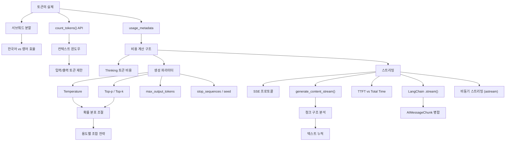

# Phase 2: 제어 --- 모델 동작을 다루기

> 토큰, 생성 파라미터, 스트리밍으로 모델 동작을 제어한다

## 목표

이 Phase를 마치면 다음을 할 수 있다:

- 토큰의 실체를 이해하고, 토큰 수를 측정하여 비용을 계산할 수 있다
- Temperature, Top-p, Top-k 등 생성 파라미터를 조합하여 출력 특성을 제어할 수 있다
- 스트리밍 방식으로 응답을 수신하고, TTFT를 측정하여 사용자 경험을 최적화할 수 있다

## 개념 관계도

## 포함된 노트

| # | 제목 | 핵심 개념 |
|---|------|-----------|
| 04 | 토큰과 컨텍스트 윈도우 | 서브워드 분할, count_tokens(), 한국어/영어 토큰 효율, 컨텍스트 윈도우, usage_metadata, Thinking 토큰, 비용 계산 |
| 05 | 생성 파라미터 | Temperature, Top-p(Nucleus Sampling), Top-k, 파라미터 조합 전략, max_output_tokens, stop_sequences, seed, LangChain 파라미터 적용 |
| 06 | Streaming | 스트리밍 vs 비스트리밍, generate_content_stream(), 청크 구조, TTFT 측정, AIMessageChunk, LCEL 체인 스트리밍, 비동기 스트리밍 |
