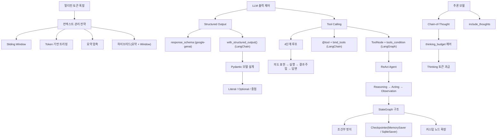

# Phase 3: 실전 --- 챗봇을 똑똑하게

> 컨텍스트 관리, 구조화 출력, 도구 호출, 추론, 에이전트를 구현한다

## 목표

이 Phase를 마치면 다음을 할 수 있다:

- 멀티턴 대화의 토큰 폭발 문제를 이해하고, 4가지 컨텍스트 관리 전략을 적용할 수 있다
- JSON Schema와 Pydantic 모델로 LLM 출력을 구조화하여 코드에서 안정적으로 파싱할 수 있다
- Tool Calling의 4단계 루프를 이해하고, google-genai와 LangChain/LangGraph에서 도구 호출을 구현할 수 있다
- 추론 모델(Thinking Model)의 thinking_budget을 활용하여 복잡한 문제의 정확도를 높일 수 있다
- LangGraph StateGraph로 ReAct 에이전트를 구현하고, Checkpointer로 대화 상태를 영속화할 수 있다

## 개념 관계도

## 포함된 노트

| # | 제목 | 핵심 개념 |
|---|------|-----------|
| 07 | 컨텍스트 매니지먼트 | 토큰 폭발 문제, Lost in the Middle, Sliding Window, trim_messages(), Token 기반 트리밍, 요약 압축, 하이브리드 전략 |
| 08 | Structured Output | 프롬프트 기반 JSON의 불안정성, response_mime_type/response_schema, Pydantic 모델, with_structured_output(), include_raw, Streaming SO |
| 09 | Tool Calling | 4단계 루프, FunctionDeclaration, 수동/자동 Function Calling, @tool 데코레이터, bind_tools, ToolNode, 다중 도구, 병렬 호출 |
| 10 | Thinking / 추론 모델 | Chain-of-Thought, thinking_budget, Thinking Token 과금, include_thoughts, 질문 유형별 최적 budget, 다른 모델 비교 |
| 11 | ReAct Agent | ReAct 패턴, LangGraph StateGraph, MessagesState, 조건부 엣지, create_react_agent, Checkpointer, 커스텀 노드, 에이전트 설계 패턴 |
