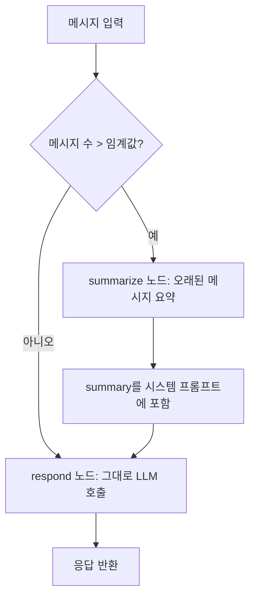

# Note 07. 컨텍스트 매니지먼트

> 대응 노트북: `note_07_context_management.ipynb`
> Phase 3 — 실전: 챗봇을 똑똑하게

---

## 학습 목표

- 멀티턴 대화에서 토큰이 이차(quadratic)로 증가하는 원리를 이해한다
- Sliding Window, Token 기반 트리밍, 요약 압축, 하이브리드 전략의 동작 원리와 트레이드오프를 설명할 수 있다
- LangChain의 `trim_messages()` 유틸리티를 활용하여 메시지를 트리밍할 수 있다
- Lost in the Middle 현상이 컨텍스트 관리가 필요한 이유를 설명할 수 있다
- LangGraph 노드 내부에서 컨텍스트 관리를 적용하는 패턴을 구현할 수 있다

---

## 핵심 개념

### 7.1 멀티턴 토큰 폭발 문제

**한 줄 요약**: LLM은 매 호출 시 전체 대화 이력을 전송하므로, 대화가 길어질수록 입력 토큰이 선형 누적되고 총 비용은 이차(quadratic)로 증가한다.

LLM API는 stateless(무상태)이기 때문에 매 호출마다 시스템 프롬프트와 이전 대화 이력 전체를 입력으로 보내야 한다. 이로 인해 턴이 늘수록 입력 토큰이 누적된다.

```
턴  1: system + user1                              → ~50 토큰
턴  5: system + user1~5 + ai1~4                     → ~650 토큰
턴 20: system + user1~20 + ai1~19                   → ~2,930 토큰
```

20턴 대화 한 건의 총 입력 토큰(1턴부터 20턴까지의 합계)은 수만 토큰에 달하며, 100명의 사용자가 각각 20턴씩 대화하면 비용이 빠르게 누적된다. 이 문제를 해결하는 것이 컨텍스트 매니지먼트(Context Management)의 핵심 목적이다.

### 7.2 Lost in the Middle 현상

**한 줄 요약**: 모델은 긴 컨텍스트의 처음과 끝 부분은 잘 활용하지만, 중간 부분에 있는 정보는 잘 활용하지 못하는 경향이 있다.

이 현상은 Liu et al. (2023)의 논문 "Lost in the Middle: How Language Models Use Long Contexts"에서 체계적으로 분석되었다. 대화 초반에 언급한 이름이나 중간에 합의한 조건을 모델이 잊어버리는 상황이 실제로 발생한다.

```
[잘 기억] 처음 부분 ... [잘 못 기억] 중간 부분 ... [잘 기억] 마지막 부분
```

컨텍스트 매니지먼트가 해결하는 세 가지 문제는 다음과 같다.

- **비용 폭발**: 턴이 늘수록 입력 토큰이 선형 증가하고, 총 비용은 이차 증가
- **품질 저하**: Lost in the Middle로 중간 정보 누락 위험
- **지연 증가**: 입력 토큰이 많을수록 TTFT(Time To First Token, 첫 토큰 도착 시간)도 증가

### 7.3 전략 1: Sliding Window(슬라이딩 윈도우)

**한 줄 요약**: 최근 N개의 메시지만 유지하고 오래된 메시지를 삭제하는 가장 간단한 전략이다.

```
전체 이력: [sys, u1, a1, u2, a2, u3, a3, u4, a4, u5]
Window=4:  [sys, ─────────────────────── u4, a4, u5]  ← 최근 4개만
```

시스템 메시지(SystemMessage)는 모델의 역할과 제약을 유지하기 위해 항상 보존한다.

```python
def sliding_window(messages, window_size, keep_system=True):
    """최근 window_size개의 메시지만 유지"""
    if keep_system and isinstance(messages[0], SystemMessage):
        system = [messages[0]]
        rest = messages[1:]
    else:
        system = []
        rest = messages
    return system + rest[-window_size:]
```

Window 크기가 작으면 토큰 절약은 크지만 맥락 손실이 커지고, 크기가 크면 맥락 보존은 좋지만 절약 효과가 적다. 실무에서는 4~8개 메시지(2~4턴)를 Window로 많이 사용한다.

### 7.4 LangChain trim_messages()

**한 줄 요약**: LangChain이 제공하는 `trim_messages()` 유틸리티는 수동 구현보다 세밀한 제어(전략, 시스템 메시지 보존, 시작 메시지 타입 보장 등)를 지원한다.

```python
from langchain_core.messages import trim_messages

trimmed = trim_messages(
    messages,
    max_tokens=5,           # 최대 허용 토큰(또는 메시지) 수
    token_counter=len,      # 카운터 함수 (len = 메시지 개수)
    strategy="last",        # "last" = 최근 유지, "first" = 처음 유지
    include_system=True,    # 시스템 메시지 항상 보존
    start_on="human",       # 결과가 HumanMessage로 시작하도록 보장
)
```

`start_on="human"`이 필요한 이유는 대부분의 LLM API가 messages 배열이 human(user) 메시지로 시작해야 하기 때문이다. `strategy="last"`로 최근 메시지만 남기면 잘리는 위치에 따라 AI 메시지가 맨 앞에 올 수 있으므로, `start_on="human"`으로 이를 방지한다.

| 파라미터 | 설명 | 기본값 |
|---------|------|-------|
| `max_tokens` | 최대 허용 토큰(또는 메시지) 수 | 필수 |
| `token_counter` | 토큰 계산 방법 (`len`, `llm`, 커스텀 함수) | 필수 |
| `strategy` | `"last"` (최근 유지) 또는 `"first"` (처음 유지) | `"last"` |
| `include_system` | 시스템 메시지 항상 포함 여부 | `False` |
| `start_on` | 결과가 시작해야 할 메시지 타입 | `None` |
| `allow_partial` | 메시지를 잘라서라도 토큰 한도에 맞출지 여부 | `False` |

최신 LangChain에서는 `trim_messages` 외에도 `@before_model` 미들웨어를 통해 에이전트 레벨에서 메시지 트리밍을 자동화하는 패턴도 지원한다. `RemoveMessage`와 `REMOVE_ALL_MESSAGES`를 활용하여 상태에서 메시지를 제거하고 트리밍된 메시지로 대체할 수 있다.

### 7.5 전략 2: Token 기반 트리밍

**한 줄 요약**: 메시지 개수가 아닌 실제 토큰 수 기준으로 트리밍하여, 메시지 길이가 불균일한 대화에서도 정확한 토큰 예산을 유지한다.

Sliding Window는 메시지 개수로 자르지만, 실제 비용은 토큰 수에 비례한다. 짧은 메시지 10개와 긴 메시지 2개는 토큰 수가 크게 다르다. `token_counter`에 실제 토큰 카운터를 전달하면 토큰 예산 내에서 메시지를 유지할 수 있다.

```python
# LLM 모델을 token_counter로 사용
trimmed = trim_messages(
    messages,
    max_tokens=100,
    token_counter=llm,     # 실제 토큰 계산
    strategy="last",
    include_system=True,
    start_on="human",
)
```

커스텀 토큰 카운터도 사용할 수 있다. 입력은 `list[BaseMessage]`이고, 출력은 `int`(총 토큰 수)를 반환하는 함수면 된다. google-genai의 `count_tokens` API를 활용하면 정확한 토큰 수를 계산할 수 있다.

```python
def custom_token_counter(messages):
    """google-genai의 count_tokens로 정확한 토큰 수를 계산"""
    text = "\n".join(m.content for m in messages)
    return client.models.count_tokens(model=MODEL, contents=text).total_tokens
```

최신 LangChain에서는 `count_tokens_approximately`라는 근사 토큰 카운터도 제공하여, 외부 API 호출 없이 빠르게 토큰 수를 추정할 수 있다.

### 7.6 전략 3: 요약 기반 압축

**한 줄 요약**: 오래된 대화를 LLM으로 요약하여 핵심 정보를 보존하면서 토큰을 절감하는 전략이다.

Sliding Window와 Token 트리밍은 오래된 메시지를 삭제한다. 요약 기반 압축은 오래된 대화를 LLM으로 요약하여 핵심 정보(이름, 요청 사항, 합의사항 등)를 보존한다.

```
전략 흐름:
1. 대화가 임계값을 초과
2. 오래된 메시지를 LLM으로 요약
3. 요약본을 시스템 프롬프트에 포함
4. 최근 메시지만 유지
```

```python
def compress_with_summary(messages, llm, keep_recent=4):
    """오래된 메시지를 요약하고 최근 메시지만 유지"""
    system_msg = messages[0] if isinstance(messages[0], SystemMessage) else None
    non_system = messages[1:] if system_msg else messages

    if len(non_system) <= keep_recent:
        return messages  # 충분히 짧으면 그대로

    old_messages = non_system[:-keep_recent]
    recent_messages = non_system[-keep_recent:]
    summary = summarize_conversation(old_messages, llm)

    base = system_msg.content if system_msg else "당신은 AI 비서입니다."
    new_system = SystemMessage(f"{base}\n\n[이전 대화 요약]\n{summary}")
    return [new_system] + recent_messages
```

요약 프롬프트 설계 시 **보존해야 할 정보의 종류**를 명시하면 품질이 개선된다. 도메인에 따라 보존 항목이 달라진다.

- **고객 상담**: 이름, 주문번호, 문의 내용, 해결 상태
- **교육**: 학생 이름, 학습 주제, 이해도, 다음 단계
- **기술 지원**: 에러 내용, 시도한 해결 방법, 환경 정보

주의사항으로, 요약 자체에 LLM 호출 비용이 발생하며, 요약 과정에서 세부 수치나 코드 조각이 손실될 수 있다. 대화가 짧을 때는 요약 비용이 절약 비용보다 클 수 있으므로 임계값을 설정해야 한다.

### 7.7 전략 4: 하이브리드(요약 + Sliding Window)

**한 줄 요약**: 요약과 Sliding Window를 결합하여, 짧은 대화는 그대로 전달하고 긴 대화는 오래된 부분을 요약하면서 최근 메시지를 유지하는 실전 전략이다.

```
대화 길이 <= 임계값  → 그대로 전달 (트리밍 불필요)
대화 길이 > 임계값   → 오래된 부분 요약 + 최근 N턴 유지
```

```python
def hybrid_context_management(messages, llm, threshold=8, keep_recent=4):
    """하이브리드 컨텍스트 관리"""
    if len(messages) <= threshold:
        return messages, "passthrough"
    compressed = compress_with_summary(messages, llm, keep_recent=keep_recent)
    return compressed, "summarized"
```

| 임계값 | keep_recent | 적합한 상황 |
|-------|------------|----------|
| 6~8 메시지 | 4 | 일반 챗봇 (빠른 응답 중요) |
| 12~16 메시지 | 6~8 | 상담/교육 (맥락 중요) |
| 500~1000 토큰 | 300 토큰 | 토큰 기반 정밀 제어 |

메시지 수 기준 분기가 간편하지만, 토큰 수 기준으로 분기하는 것이 더 정밀하다. 또한 이전 요약 위에 새 요약을 누적하는 점진적 요약(Incremental Summarization) 패턴도 가능하다.

### 7.8 전략별 비교

**한 줄 요약**: 네 가지 전략은 토큰 절약, 정보 보존, 구현 복잡도, 추가 비용 측면에서 각기 다른 특성을 가진다.

| 전략 | 토큰 절약 | 정보 보존 | 구현 복잡도 | 추가 비용 |
|------|---------|---------|----------|--------|
| Sliding Window | 높음 | 낮음 (초기 정보 손실) | 매우 낮음 | 없음 |
| Token 트리밍 | 높음 (정밀) | 낮음 | 낮음 | 없음 |
| 요약 압축 | 중간 | 높음 (핵심 보존) | 중간 | 요약 LLM 호출 |
| 하이브리드 | 중간~높음 | 높음 | 중간 | 조건부 LLM 호출 |

동일한 대화에 각 전략을 적용하고 "사용자 이름"과 "이전에 안내한 세부 정보"를 기억하는지 테스트하면, Sliding Window와 Token 트리밍은 초기 정보를 잃는 반면 요약 기반 전략은 핵심 정보를 보존하는 경향을 보인다.

전략 선택 기준은 다음과 같다.

- **빠른 응답, 비용 절감이 최우선** -- Sliding Window 또는 Token 트리밍
- **맥락 보존이 중요** (상담, 교육) -- 요약 압축 또는 하이브리드
- **실전 서비스** -- 하이브리드 (짧을 때 패스, 길 때 요약)

### 7.9 LangGraph에서의 컨텍스트 관리

**한 줄 요약**: LangGraph의 StateGraph에서는 상태에 전체 이력을 유지하면서 그래프 노드 내부에서 트리밍을 적용하는 패턴이 일반적이다.

**노드 내부 트리밍 패턴**: `MessagesState`에 저장된 전체 이력은 보존하되, LLM 호출 전에 `trim_messages`로 트리밍된 메시지만 전달한다. `MemorySaver`나 `SqliteSaver`를 통해 대화 이력 자체는 영속 보존하면서 비용은 제어할 수 있다.

```python
from langgraph.graph import StateGraph, START, END, MessagesState
from langgraph.checkpoint.memory import MemorySaver

def chatbot_node(state: MessagesState):
    # 상태에는 전체 이력이 유지되면서 LLM에는 트리밍된 메시지만 전달
    trimmed = trim_messages(
        state["messages"],
        max_tokens=300,
        token_counter=llm,
        strategy="last",
        include_system=True,
        start_on="human",
    )
    response = llm.invoke(trimmed)
    return {"messages": [response]}
```

**요약 노드 패턴**: 조건부 요약 노드를 그래프에 추가하여, 메시지 수가 임계값을 초과하면 요약 노드로 분기하는 고급 패턴이다. `ChatState`에 `summary` 필드를 추가한다.

```python
class ChatState(TypedDict):
    messages: Annotated[list, add_messages]
    summary: str

def should_summarize(state: ChatState):
    """메시지 수가 임계값을 초과하면 요약 노드로 분기"""
    if len(state["messages"]) > SUMMARY_THRESHOLD:
        return "summarize"
    return "respond"
```

요약 노드는 오래된 메시지를 요약하여 `summary` 필드에 저장하고, 응답 노드는 요약이 있으면 시스템 프롬프트에 포함하여 LLM을 호출한다. 요약 타이밍과 전략을 유연하게 제어할 수 있다는 점이 이 패턴의 강점이다.

최신 LangChain/LangGraph에서는 `langmem` 패키지의 `SummarizationNode`를 활용하여, 토큰 한도 기반 자동 요약을 그래프에 통합하는 방식도 지원한다.



---

## 장단점

| 장점 | 단점 |
|------|------|
| 컨텍스트 관리를 통해 토큰 사용량을 50~80% 절감할 수 있다 | 전략에 따라 초기 대화의 세부 정보가 손실될 수 있다 |
| Lost in the Middle 현상을 완화하여 응답 품질을 개선한다 | 요약 기반 전략은 추가 LLM 호출 비용이 발생한다 |
| `trim_messages()`로 간단하게 구현할 수 있다 | 요약 과정에서 수치, 코드 등 세부사항이 손실될 수 있다 |
| LangGraph 노드 내부 적용으로 전체 이력과 트리밍을 분리할 수 있다 | 최적의 임계값과 Window 크기를 도메인별로 튜닝해야 한다 |
| 하이브리드 전략으로 비용과 품질을 균형 있게 관리할 수 있다 | 커스텀 토큰 카운터 사용 시 추가 API 호출이 필요할 수 있다 |

---

## 핵심 정리

| 개념 | 핵심 포인트 |
|------|------------|
| 멀티턴 토큰 폭발 | 매 호출마다 전체 이력 전송으로 입력 토큰 선형 누적, 총 비용 이차 증가 |
| Lost in the Middle | 긴 컨텍스트의 중간 정보를 모델이 잘 활용하지 못하는 현상 |
| Sliding Window | 최근 N개 메시지만 유지. 구현이 간단하나 초기 맥락 손실 |
| trim_messages() | LangChain 유틸리티. strategy, include_system, start_on 등 세밀한 제어 지원 |
| Token 기반 트리밍 | 메시지 개수가 아닌 토큰 수 기준으로 정밀 트리밍. token_counter에 LLM 또는 커스텀 함수 전달 |
| 요약 기반 압축 | 오래된 대화를 LLM으로 요약하여 핵심 정보 보존. 추가 LLM 비용 발생 |
| 하이브리드 전략 | 요약 + Sliding Window 결합. 임계값 이하는 패스, 초과 시 요약. 실전에서 가장 널리 사용 |
| 요약 프롬프트 설계 | 보존해야 할 정보(이름, 요청사항 등)를 명시하면 요약 품질 개선 |
| LangGraph 노드 내부 트리밍 | 상태에 전체 이력 유지, LLM 호출 시에만 트리밍 적용 |
| 요약 노드 패턴 | ChatState에 summary 필드 추가, 조건부 분기로 요약 타이밍 제어 |

---

## 참고 자료

- [How to trim messages - LangChain](https://python.langchain.com/docs/how_to/trim_messages/) -- trim_messages() 사용법과 파라미터 설명
- [trim_messages API Reference](https://python.langchain.com/api_reference/core/messages/langchain_core.messages.utils.trim_messages.html) -- trim_messages() 함수의 API 레퍼런스
- [Short-term memory - LangChain](https://docs.langchain.com/oss/python/langchain/short-term-memory) -- LangChain의 단기 메모리 관리 및 @before_model 미들웨어 패턴
- [Add memory to your LangGraph agent](https://docs.langchain.com/oss/python/langgraph/add-memory) -- LangGraph에서 trim_messages와 SummarizationNode를 활용한 메모리 관리
- [Memory overview - LangGraph](https://docs.langchain.com/oss/python/langgraph/memory) -- LangGraph의 단기/장기 메모리 아키텍처 개요
- [Lost in the Middle: How Language Models Use Long Contexts (Liu et al., 2023)](https://arxiv.org/abs/2307.03172) -- 긴 컨텍스트에서 중간 정보를 모델이 활용하지 못하는 현상을 분석한 논문
- [Understand and count tokens - Gemini API](https://ai.google.dev/gemini-api/docs/tokens) -- google-genai의 토큰 카운팅 API 공식 문서
