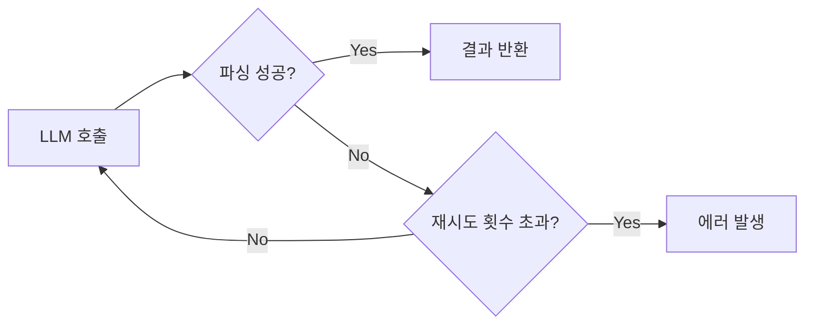

# Note 08. Structured Output

> 대응 노트북: `note_08_structured_output.ipynb`
> Phase 3 — 실전: 챗봇을 똑똑하게

---

## 학습 목표

- 프롬프트 기반 JSON 요청의 불안정성을 이해한다
- google-genai의 `response_mime_type`과 `response_schema`를 사용하여 JSON 출력을 강제할 수 있다
- LangChain의 `with_structured_output()`과 Pydantic(파이단틱) 모델을 활용하여 자동 파싱된 구조화 출력을 받을 수 있다
- Pydantic 모델을 설계하여 `Literal`, `Optional`, 중첩 모델 등 복잡한 구조화 출력을 정의할 수 있다
- 파싱 실패 시 `include_raw`를 활용한 디버깅과 재시도 패턴을 적용할 수 있다

---

## 핵심 개념

### 8.1 Structured Output(구조화 출력)이 필요한 이유

**한 줄 요약**: LLM 출력을 코드가 소비해야 할 때, 프롬프트만으로 JSON을 요청하는 방식은 불안정하다.

LLM의 출력을 사람이 읽는 것이 아니라 코드에서 파싱해야 하는 경우가 많다. API 서버에서 JSON 응답을 반환하거나, 분류 결과를 데이터베이스에 저장하거나, 추출된 정보를 다른 시스템에 전달하는 경우가 해당한다.

프롬프트에 "JSON으로 답해줘"라고 작성하면 모델이 JSON을 반환하더라도 다음과 같은 문제가 발생할 수 있다.

| 문제 | 예시 |
|------|------|
| Markdown(마크다운) 코드블록 래핑 | ` ```json {...} ``` ` |
| 자연어 혼합 | `다음은 결과입니다: {"title": ...}` |
| 키 이름 불일치 | `movie_title` vs `title` |
| 타입 불일치 | `rating: "9"` (문자열) vs `rating: 9` (정수) |
| 필드 누락 | `genre` 필드가 빠짐 |

이런 문제를 근본적으로 해결하는 것이 Structured Output이다. 출력이 사람이 아닌 코드가 소비한다면 Structured Output을 사용한다.

```python
# 프롬프트만으로 JSON 요청 — json.loads() 실패 가능
response = client.models.generate_content(
    model=MODEL,
    contents="영화 정보를 JSON 형식으로 알려줘",
)
data = json.loads(response.text)  # 마크다운 코드블록 등으로 파싱 실패
```

### 8.2 google-genai: response_mime_type

**한 줄 요약**: `response_mime_type="application/json"`을 설정하면 모델이 유효한 JSON만 출력하도록 강제된다.

google-genai SDK에서 `response_mime_type`을 `"application/json"`으로 설정하면, 모델은 마크다운 코드블록이나 자연어 없이 순수한 JSON 문자열만 반환한다. `json.loads()`가 항상 성공한다.

다만 `response_mime_type`만으로는 키 이름, 타입, 필수 필드를 보장할 수 없다. 모델이 유효한 JSON을 반환하지만, 구조(스키마)는 여전히 프롬프트에 의존한다. 동일한 프롬프트로 여러 번 호출하면 키 이름이 달라질 수 있다.

```python
response = client.models.generate_content(
    model=MODEL,
    contents=prompt,
    config={
        "response_mime_type": "application/json",
    },
)
data = json.loads(response.text)  # 항상 성공하지만, 스키마는 보장되지 않음
```

### 8.3 google-genai: response_schema

**한 줄 요약**: `response_schema`를 설정하면 모델이 정확히 해당 스키마에 맞는 JSON만 생성한다.

`response_schema`를 함께 사용하면 키 이름, 타입, 필수 필드까지 보장되는 Controlled Generation(제어 생성)이 가능하다. 스키마는 두 가지 방식으로 정의할 수 있다.

1. **JSON Schema(딕셔너리)**: `type`, `properties`, `required` 등을 직접 작성
2. **Pydantic 모델(클래스)**: Python 타입 힌트로 간결하게 정의

배열(리스트) 타입도 지원된다. `"type": "array"`와 `"items"`를 사용하면 여러 항목을 한 번에 구조화하여 받을 수 있다.

```python
# JSON Schema 방식
movie_schema = {
    "type": "object",
    "properties": {
        "title": {"type": "string"},
        "director": {"type": "string"},
        "year": {"type": "integer"},
        "rating": {"type": "number"},
    },
    "required": ["title", "director", "year", "rating"],
}

response = client.models.generate_content(
    model=MODEL,
    contents="인셉션 영화 정보를 알려줘",
    config={
        "response_mime_type": "application/json",
        "response_schema": movie_schema,
    },
)
data = json.loads(response.text)  # 스키마가 보장된 JSON
```

> google-genai SDK 최신 버전에서는 `response_json_schema` 파라미터도 지원된다. `response_schema`에 Pydantic 모델을 전달하거나, `response_json_schema`에 JSON Schema 딕셔너리를 전달할 수 있다. 파싱된 결과는 `response.parsed`로도 접근 가능하다.

### 8.4 Pydantic 모델로 스키마 정의

**한 줄 요약**: Pydantic의 `BaseModel`과 `Field`를 사용하면 JSON Schema를 직접 작성하는 것보다 간결하고 타입 안전하게 스키마를 정의할 수 있다.

Pydantic의 `BaseModel`을 상속한 클래스를 정의하고, `response_schema`에 직접 전달하면 된다. `Field(description=...)`을 사용하면 모델에게 각 필드의 의미를 알려줄 수 있다. description은 모델이 어떤 값을 채워야 하는지 판단하는 데 핵심적인 역할을 한다.

`Field` description 작성 시 다음 사항을 고려한다.

- 값의 범위를 명시: `"평점 (0.0~10.0)"` — 모델이 범위 내 값을 생성
- 단위를 명시: `"인구 수 (만 명 단위)"` — 숫자의 스케일이 일관됨
- 언어를 지정: `"한국어로 작성된 제목"` — 다국어 혼동 방지

description이 없으면 모델은 필드 이름만으로 추측한다. `year`는 비교적 명확하지만, `rating`은 5점 만점인지 10점 만점인지 알 수 없다.

```python
from pydantic import BaseModel, Field

class MovieDetailed(BaseModel):
    title: str = Field(description="영화의 한국어 제목")
    original_title: str = Field(description="영화의 원어 제목")
    director: str = Field(description="감독 이름")
    year: int = Field(description="개봉 연도 (4자리 숫자)")
    rating: float = Field(description="IMDb 기준 평점 (0.0~10.0)")
    summary: str = Field(description="영화 줄거리를 2문장 이내로 요약")

# Pydantic 모델을 response_schema에 직접 전달
response = client.models.generate_content(
    model=MODEL,
    contents="기생충 영화 정보를 알려줘",
    config={
        "response_mime_type": "application/json",
        "response_schema": MovieDetailed,
    },
)
movie = MovieDetailed.model_validate_json(response.text)  # Pydantic 인스턴스로 변환
```

### 8.5 LangChain: with_structured_output()

**한 줄 요약**: LangChain의 `with_structured_output()` 메서드에 Pydantic 모델을 전달하면, 반환값이 자동으로 Pydantic 인스턴스가 된다.

google-genai SDK에서는 `json.loads()` 또는 `model_validate_json()`으로 수동 파싱해야 하지만, LangChain은 이 과정을 자동화한다. `with_structured_output()`에 Pydantic 모델을 전달하면, `invoke()` 결과가 바로 Pydantic 인스턴스로 반환된다.

내부적으로 두 가지 메커니즘을 지원한다.

| method | 내부 동작 | 특징 |
|--------|---------|------|
| `"json_schema"` | Gemini의 `response_schema` 활용 | 더 안정적, Gemini 전용 |
| `"function_calling"` | Tool Calling 메커니즘 활용 | 범용적, 모든 LLM 지원 |

Gemini에서는 `"json_schema"`가 기본값이다. 여러 LLM 제공자를 지원해야 한다면 `"function_calling"`을 사용한다. 대부분의 경우 기본값을 그대로 사용하면 된다.

LCEL(LangChain Expression Language) 체인에서도 `with_structured_output`이 자연스럽게 동작한다. `prompt_template | llm.with_structured_output(Model)` 형태로 체인을 구성할 수 있다.

```python
from langchain_google_genai import ChatGoogleGenerativeAI

llm = ChatGoogleGenerativeAI(model=MODEL)
structured_llm = llm.with_structured_output(Movie)
result = structured_llm.invoke("매트릭스 영화 정보를 알려줘")
# result는 Movie 인스턴스 — 수동 파싱 불필요
```

```python
# LCEL 체인에서 사용
from langchain_core.prompts import ChatPromptTemplate

prompt_template = ChatPromptTemplate.from_messages([
    ("system", "당신은 영화 정보 전문가입니다."),
    ("human", "{movie_name} 영화 정보를 알려줘"),
])
chain = prompt_template | llm.with_structured_output(Movie)
result = chain.invoke({"movie_name": "쇼생크 탈출"})
```

### 8.6 Pydantic 모델 설계 심화: Literal과 Optional

**한 줄 요약**: `Literal`로 선택지를 제한하고, `Optional`로 정보가 불확실한 필드를 처리한다.

**Literal(선택지 제한)**: `Literal`을 사용하면 필드 값을 특정 선택지로 제한할 수 있다. 분류, 라벨링 작업에서 정확도가 크게 향상된다.

**Optional(선택적 필드)**: `Optional`을 사용하면 정보가 언급되지 않았을 때 모델이 `null`을 반환할 수 있다. `Optional`이 아니면 모델이 억지로 값을 만들 수 있다. 반드시 필요한 필드는 `Optional` 없이 required로 유지한다.

```python
from typing import Literal, Optional

class Sentiment(BaseModel):
    text: str = Field(description="분석 대상 텍스트")
    sentiment: Literal["positive", "negative", "neutral"] = Field(
        description="감성 분류 결과"
    )
    confidence: float = Field(description="확신도 (0.0~1.0)")

class PersonInfo(BaseModel):
    name: str = Field(description="사람 이름")
    age: Optional[int] = Field(default=None, description="나이 (언급되지 않으면 null)")
    job: Optional[str] = Field(default=None, description="직업 (언급되지 않으면 null)")
```

### 8.7 Pydantic 모델 설계 심화: 중첩 모델과 리스트

**한 줄 요약**: Pydantic 모델은 다른 모델을 필드로 포함할 수 있으며, 리스트 필드로 여러 항목을 구조화할 수 있다.

중첩은 2단계까지가 적절하다. 3단계 이상 깊어지면 모델의 출력 정확도가 떨어진다. `list[str]`의 경우 description에 "최대 N개"를 명시하지 않으면 모델이 0개 또는 수십 개를 반환할 수 있다.

| 실수 | 증상 | 해결 |
|------|------|------|
| `Field(description=...)` 누락 | 필드 값이 부정확하거나 일관성 없음 | 모든 필드에 description 추가 |
| 중첩 3단계 이상 | 모델이 깊은 필드를 빈 값으로 채움 | 2단계까지만 중첩, 나머지는 평면화 |
| `list[str]` 길이 미지정 | 0개 또는 수십 개 반환 | description에 "최대 N개" 명시 |
| `float` 범위 미지정 | 스케일 혼동 (0.8 vs 80) | description에 범위 명시 |
| `Optional` 남용 | 가능한 필드도 null로 반환 | 반드시 필요한 필드는 required 유지 |

```python
class Actor(BaseModel):
    name: str = Field(description="배우 이름")
    role: str = Field(description="극중 역할 이름")

class MovieFull(BaseModel):
    title: str = Field(description="영화 제목")
    year: int = Field(description="개봉 연도")
    genre: list[str] = Field(description="장르 리스트 (최대 3개)")
    actors: list[Actor] = Field(description="주요 배우 3명")
    rating: float = Field(description="평점 (0.0~10.0)")
```

### 8.8 include_raw와 실패 핸들링

**한 줄 요약**: `include_raw=True`를 설정하면 원본 응답, 파싱 결과, 파싱 에러를 함께 받아 디버깅과 재시도가 가능하다.

구조화 출력이 실패할 수 있다. 모델이 스키마를 완벽히 따르지 못하거나 네트워크 오류로 불완전한 응답이 도착하는 경우가 있다. `include_raw=True`를 설정하면 결과가 `{"raw": AIMessage, "parsed": PydanticModel, "parsing_error": None or Error}` 딕셔너리로 반환된다.

이 정보를 활용하면 파싱 실패 시 원본 응답을 로깅하고 재시도하는 패턴을 구현할 수 있다. LLM은 비결정적(Non-deterministic)이므로 같은 프롬프트에도 매번 다른 응답을 한다. 한 번 실패해도 재시도하면 성공할 수 있다. 재시도는 최대 2~3회로 제한하고, 재시도 실패 시 스키마를 단순화하는 것이 근본적 해결책이다.



```python
# include_raw=True로 디버깅 정보 확보
structured_raw = llm.with_structured_output(Movie, include_raw=True)
result = structured_raw.invoke("어벤져스 영화 정보를 알려줘")
# result["raw"]     → AIMessage 원본
# result["parsed"]  → Movie 인스턴스 (성공 시)
# result["parsing_error"] → None (성공 시) 또는 Error (실패 시)
```

```python
# 재시도 패턴
def invoke_with_retry(llm, prompt, max_retries=3):
    for attempt in range(max_retries):
        result = llm.with_structured_output(Movie, include_raw=True).invoke(prompt)
        if result["parsing_error"] is None:
            return result["parsed"]
        print(f"시도 {attempt + 1} 실패: {result['parsing_error']}")
    raise ValueError(f"{max_retries}회 재시도 후에도 파싱 실패")
```

### 8.9 Streaming(스트리밍) Structured Output

**한 줄 요약**: 구조화 출력도 스트리밍할 수 있으며, 각 청크는 부분적으로 채워지는 Pydantic 인스턴스로 반환된다.

LangChain의 `with_structured_output`에서 `.stream()`을 호출하면, 각 청크가 점진적으로 필드가 채워지는 인스턴스를 반환한다. UI에서 점진적으로 필드를 채워 보여줄 때 유용하다.

중간 청크는 불완전한 상태일 수 있다. 필드가 `None`이거나 부분 문자열인 경우가 있으므로 `None` 체크가 필요하다. 최종 결과는 마지막 청크에서 얻어야 한다.

```python
structured_stream = llm.with_structured_output(Movie)

final = None
for chunk in structured_stream.stream("반지의 제왕 영화 정보를 알려줘"):
    if chunk is None:
        continue
    final = chunk  # 마지막 청크가 최종 결과
```

### 8.10 google-genai vs LangChain 비교

**한 줄 요약**: google-genai는 직접적이고 빠르며, LangChain은 자동 파싱과 모델 교체 유연성을 제공한다.

| 항목 | google-genai | LangChain |
|------|-------------|----------|
| 스키마 정의 | `response_schema` (JSON Schema 또는 Pydantic) | `with_structured_output(Pydantic)` |
| 반환 타입 | JSON 문자열 — 수동 파싱 필요 | 자동으로 Pydantic 인스턴스 |
| 실패 핸들링 | 직접 `try`/`except` | `include_raw=True` |
| 스트리밍 | JSON 청크 직접 처리 | 부분 인스턴스 자동 생성 |
| 모델 교체 | Gemini 전용 | 모든 LLM 호환 |

선택 기준은 다음과 같다.

- **빠른 프로토타이핑**: google-genai가 더 직접적 (`response_schema`만 설정)
- **프로덕션 서비스**: LangChain이 더 편리 (자동 파싱, `include_raw`, 재시도)
- **모델 교체 가능성**: LangChain 권장 (인터페이스 통일)
- **성능 최적화**: google-genai가 약간 유리 (래핑 오버헤드 없음)

```python
# google-genai 방식 — 수동 파싱
resp = client.models.generate_content(
    model=MODEL, contents=prompt,
    config={"response_mime_type": "application/json", "response_schema": Movie},
)
movie = Movie.model_validate_json(resp.text)

# LangChain 방식 — 자동 파싱
movie = llm.with_structured_output(Movie).invoke(prompt)
```

---

## 장단점

| 장점 | 단점 |
|------|------|
| JSON 구문이 항상 유효하여 `json.loads()` 실패가 없다 | 자유 텍스트 대비 출력 생성 속도가 약간 느릴 수 있다 |
| 스키마로 키 이름, 타입, 필수 필드를 보장한다 | 스키마가 복잡해지면 (3단계 이상 중첩) 모델 정확도가 떨어진다 |
| Pydantic 모델로 타입 안전한 데이터를 바로 활용할 수 있다 | 창작, 번역 등 자유 텍스트 작업에는 적합하지 않다 |
| `Literal`로 분류 정확도를 크게 향상시킬 수 있다 | `Optional` 남용 시 모델이 가능한 필드도 null로 반환할 수 있다 |
| LangChain의 `with_structured_output`으로 자동 파싱이 가능하다 | `Field(description=...)`을 누락하면 필드 값의 일관성이 떨어진다 |

---

## 핵심 정리

| 개념 | 핵심 포인트 |
|------|------------|
| Structured Output | LLM 출력을 코드가 소비할 때 사용. 프롬프트 기반 JSON 요청은 불안정 |
| `response_mime_type` | `"application/json"` 설정으로 유효한 JSON 강제. 스키마는 보장하지 않음 |
| `response_schema` | JSON Schema 또는 Pydantic 모델로 키 이름, 타입, 필수 필드까지 보장 (제어 생성) |
| Pydantic `BaseModel` | 타입 힌트 기반 스키마 정의. `model_validate_json()`으로 인스턴스 변환 |
| `Field(description=...)` | 모델에게 필드의 의미, 범위, 단위, 언어를 알려주는 핵심 수단 |
| `with_structured_output()` | LangChain 메서드. Pydantic 모델 전달 시 자동 파싱된 인스턴스 반환 |
| method: `json_schema` vs `function_calling` | Gemini 제어 생성 vs Tool Calling 메커니즘. Gemini에서는 `json_schema`가 기본 |
| `Literal` | 필드 값을 특정 선택지로 제한. 분류/라벨링 정확도 향상 |
| `Optional` | 정보가 불확실할 때 null 허용. 남용 시 불필요한 null 반환 주의 |
| 중첩 모델 | 2단계까지 적절. 3단계 이상은 정확도 저하 |
| `include_raw=True` | 원본 AIMessage + 파싱 결과 + 에러를 함께 반환. 디버깅과 재시도에 활용 |
| 스트리밍 Structured Output | 부분적으로 채워지는 Pydantic 인스턴스를 청크 단위로 수신 |

---

## 참고 자료

- [Structured outputs - Gemini API 공식 문서](https://ai.google.dev/gemini-api/docs/structured-output) — google-genai의 `response_schema`, `response_mime_type`, 제어 생성 가이드
- [Google Gen AI Python SDK](https://googleapis.github.io/python-genai/) — google-genai Python SDK 공식 문서, `GenerateContentConfig` 레퍼런스
- [Structured output - LangChain 공식 문서](https://docs.langchain.com/oss/python/langchain/structured-output) — `with_structured_output()` 메서드, `include_raw`, method 옵션 가이드
- [ChatGoogleGenerativeAI - LangChain 통합 문서](https://docs.langchain.com/oss/python/integrations/chat/google_generative_ai) — Gemini 모델에서의 `with_structured_output` 사용법
- [Models - Pydantic 공식 문서](https://docs.pydantic.dev/latest/concepts/models/) — `BaseModel`, 중첩 모델, `model_validate_json()` 레퍼런스
- [Fields - Pydantic 공식 문서](https://docs.pydantic.dev/latest/concepts/fields/) — `Field`, `description`, `default`, 유효성 검증 옵션 레퍼런스
- [Gemini API Structured Outputs 발표 블로그](https://blog.google/technology/developers/gemini-api-structured-outputs/) — JSON Schema 지원, 암묵적 속성 순서 등 최신 기능 소개
