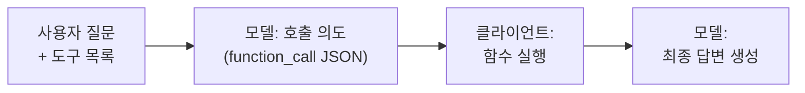
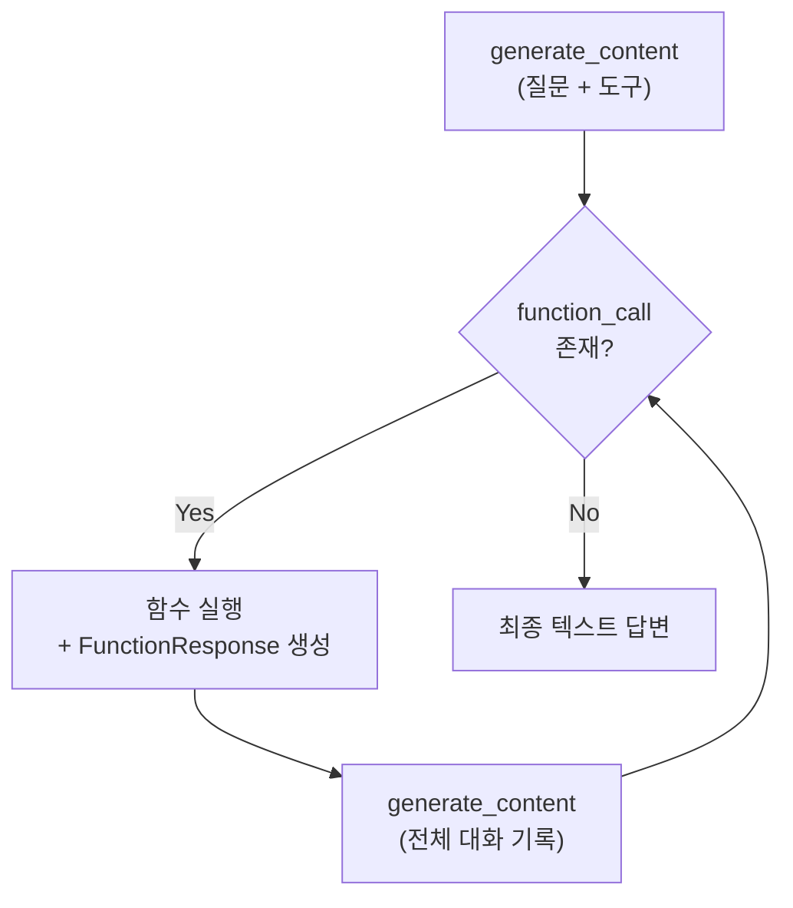
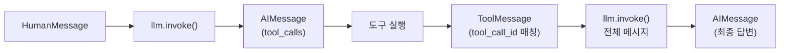
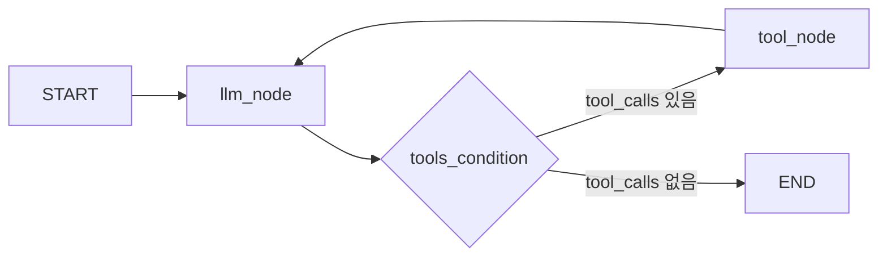
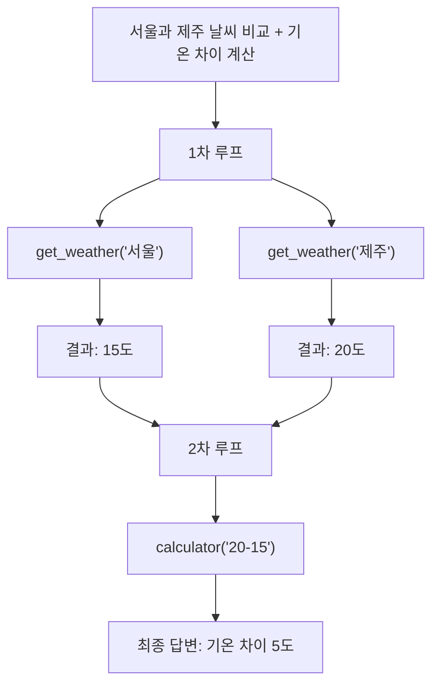

# Note 09. Tool Calling

> 대응 노트북: `note_09_tool_calling.ipynb`
> Phase 3 — 실전: 챗봇을 똑똑하게

---

## 학습 목표

- Tool Calling의 본질(의도 표현 → 함수 실행 → 결과 주입 → 답변 생성)인 4단계 루프를 이해한다
- google-genai에서 FunctionDeclaration을 사용한 수동 Function Calling과 파이썬 함수를 직접 전달하는 자동 Function Calling을 구현할 수 있다
- LangChain의 `@tool` 데코레이터, `bind_tools()`, `ToolMessage` 패턴으로 도구 호출 루프를 구현할 수 있다
- LangGraph의 `ToolNode`와 `tools_condition`을 사용하여 자동화된 도구 실행 그래프를 구성할 수 있다
- 다중 도구 바인딩, 병렬 호출, 도구 설명(description) 품질이 모델 동작에 미치는 영향을 이해한다

---

## 핵심 개념

### 9.1 Tool Calling의 본질

**한 줄 요약**: LLM이 함수를 직접 실행하지 않고 "호출 의도"만 JSON으로 출력하면, 클라이언트가 실행 후 결과를 다시 모델에 전달하는 4단계 루프이다.

LLM은 실시간 데이터 검색, 정확한 수학 계산, 외부 API 호출 등을 자체적으로 수행할 수 없다. Tool Calling은 이 한계를 극복하는 메커니즘으로, 모델에게 사용 가능한 도구 목록을 알려주고 모델이 필요한 도구의 호출 의도를 표현하도록 한다.

핵심 루프는 4단계로 구성된다.

1. 사용자 질문과 함께 도구 목록을 모델에 전달한다
2. 모델이 "이 함수를 이 인자로 호출해야 한다"는 의도를 JSON 형태로 출력한다
3. 클라이언트(개발자 코드)가 실제 함수를 실행하고 결과를 모델에 다시 전달한다
4. 모델이 함수 결과를 바탕으로 최종 답변을 생성한다

모델은 함수를 직접 실행하지 않는다. "이 함수를 호출하세요"라는 요청만 한다. 이 설계는 보안(개발자가 실행 전 인자를 검증), 유연성(어떤 함수든 연결 가능), 비용(불필요한 호출 방지) 측면에서 이점을 제공한다.

| 상황 | Tool Calling 없이 | Tool Calling 있으면 |
|------|------------------|-------------------|
| "서울 날씨 알려줘" | 학습 데이터 기반 추측 | `get_weather("서울")` → 실시간 데이터 → 정확한 답변 |
| "127 x 389는?" | 근사값 (오류 가능) | `calculator("127*389")` → 49403 (정확한 결과) |
| "이메일 보내줘" | 실행 불가 | `send_email(to=..., body=...)` → 실제 발송 |



### 9.2 google-genai: FunctionDeclaration

**한 줄 요약**: `types.FunctionDeclaration`으로 도구의 이름, 설명, 파라미터를 JSON Schema 형식으로 정의하고, `types.Tool`로 감싸서 모델에 전달한다.

google-genai SDK에서 도구를 정의하려면 `FunctionDeclaration`을 사용한다. 도구의 이름(`name`), 설명(`description`), 파라미터 스키마(`parameters`)를 명시적으로 선언한다. 여러 개의 `FunctionDeclaration`을 하나의 `types.Tool` 객체로 묶어 모델에 전달할 수 있다.

```python
from google.genai import types

get_weather_func = types.FunctionDeclaration(
    name="get_weather",
    description="지정된 도시의 현재 날씨를 조회합니다",
    parameters={
        "type": "object",
        "properties": {
            "city": {"type": "string", "description": "도시 이름"},
        },
        "required": ["city"],
    },
)

# 여러 도구를 Tool 객체로 감싸기
tools = types.Tool(function_declarations=[get_weather_func, calculator_func])
```

### 9.3 google-genai: 수동 Function Calling

**한 줄 요약**: 4단계 루프를 개발자가 직접 구현하여 함수 호출 전 인자 검증, 로깅, 에러 처리 등 세밀한 제어를 수행하는 방식이다.

수동 Function Calling은 모델 응답에서 `function_call`을 파싱하고, 해당 함수를 실행한 뒤, `Part.from_function_response()`로 결과를 감싸서 모델에 다시 전달하는 과정을 모두 개발자가 직접 작성한다.

1단계에서 모델에 도구와 함께 질문을 전달하면, 2단계에서 모델은 `response.candidates[0].content.parts`에 `function_call`을 포함한 응답을 반환한다. 3단계에서 해당 함수를 실행하고 `FunctionResponse`를 생성한다. 4단계에서 전체 대화 기록(사용자 질문, 모델의 function_call 응답, 함수 실행 결과)을 모델에 전달하여 최종 답변을 받는다.

코드가 길어지고 루프를 직접 관리해야 하는 단점이 있지만, 함수 실행 전 인자 검증, 결과 가공, 에러 처리 등 세밀한 제어가 필요한 경우 적합하다.

```python
# 1단계: 모델에 도구와 함께 질문 전달
response = client.models.generate_content(
    model=MODEL, contents="서울 날씨 알려줘",
    config=types.GenerateContentConfig(tools=[tools]),
)

# 2단계: function_call 파싱
fc = response.candidates[0].content.parts[0].function_call

# 3단계: 함수 실행 + FunctionResponse 생성
func_result = available_functions[fc.name](**dict(fc.args))
function_response = types.Part.from_function_response(
    name=fc.name, response=func_result,
)

# 4단계: 전체 대화 기록으로 최종 답변 요청
final_response = client.models.generate_content(
    model=MODEL,
    contents=[
        types.Content(role="user", parts=[types.Part.from_text(text="서울 날씨 알려줘")]),
        response.candidates[0].content,              # 모델의 function_call 응답
        types.Content(role="user", parts=[function_response]),  # 함수 실행 결과
    ],
    config=types.GenerateContentConfig(tools=[tools]),
)
```



### 9.4 google-genai: 자동 Function Calling

**한 줄 요약**: 파이썬 함수를 `tools` 매개변수에 직접 전달하면 SDK가 스키마 추출, function_call 파싱, 함수 실행, 결과 주입을 자동으로 수행한다.

자동 Function Calling에서는 `FunctionDeclaration`을 별도로 작성할 필요 없이 파이썬 함수를 그대로 전달한다. SDK가 함수의 이름, docstring, 타입 힌트를 분석하여 자동으로 `FunctionDeclaration`을 생성한다. 따라서 함수의 docstring과 타입 힌트가 정확해야 한다.

자동 Function Calling은 최대 10회 루프를 수행하며 무한 루프를 방지한다. `AutomaticFunctionCallingConfig(disable=True)`를 설정하면 자동 실행을 비활성화하고 수동으로 처리할 수도 있다.

```python
def get_weather_auto(city: str) -> dict:
    """지정된 도시의 현재 날씨 정보를 조회합니다.

    Args:
        city: 도시 이름 (예: 서울, 부산, 제주)

    Returns:
        온도, 날씨 상태, 습도를 포함하는 딕셔너리
    """
    return weather_data.get(city, {"temp": 0, "condition": "알 수 없음"})

# 함수를 직접 tools에 전달 — SDK가 나머지를 자동 처리
response = client.models.generate_content(
    model=MODEL, contents="부산 날씨 알려줘",
    config=types.GenerateContentConfig(tools=[get_weather_auto]),
)
```

수동과 자동의 선택 기준은 다음과 같다.

- **자동**: 빠른 프로토타이핑, 간단한 도구, 인자 검증이 불필요한 경우
- **수동**: 인자 검증, 로깅, 에러 처리, 사용자 확인이 필요한 경우 (예: 결제 API)

### 9.5 LangChain: @tool 데코레이터

**한 줄 요약**: `@tool` 데코레이터를 함수에 적용하면 함수의 이름, docstring, 타입 힌트가 자동으로 도구의 name, description, args_schema로 변환된다.

LangChain에서 도구를 정의하는 표준 방식은 `@tool` 데코레이터이다. 데코레이터가 적용된 함수는 `BaseTool` 인스턴스가 되어 `name`, `description`, `args_schema` 속성을 자동으로 갖게 된다.

`@tool` 데코레이터 규칙은 다음과 같다.

- 함수 이름이 도구의 `name`이 된다
- docstring 첫 줄이 도구의 `description`이 된다
- 타입 힌트가 파라미터 스키마로 변환된다
- 반환 타입은 `str`을 권장한다 (JSON 문자열로 반환하면 모델이 파싱하기 쉬움)

복잡한 파라미터가 필요한 경우 Pydantic `BaseModel`을 `args_schema`로 지정하여 각 파라미터에 `Field(description=...)`을 추가할 수 있다.

```python
from langchain_core.tools import tool

@tool
def get_weather_lc(city: str) -> str:
    """지정된 도시의 현재 날씨 정보를 조회합니다."""
    return json.dumps(data, ensure_ascii=False)

# Pydantic으로 상세한 파라미터 정의
from pydantic import BaseModel, Field

class HotelSearchInput(BaseModel):
    city: str = Field(description="검색할 도시 이름")
    budget: int = Field(description="1박 예산 (원 단위)")
    stars: int = Field(default=3, description="최소 별점 (1~5)")

@tool(args_schema=HotelSearchInput)
def search_hotel(city: str, budget: int, stars: int = 3) -> str:
    """도시에서 예산에 맞는 호텔을 검색합니다."""
    ...
```

### 9.6 LangChain: bind_tools + ToolMessage 루프

**한 줄 요약**: `bind_tools()`로 모델에 도구를 바인딩하면 `AIMessage.tool_calls`에 호출 의도가 담기고, 개발자가 함수를 실행한 결과를 `ToolMessage`로 모델에 다시 전달한다.

`llm.bind_tools([도구 리스트])`를 호출하면 도구가 바인딩된 모델 인스턴스가 반환된다. 이 모델을 호출하면 도구가 필요할 때 `AIMessage.tool_calls`에 호출 의도를 담아 반환한다.

`tool_calls`는 `name`(도구 이름), `args`(인자), `id`(고유 ID)로 구성된 딕셔너리 리스트이다. 개발자는 이 정보를 파싱하여 해당 함수를 실행하고, 결과를 `ToolMessage`로 감싸서 모델에 전달한다.

`ToolMessage`의 `tool_call_id`는 반드시 원래 `tool_call`의 `id`와 일치해야 한다. 일치하지 않으면 모델이 어떤 호출에 대한 결과인지 매칭할 수 없어 오류가 발생한다.

```python
from langchain_core.messages import HumanMessage, ToolMessage

# 1단계: 모델에 도구 바인딩
llm_with_tools = llm.bind_tools([get_weather_lc, calculator_lc])

# 2단계: 모델 호출 — tool_calls가 포함된 AIMessage 반환
ai_message = llm_with_tools.invoke("제주 날씨 알려줘")

# 3단계: 도구 실행 + ToolMessage 생성
for tc in ai_message.tool_calls:
    result = tool_map[tc["name"]].invoke(tc["args"])
    tool_msg = ToolMessage(content=result, tool_call_id=tc["id"])  # id 매칭 필수

# 4단계: 전체 메시지 리스트로 최종 답변 요청
messages = [HumanMessage(content="제주 날씨 알려줘"), ai_message, *tool_messages]
final = llm_with_tools.invoke(messages)
```



### 9.7 LangGraph: ToolNode와 조건부 엣지

**한 줄 요약**: `ToolNode`는 `AIMessage.tool_calls`를 자동으로 파싱하여 도구를 실행하고, `tools_condition`은 tool_calls 유무에 따라 도구 노드 또는 종료로 분기한다.

LangChain의 수동 루프를 그래프 구조로 자동화한 것이 LangGraph의 `ToolNode`이다. `ToolNode`는 `AIMessage.tool_calls`에서 도구 이름과 인자를 파싱하고, 해당 도구를 실행하며, 결과를 `ToolMessage`로 감싸서 반환하는 과정을 자동으로 처리한다. 복수의 tool_calls가 있으면 병렬로 실행한다.

`tools_condition`은 조건부 엣지 함수로, 마지막 메시지에 `tool_calls`가 있으면 `"tools"` 노드로, 없으면 `END`로 라우팅한다. 이 패턴으로 LLM과 도구 실행 사이의 반복 루프를 자동으로 구성할 수 있다.

`MemorySaver` 같은 Checkpointer(체크포인터)를 추가하면 도구 호출 이력을 포함한 전체 대화 상태가 유지되어, "아까 검색한 결과에서..."와 같은 후속 질문에 정확히 답할 수 있다.

```python
from langgraph.prebuilt import ToolNode, tools_condition
from langgraph.graph import StateGraph, MessagesState, START, END

# 그래프 구성
graph_builder = StateGraph(MessagesState)
graph_builder.add_node("llm", llm_node)
graph_builder.add_node("tools", ToolNode([get_weather_lc, calculator_lc]))

graph_builder.add_edge(START, "llm")
graph_builder.add_conditional_edges("llm", tools_condition)  # tool_calls → tools, 없으면 → END
graph_builder.add_edge("tools", "llm")  # 도구 실행 후 다시 LLM으로

graph = graph_builder.compile()
```



도구가 바인딩되어 있어도 모델이 도구 없이 답변할 수 있다고 판단하면 `tool_calls` 없이 직접 텍스트를 반환한다. 이 판단은 도구의 description과 사용자 질문의 의미적 유사도에 기반한다.

### 9.8 다중 도구와 병렬 호출

**한 줄 요약**: 모델은 한 번의 응답에서 여러 도구를 동시에 호출할 수 있으며, ToolNode는 병렬 도착한 tool_calls를 모두 실행한 뒤 결과를 한 번에 반환한다.

모델은 질문의 요구사항에 따라 같은 도구를 서로 다른 인자로 여러 번 호출하거나, 서로 다른 도구를 동시에 호출할 수 있다. "서울과 부산 날씨를 비교해줘"라는 질문에 대해 `get_weather("서울")`과 `get_weather("부산")`을 하나의 `AIMessage`에 2개의 `tool_calls`로 동시에 요청한다.

병렬 호출의 이점은 다음과 같다.

- 네트워크 요청이 필요한 도구를 동시에 실행하면 응답 시간이 단축된다
- ToolNode는 병렬로 도착한 tool_calls를 모두 실행한 뒤 결과를 한 번에 반환한다

단, 도구 간 의존성(A의 결과가 B의 입력)이 있으면 모델이 순차적으로 호출한다. 예를 들어 "서울과 제주 기온 차이를 계산해줘"는 먼저 두 도시 날씨를 병렬 조회한 후, 결과를 바탕으로 계산기 도구를 순차 호출한다.



### 9.9 도구 설명(description)의 중요성

**한 줄 요약**: 모델이 어떤 도구를 선택할지는 description에 달려 있으며, 부정확한 설명은 잘못된 도구 선택이나 도구 미사용으로 이어진다.

도구의 description은 모델이 도구를 선택하는 유일한 근거이다. 모호한 설명("도구입니다")은 모델이 해당 도구의 용도를 판단할 수 없어 호출하지 않는 원인이 된다.

좋은 도구 description 작성 원칙은 다음과 같다.

- **무엇을 하는지** 명확히 작성: "날씨를 조회합니다" (O), "도구입니다" (X)
- **입력 조건**을 명시: "한국 도시만 지원" → 모델이 부적절한 인자를 넣지 않음
- **반환값**을 설명: "온도, 상태, 습도를 포함하는 JSON" → 모델이 후처리 계획을 수립
- **제한사항**을 명시: "최대 10개 결과" → 모델이 기대치를 조절

도구가 10개 이상이면 모델의 도구 선택 정확도가 떨어질 수 있다. 이 경우 도구를 카테고리별로 그룹화하거나, 질문에 따라 관련 도구만 동적으로 바인딩하는 전략이 필요하다.

### 9.10 google-genai vs LangChain vs LangGraph 비교

**한 줄 요약**: 원리 학습에는 google-genai 수동, 프로토타이핑에는 google-genai 자동, 커스텀 로직에는 LangChain, 프로덕션 에이전트에는 LangGraph가 적합하다.

| 항목 | google-genai (수동) | google-genai (자동) | LangChain | LangGraph |
|------|-------------------|-------------------|-----------|----------|
| 도구 정의 | FunctionDeclaration | 파이썬 함수 | @tool | @tool |
| 루프 관리 | 직접 구현 | SDK 자동 | 직접 구현 | 그래프 자동 |
| 상태 관리 | contents 리스트 | SDK 내부 | messages 리스트 | MessagesState |
| 병렬 호출 | 직접 파싱 | 자동 | 직접 파싱 | ToolNode 자동 |
| 확장성 | 낮음 | 중간 | 중간 | 높음 |
| 적합한 경우 | 원리 학습 | 빠른 프로토타입 | 커스텀 로직 | 프로덕션 에이전트 |

google-genai 수동 방식은 4단계 루프의 동작 원리를 이해하는 데 적합하고, LangGraph는 ToolNode, tools_condition, Checkpointer를 결합하여 상태 관리, 병렬 실행, 대화 이력 유지까지 자동으로 처리하므로 프로덕션 에이전트에 적합하다.

---

## 장단점

| 장점 | 단점 |
|------|------|
| LLM의 지식 한계(실시간 데이터)와 실행 능력 부재(계산, API)를 동시에 해결 | 도구 정의와 description 작성에 추가 설계 비용 발생 |
| 모델이 함수를 직접 실행하지 않아 보안성 확보 (인자 검증 가능) | 도구 수가 많아지면 모델의 선택 정확도 저하 |
| 병렬 호출로 여러 도구를 동시에 실행하여 응답 시간 단축 | 도구 간 의존성이 있으면 순차 호출이 필요하여 루프 횟수 증가 |
| LangGraph ToolNode로 루프 관리를 자동화하여 코드 복잡도 감소 | 자동 Function Calling은 세밀한 에러 처리, 인자 검증이 어려움 |
| 도구의 description만으로 모델이 상황에 맞는 도구를 자율적으로 선택 | description 품질이 낮으면 도구를 호출하지 않거나 잘못된 도구를 선택 |

---

## 핵심 정리

| 개념 | 핵심 포인트 |
|------|------------|
| Tool Calling 4단계 루프 | 질문+도구 전달 → 모델이 호출 의도 JSON 출력 → 클라이언트가 함수 실행 → 결과로 최종 답변 생성 |
| FunctionDeclaration | google-genai에서 name, description, parameters(JSON Schema)로 도구를 명시적으로 선언 |
| 수동 Function Calling | 4단계를 직접 구현. `Part.from_function_response()`로 결과 전달. 세밀한 제어 가능 |
| 자동 Function Calling | 파이썬 함수를 직접 전달. SDK가 스키마 추출~결과 주입까지 자동 처리. 최대 10회 루프 |
| @tool 데코레이터 | 함수 이름→name, docstring→description, 타입 힌트→args_schema 자동 변환 |
| bind_tools + ToolMessage | `AIMessage.tool_calls`로 호출 의도 수신, `ToolMessage(tool_call_id=tc["id"])`로 결과 전달. ID 매칭 필수 |
| ToolNode | tool_calls 파싱, 도구 실행, ToolMessage 반환을 자동 처리. 병렬 실행 지원 |
| tools_condition | tool_calls 유무로 분기: 있으면 도구 노드, 없으면 END |
| 병렬 호출 | 모델이 하나의 응답에서 여러 tool_calls를 동시에 생성. ToolNode가 병렬 실행 |
| description 품질 | 도구 선택의 유일한 근거. 기능, 입력 조건, 반환값, 제한사항을 명확히 작성 |

---

## 참고 자료

- [Function calling with the Gemini API](https://ai.google.dev/gemini-api/docs/function-calling) — Gemini API 공식 Function Calling 가이드: FunctionDeclaration, 자동/수동 호출, 병렬 호출
- [Google Gen AI Python SDK](https://github.com/googleapis/python-genai) — google-genai 공식 리포지토리: 자동 Function Calling, FunctionDeclaration 사용법
- [LangChain Tools 문서](https://docs.langchain.com/oss/python/langchain/tools) — LangChain 공식 도구 정의 가이드: @tool 데코레이터, bind_tools, ToolMessage
- [Tool Calling with LangChain (블로그)](https://blog.langchain.com/tool-calling-with-langchain/) — LangChain 공식 블로그: tool_calls 표준 인터페이스 소개
- [LangGraph ToolNode 소스](https://github.com/langchain-ai/langgraph/blob/main/libs/prebuilt/langgraph/prebuilt/tool_node.py) — LangGraph 공식 리포지토리: ToolNode, tools_condition 구현
- [Function Calling Tutorial (Gemini API)](https://ai.google.dev/gemini-api/docs/function-calling/tutorial) — Gemini API 공식 튜토리얼: FunctionDeclaration 정의부터 최종 답변까지 단계별 구현
