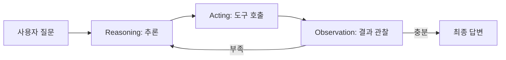
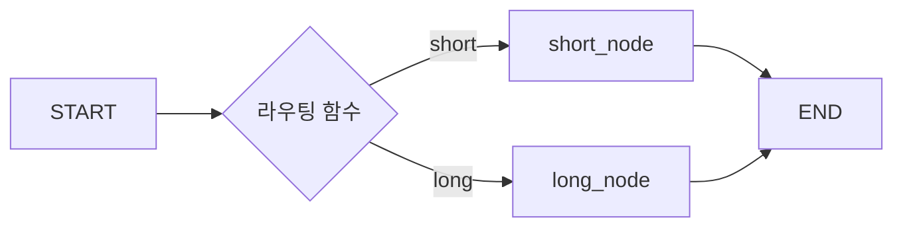
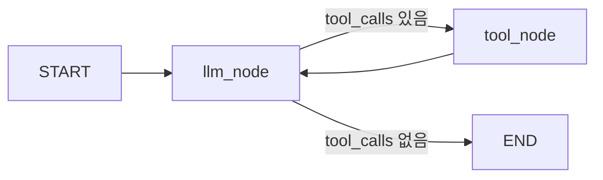
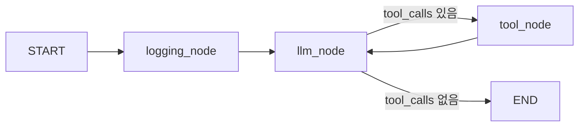

# Note 11. ReAct Agent

> 대응 노트북: `note_11_react_agent.ipynb`
> Phase 3 — 실전: 챗봇을 똑똑하게

---

## 학습 목표

- ReAct(Reasoning + Acting) 패턴의 원리와 동작 흐름을 이해한다
- LangGraph의 StateGraph, Node, Edge, State 구조를 활용할 수 있다
- `tools_condition`을 사용한 조건부 분기로 ReAct 루프를 구현할 수 있다
- Checkpointer(MemorySaver, SqliteSaver)를 통해 대화 상태를 영속화할 수 있다
- 커스텀 노드를 추가하여 에이전트 그래프를 확장할 수 있다

---

## 핵심 개념

### 11.1 ReAct 패턴

**한 줄 요약**: ReAct는 LLM이 추론(Reasoning)과 행동(Acting)을 반복하며 답변을 완성하는 에이전트 패턴이다.

ReAct는 Yao et al.(2022)이 제안한 패턴으로, 모델이 다음 세 단계를 반복한다.

1. **Reasoning**: 현재 상태를 분석하고 다음 행동을 추론한다.
2. **Acting**: 추론 결과에 따라 도구를 호출한다.
3. **Observation**: 도구 실행 결과를 관찰하고, 충분하면 최종 답변을 생성한다. 부족하면 1단계로 돌아간다.

노트북 9의 Tool Calling은 도구를 1회 또는 병렬 1회 호출하고 끝나는 단순 루프였다. ReAct는 필요할 때까지 도구 호출을 반복하며, 조건부 엣지로 분기하고, StateGraph가 상태를 자동 관리한다는 점에서 다르다.

| 구분 | Tool Calling (노트북 9) | ReAct (노트북 11) |
|------|----------------------|-------------------|
| 도구 호출 | 1회 또는 병렬 1회 | 필요할 때까지 반복 |
| 분기 로직 | 없음 | 조건부 엣지로 분기 |
| 상태 관리 | messages 리스트 수동 관리 | StateGraph 자동 관리 |
| 확장성 | 단일 루프 | 노드 추가로 유연하게 확장 |



### 11.2 LangGraph StateGraph 기초

**한 줄 요약**: StateGraph는 State, Node, Edge 세 구성 요소로 에이전트의 실행 흐름을 정의하는 LangGraph의 핵심 클래스이다.

LangGraph에서 에이전트는 그래프로 표현된다. 그래프는 세 가지 구성 요소로 이루어진다.

| 구성 요소 | 역할 | 예시 |
|-----------|------|------|
| **State** | 그래프 전체에서 공유하는 데이터 | `{"messages": [...]}` |
| **Node** | 상태를 받아 처리하고 변경분을 반환하는 함수 | `llm_node`, `tool_node` |
| **Edge** | 노드 간 연결 (무조건 엣지 / 조건부 엣지) | `llm -> tools` 또는 `llm -> END` |

StateGraph는 빌더 클래스이므로 직접 실행할 수 없다. `compile()`을 호출하여 실행 가능한 그래프 객체를 생성한 후 `invoke()`, `stream()` 등의 메서드를 사용한다.

노드 함수는 `state`를 받아서 **변경할 부분만** 반환한다. `{"messages": [new_msg]}`를 반환하면, reducer 함수가 기존 리스트에 새 메시지를 추가한다.

```python
from langgraph.graph import StateGraph, MessagesState, START, END

# 그래프 정의
builder = StateGraph(MessagesState)
builder.add_node("llm", llm_func)     # 노드 추가
builder.add_edge(START, "llm")         # 무조건 엣지
builder.add_edge("llm", END)

graph = builder.compile()              # 컴파일 후 실행 가능
result = graph.invoke({"messages": [HumanMessage(content="안녕")]})
```

### 11.3 MessagesState와 커스텀 State

**한 줄 요약**: MessagesState는 LangGraph가 제공하는 기본 상태 클래스이며, 추가 필드가 필요하면 TypedDict로 커스텀 State를 정의한다.

`MessagesState`는 `messages` 필드 하나를 가진 기본 상태 클래스이다. 내부적으로 `add_messages` reducer를 사용하여, 노드가 반환한 메시지를 기존 리스트에 **추가**(덮어쓰지 않음)한다.

```python
class MessagesState(TypedDict):
    messages: Annotated[list[AnyMessage], add_messages]
```

추가 필드가 필요하면 `TypedDict`로 커스텀 상태를 정의한다. `messages` 필드는 반드시 `Annotated[list[AnyMessage], add_messages]`로 정의해야 LangGraph가 메시지를 올바르게 누적한다. 다른 필드는 일반 타입으로 정의하며, 반환 시 값을 덮어쓴다.

```python
from typing import Annotated, TypedDict
from langgraph.graph.message import add_messages
from langchain_core.messages import AnyMessage

class ChatState(TypedDict):
    messages: Annotated[list[AnyMessage], add_messages]  # reducer: 누적
    turn_count: int       # overwrite: 덮어쓰기
    user_name: str        # overwrite: 덮어쓰기
```

State 채널은 세 가지 유형이 있다.

| 유형 | 정의 방식 | 동작 | 예시 |
|------|----------|------|------|
| **Reducer** | `Annotated[T, func]` | 함수가 이전값과 새 값을 결합 | `messages` (`add_messages`) |
| **Overwrite** | `T` (일반 타입) | 새 값이 이전 값을 덮어씀 | `turn_count: int` |
| **Default** | `T = default_value` | 초기값 지정 가능 | `mode: str = "normal"` |

`add_messages`에서 같은 `id`를 가진 메시지를 반환하면 추가 대신 **교체**한다. 이를 활용하면 이전 메시지를 수정하거나 요약으로 대체할 수 있다.

### 11.4 조건부 엣지(Conditional Edge)

**한 줄 요약**: `add_conditional_edges()`는 라우팅 함수의 반환값에 따라 다음 노드를 동적으로 결정하는 분기 메커니즘이다.

무조건 엣지(`add_edge`)는 항상 같은 노드로 이동한다. 조건부 엣지(`add_conditional_edges`)는 라우팅 함수를 실행하여 그 반환값에 따라 다른 노드로 분기한다. ReAct 패턴에서 "도구 호출이 있으면 tool_node로, 없으면 END로" 분기하는 것이 대표적인 사용 사례이다.

라우팅 함수는 현재 상태를 받아 다음 노드의 이름(문자열)을 반환한다.

```python
def route_by_length(state: MessagesState):
    """메시지 길이에 따라 분기한다."""
    last_msg = state["messages"][-1].content
    if len(last_msg) > 20:
        return "long"
    return "short"

builder.add_conditional_edges(START, route_by_length)
```



### 11.5 ReAct 에이전트 구현

**한 줄 요약**: `llm_node`와 `ToolNode`를 `tools_condition` 조건부 엣지로 연결하면 ReAct 루프가 완성된다.

ReAct 에이전트의 그래프 구조는 다음과 같다.

1. `START`에서 `llm_node`로 진입한다.
2. `llm_node`가 LLM을 호출한다. LLM은 도구가 필요하면 `tool_calls`를 포함한 AIMessage를 반환하고, 불필요하면 텍스트만 반환한다.
3. `tools_condition`이 마지막 AIMessage의 `tool_calls`를 검사한다. 있으면 `"tools"` 노드로, 없으면 `END`로 분기한다.
4. `ToolNode`가 도구를 실행하고 결과를 ToolMessage로 반환한다.
5. `tools` 노드 실행 후 다시 `llm_node`로 돌아간다 (루프).

이 루프가 ReAct 패턴의 핵심이다. 도구가 바인딩되어 있어도, 모델이 도구 없이 답변 가능하다고 판단하면 `tool_calls` 없이 텍스트를 직접 반환하여 `END`로 분기한다.

```python
from langgraph.prebuilt import ToolNode, tools_condition

def llm_node(state: MessagesState):
    response = llm_with_tools.invoke(state["messages"])
    return {"messages": [response]}

builder = StateGraph(MessagesState)
builder.add_node("llm", llm_node)
builder.add_node("tools", ToolNode(tools))

builder.add_edge(START, "llm")
builder.add_conditional_edges("llm", tools_condition)  # tool_calls 유무로 분기
builder.add_edge("tools", "llm")                       # 도구 실행 후 다시 LLM으로

react_graph = builder.compile()
```



### 11.6 create_react_agent

**한 줄 요약**: `create_react_agent()`는 위의 수동 그래프 구성을 한 줄로 대체하는 LangGraph 프리빌트 함수이다.

LangGraph는 ReAct 패턴을 한 줄로 생성할 수 있는 `create_react_agent()` 함수를 제공한다. 내부적으로 `llm_node`, `ToolNode`, `tools_condition` 조건부 엣지를 자동으로 구성한다.

```python
from langgraph.prebuilt import create_react_agent

agent = create_react_agent(llm, tools)
result = agent.invoke({"messages": [HumanMessage(content="서울 날씨")]})
```

| 방식 | 장점 | 단점 |
|------|------|------|
| 수동 구성 | 완전한 제어, 커스텀 노드 추가 가능 | 코드가 길다 |
| `create_react_agent` | 간결, 빠른 프로토타이핑 | 커스터마이징이 제한적 |

동작 원리를 이해한 후에 `create_react_agent()`를 사용하는 것이 권장된다.

### 11.7 Checkpointer: 대화 상태 영속화

**한 줄 요약**: Checkpointer를 추가하면 `thread_id` 단위로 대화 상태를 저장하고 복원하여 멀티턴 대화를 지원한다.

LangGraph의 Checkpointer는 그래프 실행의 각 단계(super-step)마다 상태를 저장한다. `compile()` 시 checkpointer 인자를 전달하고, `invoke()` 시 `config`에 `thread_id`를 지정하면 해당 스레드의 상태를 자동으로 저장 및 복원한다.

같은 `thread_id`는 같은 대화 이력을 공유하고, 다른 `thread_id`는 완전히 독립된 대화가 된다. 채팅 앱에서는 채팅방 ID를 `thread_id`로 사용하는 것이 자연스럽다.

| Checkpointer | 저장 방식 | 적합한 경우 |
|-------------|----------|------------|
| `MemorySaver` | 인메모리 (프로세스 종료 시 소멸) | 개발, 테스트 |
| `SqliteSaver` | SQLite 파일 (디스크 영속) | 프로덕션 (단일 서버) |

```python
from langgraph.checkpoint.memory import MemorySaver

memory = MemorySaver()
react_with_memory = builder.compile(checkpointer=memory)

# thread_id로 대화 분리
config = {"configurable": {"thread_id": "thread-1"}}
result = react_with_memory.invoke(
    {"messages": [HumanMessage(content="서울 날씨")]},
    config=config,
)
```

### 11.8 SqliteSaver: 영속적 상태 저장

**한 줄 요약**: `SqliteSaver`는 SQLite 파일에 상태를 저장하여 프로세스를 재시작해도 대화를 이어갈 수 있게 한다.

`MemorySaver`는 프로세스가 종료되면 상태가 사라진다. `SqliteSaver`는 SQLite 파일에 상태를 영속적으로 저장하므로, 프로세스를 재시작해도 이전 대화를 복원할 수 있다. `langgraph-checkpoint-sqlite` 패키지를 별도 설치해야 한다.

```python
from langgraph.checkpoint.sqlite import SqliteSaver
import sqlite3

conn = sqlite3.connect("chat_state.db", check_same_thread=False)
sqlite_saver = SqliteSaver(conn)

react_persistent = builder.compile(checkpointer=sqlite_saver)
```

### 11.9 커스텀 노드 추가

**한 줄 요약**: ReAct 그래프에 커스텀 노드를 추가하여 로깅, 라우팅, 검증 등 기능을 확장할 수 있다.

기본 ReAct 그래프(llm + tools)에 커스텀 노드를 삽입하여 기능을 확장할 수 있다. 커스텀 노드도 일반 노드와 동일하게 상태를 받아 변경분을 반환하는 함수이다. 상태를 변경하지 않으려면 `{"messages": []}`를 반환한다.

확장 가능한 커스텀 노드의 예시:
- **로깅 노드**: llm_node 전에 입력을 기록
- **라우터 노드**: 질문 유형에 따라 다른 LLM 또는 경로를 선택
- **요약 노드**: 대화가 길어지면 이전 대화를 요약
- **검증 노드**: LLM 답변을 검증하고 필요 시 재생성

```python
def logging_node(state: MessagesState):
    """입력 메시지를 로깅한다. 상태는 변경하지 않는다."""
    last_msg = state["messages"][-1]
    call_log.append({"type": type(last_msg).__name__})
    return {"messages": []}  # 상태 변경 없음

builder.add_node("log", logging_node)
builder.add_edge(START, "log")
builder.add_edge("log", "llm")
```



### 11.10 에이전트 설계 패턴

**한 줄 요약**: 에이전트 그래프는 단일 LLM, ReAct, 라우터, 파이프라인, 하이브리드 등 다양한 패턴으로 구성할 수 있다.

| 패턴 | 구조 | 적합한 경우 |
|------|------|------------|
| 단일 LLM | START -> llm -> END | 간단한 질의응답 |
| ReAct | llm <-> tools (루프) | 도구 활용 에이전트 |
| 라우터 | router -> node_a / node_b -> END | 질문 유형별 분기 |
| 파이프라인 | node_a -> node_b -> node_c -> END | 순차 처리 |
| 하이브리드 | router -> ReAct / 단일 LLM | 복합 에이전트 |

그래프 설계 시 다음 원칙을 준수한다.

- 노드는 **단일 책임 원칙**에 따라 하나의 역할만 담당하도록 설계한다.
- 상태(State)에는 필요한 정보만 포함한다. 과도한 상태는 디버깅을 어렵게 한다.
- 조건부 엣지의 분기 조건은 명확해야 한다.
- **무한 루프 방지**: 도구 호출 횟수에 상한을 두거나 종료 조건을 명확히 한다.

```python
MAX_TOOL_CALLS = 5

def llm_node_with_limit(state: MessagesState):
    """도구 호출 횟수를 제한하는 LLM 노드."""
    tool_msg_count = sum(
        1 for m in state["messages"] if isinstance(m, ToolMessage)
    )
    if tool_msg_count >= MAX_TOOL_CALLS:
        response = llm.invoke(state["messages"])  # 도구 바인딩 없이 호출
    else:
        response = llm_with_tools.invoke(state["messages"])
    return {"messages": [response]}
```

### 11.11 그래프 시각화

**한 줄 요약**: `get_graph().draw_mermaid()`로 그래프 구조를 Mermaid 다이어그램 텍스트 또는 PNG 이미지로 시각화할 수 있다.

LangGraph는 컴파일된 그래프의 구조를 시각화하는 기능을 내장하고 있다. `draw_mermaid()`는 Mermaid 문법의 텍스트를, `draw_mermaid_png()`는 PNG 이미지를 반환한다.

```python
# Mermaid 텍스트 출력
print(react_graph.get_graph().draw_mermaid())

# PNG 이미지 출력 (Jupyter 환경)
from IPython.display import Image, display
img = react_graph.get_graph().draw_mermaid_png()
display(Image(img))
```

디버깅 시에는 `stream()`에서 `stream_mode="values"`를 사용하면 각 단계의 전체 상태를 확인할 수 있어 그래프가 예상대로 동작하는지 검증할 수 있다.

---

## 장단점

| 장점 | 단점 |
|------|------|
| 도구를 필요할 때까지 반복 호출하여 복잡한 다단계 작업을 수행할 수 있다 | 도구 반복 호출로 API 비용과 지연 시간이 증가할 수 있다 |
| StateGraph가 상태를 자동으로 관리하여 수동 메시지 관리가 불필요하다 | 그래프 구조의 학습 곡선이 단순 루프보다 높다 |
| 노드 추가로 기능을 유연하게 확장할 수 있다 | 무한 루프에 빠질 가능성이 있어 상한 제어가 필요하다 |
| Checkpointer로 멀티턴 대화 상태를 영속화할 수 있다 | 상태가 계속 커지면 메모리/저장소 관리가 필요하다 |
| 조건부 엣지로 질문 유형에 따른 분기 처리가 가능하다 | 디버깅 시 메시지 흐름 추적이 복잡해질 수 있다 |

---

## 핵심 정리

| 개념 | 핵심 포인트 |
|------|------------|
| ReAct 패턴 | Reasoning -> Acting -> Observation 반복. 도구 호출이 불필요할 때까지 루프 |
| StateGraph | State, Node, Edge로 구성. `compile()` 후 `invoke()`/`stream()`으로 실행 |
| MessagesState | `add_messages` reducer로 메시지를 누적. 같은 `id`면 교체 |
| 커스텀 State | `TypedDict`로 정의. `messages`는 반드시 `Annotated[list, add_messages]` |
| 조건부 엣지 | `add_conditional_edges()`로 라우팅 함수 반환값에 따라 다음 노드 결정 |
| tools_condition | AIMessage의 `tool_calls` 유무로 `"tools"` 또는 `END` 분기 |
| ToolNode | 도구 실행을 담당하는 LangGraph 프리빌트 노드 |
| create_react_agent | ReAct 그래프를 한 줄로 생성하는 프리빌트 함수 |
| MemorySaver | 인메모리 checkpointer. 개발/테스트용 |
| SqliteSaver | SQLite 파일 기반 checkpointer. 프로세스 재시작 후에도 대화 복원 가능 |
| thread_id | 대화 단위 식별자. 같은 ID면 이력 공유, 다른 ID면 독립 |
| 커스텀 노드 | 로깅, 라우팅, 요약, 검증 등 기능 확장. 상태 변경 없이 반환 가능 |
| 무한 루프 방지 | ToolMessage 수를 세어 상한 도달 시 도구 바인딩 없이 LLM 호출 |

---

## 참고 자료

- [ReAct: Synergizing Reasoning and Acting in Language Models (arXiv)](https://arxiv.org/abs/2210.03629) — ReAct 패턴의 원본 논문 (Yao et al., ICLR 2023)
- [LangGraph Overview](https://docs.langchain.com/oss/python/langgraph/overview) — LangGraph 공식 문서: StateGraph, Node, Edge 개요
- [LangGraph Quickstart](https://docs.langchain.com/oss/python/langgraph/quickstart) — StateGraph로 ReAct 에이전트를 구성하는 공식 튜토리얼
- [LangGraph Persistence](https://docs.langchain.com/oss/python/langgraph/persistence) — Checkpointer(MemorySaver, SqliteSaver) 공식 문서
- [LangGraph Agents Reference](https://reference.langchain.com/python/langgraph/agents/) — `create_react_agent` 등 프리빌트 에이전트 API 레퍼런스
- [LangGraph Checkpointing Reference](https://reference.langchain.com/python/langgraph/checkpoints/) — BaseCheckpointSaver, MemorySaver, SqliteSaver API 레퍼런스
- [LangChain Agents Documentation](https://docs.langchain.com/oss/python/langchain/agents) — LangChain 에이전트 및 ReAct 패턴 공식 문서
- [ReAct Agent with Gemini and LangGraph (Google AI)](https://ai.google.dev/gemini-api/docs/langgraph-example) — Gemini와 LangGraph로 ReAct 에이전트를 구현하는 Google 공식 가이드
