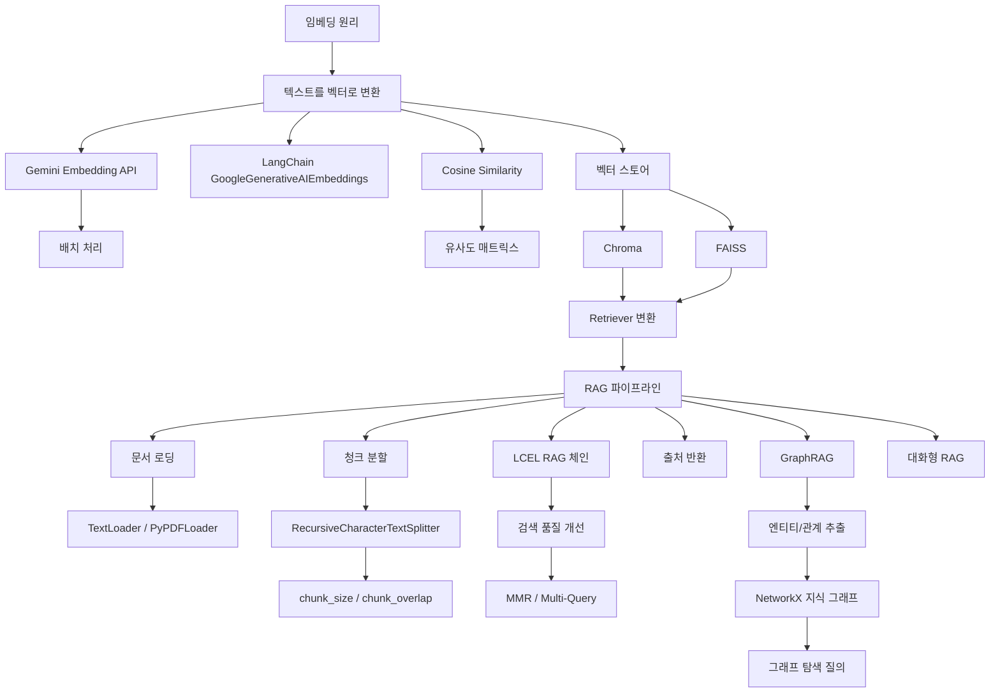

# Phase 4: 지식 확장 --- 외부 문서 활용

> 임베딩과 RAG로 외부 지식을 LLM에 연결한다

## 목표

이 Phase를 마치면 다음을 할 수 있다:

- 임베딩의 원리를 이해하고, Gemini Embedding API로 텍스트를 벡터로 변환할 수 있다
- Chroma와 FAISS 벡터 스토어에 문서를 저장하고 유사도 검색을 수행할 수 있다
- RAG 파이프라인(문서 로딩 - 청크 분할 - 벡터 저장 - 검색 - 생성)을 구현할 수 있다
- GraphRAG의 개념을 이해하고, 지식 그래프 기반 관계 추론 질의에 답할 수 있다

## 개념 관계도

## 포함된 노트

| # | 제목 | 핵심 개념 |
|---|------|-----------|
| 12 | Embedding | 임베딩 원리, Gemini Embedding API, LangChain 임베딩, Cosine Similarity, 벡터 스토어(Chroma/FAISS), Retriever, 한국어 임베딩 특성 |
| 13 | RAG + GraphRAG | RAG 파이프라인, 문서 로딩/청크 분할, LCEL RAG 체인, 검색 품질 개선(MMR/Multi-Query), GraphRAG, NetworkX 지식 그래프, 대화형 RAG |
