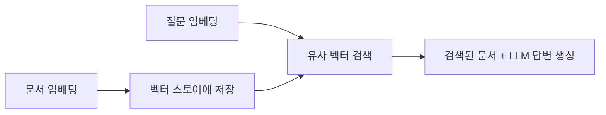

# Note 12. Embedding

> 대응 노트북: `note_12_embedding.ipynb`
> Phase 4 — 지식 확장: 외부 문서 활용

---

## 학습 목표

- 임베딩의 원리와 벡터 공간에서의 의미적 유사성을 이해한다
- Gemini Embedding API를 google-genai SDK와 LangChain 두 방식으로 사용할 수 있다
- Cosine Similarity(코사인 유사도)를 직접 구현하고 유사도 매트릭스를 시각화할 수 있다
- Chroma와 FAISS 벡터 스토어에 문서를 저장하고 유사도 검색을 수행할 수 있다
- 벡터 스토어를 Retriever로 변환하여 RAG 파이프라인에 연결하는 방법을 이해한다

---

## 핵심 개념

### 12.1 임베딩이란

**한 줄 요약**: Embedding(임베딩)은 텍스트를 고차원 숫자 벡터로 변환하여, 의미적 유사성을 수학적 거리로 측정할 수 있게 하는 기술이다.

임베딩의 핵심 원리는 **의미가 비슷한 텍스트는 벡터 공간에서 가까이 위치한다**는 것이다. 단어가 다르더라도 의미가 유사하면 벡터 간 거리가 가깝고, 의미가 다르면 벡터 간 거리가 멀다.

```
"서울의 날씨"  →  [0.12, -0.34, 0.56, ...] (3072차원)
"수도 기온"    →  [0.11, -0.32, 0.55, ...] (3072차원)  ← 벡터가 유사
"파이썬 문법"  →  [0.78, 0.21, -0.43, ...] (3072차원)  ← 벡터가 다름
```

이 성질을 이용하면 다음 작업이 가능하다:

- 질문과 가장 관련 있는 문서 찾기 (RAG의 Retrieve 단계)
- 유사한 상품 추천
- 중복 문서 탐지

### 12.2 Gemini Embedding API (google-genai)

**한 줄 요약**: `client.models.embed_content()`로 텍스트를 임베딩 벡터로 변환하며, 단일 텍스트와 배치 처리를 모두 지원한다.

Gemini는 `gemini-embedding-001` 모델을 제공한다. 기본 3072차원 벡터를 반환하며, 한국어를 포함한 100개 이상의 언어를 지원한다. 이 모델은 Matryoshka Representation Learning(MRL) 기법으로 학습되어, 차원을 축소해도 품질 손실이 적다.

```python
# 단일 텍스트 임베딩
result = client.models.embed_content(
    model="gemini-embedding-001",
    contents="서울의 날씨가 좋습니다",
)
embedding = result.embeddings[0].values  # 3072차원 float 리스트

# 배치 임베딩 — 한 번의 API 호출로 여러 텍스트 처리
result = client.models.embed_content(
    model="gemini-embedding-001",
    contents=["텍스트1", "텍스트2", "텍스트3"],
)
```

`contents`에 문자열 하나를 전달하면 단일 임베딩, 리스트를 전달하면 배치 처리가 수행된다.

#### task_type: 용도별 임베딩

`config`에 `task_type`을 지정하면 용도에 최적화된 임베딩을 생성할 수 있다. 같은 텍스트라도 task_type에 따라 미세하게 다른 벡터가 생성된다.

| task_type | 용도 |
|-----------|------|
| `RETRIEVAL_QUERY` | 검색 질의 임베딩 |
| `RETRIEVAL_DOCUMENT` | 저장할 문서 임베딩 |
| `SEMANTIC_SIMILARITY` | 문장 유사도 비교 |
| `CLASSIFICATION` | 텍스트 분류 |
| `CLUSTERING` | 클러스터링 |
| `QUESTION_ANSWERING` | Q&A 시스템의 질문 임베딩 |
| `FACT_VERIFICATION` | 사실 검증 대상 텍스트 임베딩 |

```python
from google.genai import types

# 검색 질의용 임베딩
result = client.models.embed_content(
    model="gemini-embedding-001",
    contents="검색 질의 텍스트",
    config=types.EmbedContentConfig(task_type="RETRIEVAL_QUERY"),
)
```

RAG에서는 문서 저장 시 `RETRIEVAL_DOCUMENT`, 검색 시 `RETRIEVAL_QUERY`를 사용하면 검색 정확도가 향상될 수 있다.

#### 출력 차원 조절

`output_dimensionality` 파라미터로 임베딩 벡터의 차원을 줄일 수 있다. 기본값은 3072차원이며, 권장 차원은 768, 1536, 3072이다.

```python
result = client.models.embed_content(
    model="gemini-embedding-001",
    contents="텍스트",
    config=types.EmbedContentConfig(output_dimensionality=768),
)
# 결과: 768차원 벡터 (기본 3072차원 대비 1/4 크기)
```

차원을 줄이면 저장 공간과 검색 속도가 개선되지만, 정확도가 약간 감소할 수 있다.

### 12.3 LangChain 임베딩

**한 줄 요약**: `GoogleGenerativeAIEmbeddings`는 LangChain의 통일된 임베딩 인터페이스를 제공하며, 벡터 스토어와 직접 연결할 수 있다.

LangChain은 `langchain-google-genai` 패키지의 `GoogleGenerativeAIEmbeddings` 클래스를 통해 Gemini 임베딩을 사용한다. 인터페이스가 통일되어 있어 벡터 스토어 교체 시 코드 변경이 최소화된다.

```python
from langchain_google_genai import GoogleGenerativeAIEmbeddings

embeddings_model = GoogleGenerativeAIEmbeddings(
    model="models/gemini-embedding-001",
    google_api_key=GEMINI_API_KEY,
)

# 단일 질의 임베딩
query_emb = embeddings_model.embed_query("서울의 날씨")

# 문서 배치 임베딩
doc_embs = embeddings_model.embed_documents(["문서1", "문서2"])
```

| 메서드 | 용도 | 입력 |
|--------|------|------|
| `embed_query()` | 검색 질의 임베딩 | 문자열 1개 |
| `embed_documents()` | 문서 임베딩 (배치) | 문자열 리스트 |

`embed_query`와 `embed_documents`를 구분하는 것은 LangChain의 관례이다. 일부 임베딩 모델은 질의용과 문서용 임베딩을 다르게 생성하므로, 벡터 스토어와의 호환을 위해 구분하여 사용한다.

### 12.4 Cosine Similarity(코사인 유사도)

**한 줄 요약**: 두 벡터의 방향만 비교하여 의미적 유사성을 -1.0에서 1.0 사이의 값으로 측정하는 방법이다.

Cosine Similarity(코사인 유사도)는 벡터의 크기(길이)가 아닌 **방향**만 비교한다. 따라서 긴 문장이든 짧은 문장이든, 의미가 같으면 유사도가 높다.

```
cosine_similarity(A, B) = (A . B) / (||A|| x ||B||)
```

| 값 | 의미 |
|----|------|
| 1.0 | 완전히 같은 방향 (매우 유사) |
| 0.0 | 직교 (관련 없음) |
| -1.0 | 반대 방향 (매우 다름) |

numpy로 직접 구현하면 다음과 같다:

```python
import numpy as np

def cosine_similarity(a, b):
    """두 벡터의 코사인 유사도를 계산한다."""
    a, b = np.array(a), np.array(b)
    return np.dot(a, b) / (np.linalg.norm(a) * np.linalg.norm(b))
```

### 12.5 유사도 매트릭스 시각화

**한 줄 요약**: 여러 문장 간의 유사도를 NxN 매트릭스로 계산하고 히트맵으로 시각화하면 주제별 유사도 패턴을 직관적으로 확인할 수 있다.

벡터를 정규화한 후 행렬곱을 수행하면 반복문 없이 전체 유사도 매트릭스를 한 번에 계산할 수 있다. 대규모 데이터에서 반복문 대비 수백~수천 배 빠르다.

```python
def cosine_similarity_matrix(vectors):
    """벡터 리스트로 NxN 유사도 매트릭스를 한 번에 계산한다."""
    vecs = np.array(vectors)
    norms = np.linalg.norm(vecs, axis=1, keepdims=True)
    normalized = vecs / norms
    return normalized @ normalized.T  # NxN 행렬곱
```

시각화 결과에서 같은 주제의 문장 쌍(예: 날씨-날씨, 프로그래밍-프로그래밍)은 높은 유사도를, 다른 주제 간에는 상대적으로 낮은 유사도를 보인다. 이 패턴이 벡터 검색의 근거가 된다.

### 12.6 벡터 스토어란

**한 줄 요약**: Vector Store(벡터 스토어)는 임베딩 벡터를 저장하고, 질의 벡터와 가장 유사한 벡터를 빠르게 검색하는 특수 데이터베이스이다.

벡터 스토어를 사용한 RAG의 기본 흐름은 다음과 같다:



| 벡터 스토어 | 개발사 | 특징 | 적합한 규모 |
|-------------|--------|------|------------|
| **Chroma** | Chroma Inc. | SQLite 백엔드, 메타데이터 필터링 | 프로토타입 ~ 중규모 |
| **FAISS** | Meta | 인메모리, 대규모 고속 검색 | 대규모 프로덕션 |
| Pinecone | Pinecone | 매니지드 클라우드 서비스 | 서버리스 프로덕션 |
| Weaviate | Weaviate | 하이브리드 검색 (벡터+키워드) | 복합 검색 |

### 12.7 Chroma

**한 줄 요약**: Chroma는 Python 네이티브 벡터 스토어로, SQLite 기반 자동 영속화와 메타데이터 필터링을 지원한다.

Chroma에 문서를 저장하고 검색하는 기본 흐름은 다음과 같다:

```python
from langchain_community.vectorstores import Chroma
from langchain_core.documents import Document

documents = [
    Document(page_content="서울은 대한민국의 수도입니다.", metadata={"city": "서울"}),
    Document(page_content="부산은 해운대 해수욕장이 유명합니다.", metadata={"city": "부산"}),
]

# Chroma에 문서 저장
chroma_db = Chroma.from_documents(
    documents=documents,
    embedding=embedding_func,
    collection_name="korean_cities",
)

# 유사도 검색 — 값이 작을수록 더 유사 (거리 기반)
results = chroma_db.similarity_search_with_score(query, k=3)
```

Chroma의 `similarity_search_with_score`는 유사도가 아닌 **거리**(distance)를 반환한다. 값이 작을수록 더 유사하며, 기본 거리 함수는 L2(유클리드 거리)이다.

#### 메타데이터 필터링

Chroma의 핵심 강점은 벡터 유사도 검색과 메타데이터 필터를 결합할 수 있다는 점이다:

```python
results = chroma_db.similarity_search(
    "유명한 관광지", k=2,
    filter={"city": {"$in": ["부산", "제주", "경주"]}},
)
```

#### 영속 저장

`persist_directory`를 지정하면 SQLite 파일에 자동 저장된다. 프로세스를 재시작해도 데이터가 유지된다.

```python
# 영속 저장
chroma_db = Chroma.from_documents(
    documents=documents,
    embedding=embedding_func,
    persist_directory="./chroma_db",
)

# 재로딩
chroma_loaded = Chroma(
    persist_directory="./chroma_db",
    embedding_function=embedding_func,
)
```

### 12.8 FAISS

**한 줄 요약**: FAISS(Facebook AI Similarity Search)는 Meta가 개발한 고성능 인메모리 벡터 검색 라이브러리로, 대규모 데이터에서 검색 속도가 우수하다.

FAISS는 LangChain의 동일한 `VectorStore` 인터페이스를 따르므로, Chroma와 동일한 메서드를 사용한다:

```python
from langchain_community.vectorstores import FAISS

faiss_db = FAISS.from_documents(documents=documents, embedding=embedding_func)
results = faiss_db.similarity_search_with_score(query, k=3)
```

| 항목 | Chroma | FAISS |
|------|--------|-------|
| 저장 방식 | SQLite (영속) | 인메모리 (파일 저장 별도) |
| 메타데이터 필터 | 지원 | 미지원 (별도 구현 필요) |
| 검색 속도 | 보통 | 빠름 (대규모 데이터) |
| 설치 | `pip install chromadb` | `pip install faiss-cpu` |

소규모 데이터에서는 두 벡터 스토어의 검색 속도 차이가 미미하다. FAISS의 속도 이점은 수만~수백만 건의 데이터에서 두드러진다.

#### FAISS 영속화

FAISS는 인메모리이므로 `save_local()` / `load_local()`을 직접 호출해야 한다:

```python
# 저장
faiss_db.save_local("faiss_index")

# 복원 — pickle 역직렬화 허용 필요
faiss_loaded = FAISS.load_local(
    "faiss_index",
    embedding_func,
    allow_dangerous_deserialization=True,
)
```

`allow_dangerous_deserialization=True`는 pickle 파일의 역직렬화를 허용한다. 신뢰할 수 없는 소스의 파일은 로드하지 않도록 주의해야 한다.

### 12.9 Retriever 변환과 검색 전략

**한 줄 요약**: 벡터 스토어를 `as_retriever()`로 Retriever 객체로 변환하면 RAG 파이프라인에 바로 연결할 수 있으며, similarity/MMR 등 검색 전략을 선택할 수 있다.

```python
retriever = chroma_db.as_retriever(
    search_type="similarity",
    search_kwargs={"k": 3},
)
docs = retriever.invoke("바다 여행")  # Document 리스트 반환
```

#### MMR (Maximal Marginal Relevance)

일반 유사도 검색은 가장 유사한 문서 k개를 반환하지만, 상위 결과가 서로 비슷한 내용일 수 있다. MMR은 유사도와 다양성의 균형을 맞춰, 서로 다른 관점의 문서를 반환한다.

```
MMR = argmax [ lambda * sim(query, doc) - (1 - lambda) * max(sim(doc, selected_docs)) ]
```

`fetch_k`는 내부적으로 가져오는 후보 수이며, k보다 커야 한다. 후보 중에서 유사도와 다양성을 함께 고려하여 최종 k개를 선택한다.

| 검색 전략 | 적합한 경우 |
|-----------|------------|
| `similarity` | 가장 관련 있는 문서가 필요할 때 (사실 확인, 정의 질문) |
| `mmr` | 다양한 관점의 문서가 필요할 때 (비교 분석, 종합 보고) |
| `similarity_score_threshold` | 일정 유사도 이상만 필요할 때 (관련 없는 결과 제거) |

#### 거리 함수 비교

| 거리 함수 | 범위 | 특징 | Chroma 기본값 |
|----------|------|------|---------------|
| L2 (유클리드) | 0 ~ inf | 벡터 크기에 민감 | O |
| Cosine | -1 ~ 1 | 방향만 비교, 크기 무시 | |
| Inner Product | -inf ~ inf | 정규화된 벡터에서는 Cosine과 동일 | |

### 12.10 한국어 임베딩 특성과 비용

**한 줄 요약**: Gemini 임베딩 모델은 다국어를 지원하며 한/영 혼용에서도 높은 유사도를 보이지만, 한국어 고유의 토큰 효율과 동형어 문제를 인지해야 한다.

| 특성 | 설명 |
|------|------|
| 토큰 효율 | 한국어는 영어보다 같은 의미를 전달하는 데 더 많은 토큰 소비 |
| 동의어/동형어 | "사과"(과일) vs "사과"(apologize) — 문맥 없이 구분이 어려움 |
| 조사 영향 | "서울은", "서울이", "서울에서" — 같은 엔티티이지만 다른 표현 |
| 한/영 혼용 | "Python 코딩"과 "파이썬 코딩"의 유사도가 높음 (약 0.89) |

한/영 혼용 문장, 그리고 한국어-영어 간 동일 의미 문장도 상당히 높은 유사도를 보인다. 다국어 임베딩 모델이 언어를 넘어 의미를 포착하고 있음을 확인할 수 있다.

#### 임베딩 비용 구조

| 항목 | 설명 |
|------|------|
| 임베딩 생성 | 문서 저장 시 1회 (저장 후에는 재생성 불필요) |
| 검색 질의 | 매 검색마다 질의 임베딩 1회 (짧은 텍스트이므로 비용 매우 적음) |
| 배치 처리 | 한 번에 여러 텍스트를 임베딩하면 API 호출 횟수 절감 |
| 차원 축소 | `output_dimensionality`로 저장 공간 절감 |

비용 최적화의 핵심은 불필요한 재임베딩을 피하는 것이다. 문서 임베딩은 한 번만 하면 되므로 초기 비용만 발생한다.

---

## 장단점

| 장점 | 단점 |
|------|------|
| 의미 기반 검색이 가능하여 키워드 불일치 문제 해결 | 임베딩 모델에 따라 검색 품질이 달라짐 |
| 다국어 지원으로 한/영 혼용 텍스트도 유사도 측정 가능 | 동형어(같은 표기, 다른 의미)의 문맥 구분이 어려움 |
| LangChain VectorStore 인터페이스로 벡터 스토어 교체 용이 | 대규모 데이터 시 저장 공간과 검색 비용 증가 |
| task_type 지정으로 용도별 최적화 가능 | 임베딩 차원이 높을수록 저장/검색 비용 증가 |
| 배치 처리로 API 호출 효율화 가능 | 임베딩 모델 변경 시 전체 문서 재임베딩 필요 |

---

## 핵심 정리

| 개념 | 핵심 포인트 |
|------|------------|
| Embedding(임베딩) | 텍스트를 고차원 벡터로 변환; 의미가 유사한 텍스트는 벡터 공간에서 가까이 위치 |
| gemini-embedding-001 | 기본 3072차원, MRL 기법으로 차원 축소 가능 (권장: 768, 1536, 3072) |
| task_type | 용도별 최적화 임베딩 생성 (RETRIEVAL_QUERY, RETRIEVAL_DOCUMENT 등 8종) |
| GoogleGenerativeAIEmbeddings | LangChain 통일 인터페이스; embed_query()와 embed_documents()로 구분 |
| Cosine Similarity | 벡터 방향만 비교; 1.0(유사) ~ -1.0(다름) 범위 |
| 유사도 매트릭스 | 정규화 후 행렬곱으로 NxN 유사도를 한 번에 계산; 히트맵으로 시각화 |
| Chroma | SQLite 영속화, 메타데이터 필터링 지원; 프로토타입~중규모에 적합 |
| FAISS | Meta 개발 인메모리 검색; 대규모 데이터에서 속도 우수; save_local()/load_local() 필요 |
| Retriever | as_retriever()로 변환; similarity, mmr, threshold 검색 전략 선택 가능 |
| MMR | 유사도와 다양성의 균형; fetch_k 후보에서 다양한 k개 선택 |

---

## 참고 자료

- [Embeddings - Gemini API 공식 문서](https://ai.google.dev/gemini-api/docs/embeddings) — gemini-embedding-001 모델 사양, task_type, output_dimensionality 설명
- [Google Gen AI Python SDK - embed_content](https://github.com/googleapis/python-genai) — google-genai SDK의 임베딩 API 사용법
- [국내 블로그 내 임베딩 정보](hhttps://velog.io/@dongho5041/%EB%94%A5%EB%9F%AC%EB%8B%9D-%EC%9D%B8%EA%B3%B5%EC%8B%A0%EA%B2%BD%EB%A7%9D%EC%9D%98-Embedding%EC%9D%B4%EB%9E%80) — 인공신경망의 Embedding이란?
- [Chroma - LangChain 통합 문서](https://python.langchain.com/docs/integrations/vectorstores/chroma/) — Chroma 벡터 스토어 사용법과 메타데이터 필터링
- [FAISS Wiki - GitHub](https://github.com/facebookresearch/faiss/wiki) — FAISS 인덱스 유형, 검색 알고리즘 설명
- [Gemini Embedding now generally available - Google Developers Blog](https://developers.googleblog.com/gemini-embedding-available-gemini-api/) — gemini-embedding-001 출시 및 MTEB 벤치마크 성능
