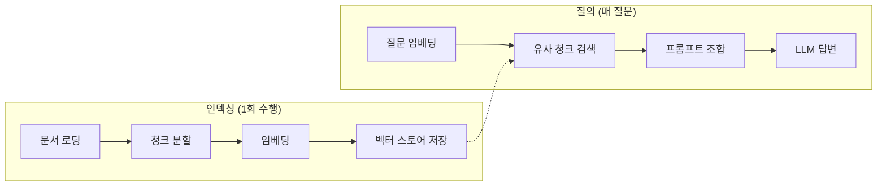
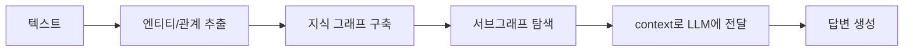

# Note 13. RAG + GraphRAG

> 대응 노트북: `note_13_rag.ipynb`
> Phase 4 — 지식 확장: 외부 문서 활용

## 학습 목표

- RAG(Retrieval-Augmented Generation, 검색 증강 생성)의 전체 파이프라인을 이해하고 구현할 수 있다
- 문서 로딩, 청크 분할, 벡터 저장, 검색의 인덱싱/질의 흐름을 구성할 수 있다
- LCEL 체인으로 RAG를 구현하고, 검색 품질을 개선하는 전략을 적용할 수 있다
- GraphRAG의 개념을 이해하고, NetworkX로 지식 그래프를 구축하여 관계 추론 질의에 답할 수 있다

---

## 핵심 개념

### 13.1 RAG란?

**한 줄 요약**: LLM이 학습하지 않은 외부 문서를 검색하여 답변에 활용하는 기법이다.

RAG(Retrieval-Augmented Generation)는 세 단계로 구성된다.

1. **Retrieve** — 질문을 임베딩하여 벡터 스토어에서 유사 문서를 검색
2. **Augment** — 검색된 문서를 프롬프트에 주입
3. **Generate** — LLM이 문서 기반으로 답변 생성

```
사용자 질문 → [Retrieve] 벡터 검색 → [Augment] 프롬프트 주입 → [Generate] 답변 생성
```

RAG가 필요한 이유는 대안과 비교하면 명확하다.

| 방법 | 장점 | 단점 |
|------|------|------|
| Fine-tuning | 모델 자체에 지식 내장 | 비용 높음, 데이터 업데이트 어려움 |
| Long Context | 전체 문서를 프롬프트에 삽입 | 토큰 비용 증가, 길어지면 정확도 하락 |
| **RAG** | 필요한 부분만 검색하여 주입 | 검색 품질에 의존 |

RAG는 비용 효율적이면서 최신 정보를 반영할 수 있다. 문서가 업데이트되면 벡터 스토어만 갱신하면 된다.

### 13.2 RAG 파이프라인 전체 흐름

**한 줄 요약**: RAG 파이프라인은 인덱싱(준비, 1회)과 질의(실행, 매 질문)로 나뉜다.



인덱싱 단계에서는 문서를 청크로 분할하고, 각 청크를 임베딩하여 벡터 스토어에 저장한다. 질의 단계에서는 사용자 질문을 임베딩하여 유사한 청크를 검색하고, 검색된 문서를 프롬프트에 포함하여 LLM에 전달한다.

### 13.3 문서 로딩과 청크 분할

**한 줄 요약**: 문서를 적절한 크기의 청크(Chunk)로 나누는 것이 RAG 인덱싱의 핵심 전처리 과정이다.

**문서 로더(Document Loaders)**는 다양한 형식의 데이터를 LangChain `Document` 객체로 변환한다.

| 로더 | 형식 | 사용법 |
|------|------|--------|
| `TextLoader` | .txt | `TextLoader("file.txt")` |
| `PyPDFLoader` | .pdf | `PyPDFLoader("file.pdf")` |
| `CSVLoader` | .csv | `CSVLoader("file.csv")` |
| `WebBaseLoader` | 웹페이지 | `WebBaseLoader("https://...")` |
| `JSONLoader` | .json | `JSONLoader("file.json")` |

**청크 분할(Chunking)**은 문서를 적절한 크기로 나누는 과정이다. `RecursiveCharacterTextSplitter`는 `separators` 순서(`\n\n` → `\n` → `. ` → ` `)대로 분할을 시도하여, 단락과 문장 단위의 자연스러운 분할을 수행한다.

| 파라미터 | 역할 | 권장값 |
|----------|------|--------|
| `chunk_size` | 청크 최대 문자 수 | 200~1000 (도메인에 따라) |
| `chunk_overlap` | 인접 청크 간 겹치는 문자 수 | chunk_size의 10~20% |

`chunk_overlap`은 청크 경계에서 문맥이 끊기는 것을 방지한다.

```python
from langchain_text_splitters import RecursiveCharacterTextSplitter

text_splitter = RecursiveCharacterTextSplitter(
    chunk_size=200,       # 청크 최대 200자
    chunk_overlap=30,     # 30자 겹침
    separators=["\n\n", "\n", ". ", " "],  # 분할 우선순위
)
chunks = text_splitter.split_documents(documents)
```

청크 크기 선택 기준은 다음과 같다.

| 전략 | chunk_size | overlap | 적합한 경우 |
|------|-----------|---------|------------|
| 작은 청크 | 100~200 | 10~20 | 짧은 사실 확인 질문 |
| 중간 청크 | 300~500 | 30~50 | 일반적인 Q&A |
| 큰 청크 | 500~1000 | 50~100 | 문맥이 중요한 질문 |

### 13.4 벡터 스토어에 저장

**한 줄 요약**: 분할된 청크를 임베딩하여 벡터 스토어에 저장하면 인덱싱이 완료된다.

Chroma에 청크를 저장하고 Retriever를 생성하는 코드는 다음과 같다.

```python
from langchain_community.vectorstores import Chroma

# Chroma에 청크 저장
vectorstore = Chroma.from_documents(
    documents=chunks,
    embedding=embedding_func,
    collection_name="company_policy",
)

# Retriever 생성 — RAG 체인의 검색 컴포넌트
retriever = vectorstore.as_retriever(
    search_type="similarity",
    search_kwargs={"k": 3},  # 상위 3개 문서 반환
)
```

`as_retriever()`로 벡터 스토어를 Retriever 객체로 변환하면, LCEL 체인에서 검색 컴포넌트로 사용할 수 있다.

### 13.5 LCEL RAG 체인

**한 줄 요약**: LangChain Expression Language(LCEL)로 retriever, prompt, model, parser를 하나의 파이프라인으로 연결한다.

LCEL RAG 체인의 구조는 다음과 같다.

| 단계 | 역할 | 입력 → 출력 |
|------|------|------------|
| retriever | 유사 문서 검색 | 질문 → Document 리스트 |
| prompt | 프롬프트 조합 | context + question → 프롬프트 |
| model | LLM 호출 | 프롬프트 → AIMessage |
| parser | 텍스트 추출 | AIMessage → 문자열 |

```python
from langchain_core.prompts import ChatPromptTemplate
from langchain_core.output_parsers import StrOutputParser
from langchain_core.runnables import RunnablePassthrough

rag_prompt = ChatPromptTemplate.from_template(
    """아래 문서를 참고하여 질문에 답하세요.
문서에 없는 내용은 "문서에서 해당 정보를 찾을 수 없습니다"라고 답하세요.

[참고 문서]
{context}

[질문]
{question}"""
)

def format_docs(docs):
    return "\n\n".join(doc.page_content for doc in docs)

# LCEL RAG 체인
rag_chain = (
    {"context": retriever | format_docs, "question": RunnablePassthrough()}
    | rag_prompt
    | llm
    | StrOutputParser()
)
```

첫 번째 딕셔너리는 `RunnableParallel`의 축약형이다. `retriever | format_docs`로 문서를 검색하고 텍스트로 변환하며, `RunnablePassthrough()`는 질문을 그대로 통과시킨다. 이 두 값이 프롬프트 템플릿의 `{context}`와 `{question}`에 각각 대입된다.

RAG 프롬프트 설계에서 가장 중요한 지시는 "문서에 없는 내용은 모른다고 답하라"이다. 이 지시가 없으면 LLM이 학습 데이터를 기반으로 답변을 지어낼 수 있다(할루시네이션).

### 13.6 검색 결과 확인과 출처 반환

**한 줄 요약**: `RunnableParallel`로 답변과 검색된 원본 문서를 동시에 반환하여 출처 추적과 할루시네이션 검증을 수행한다.

```python
from langchain_core.runnables import RunnableParallel

rag_chain_with_source = RunnableParallel(
    answer=rag_chain,
    source_docs=retriever,
)
# 결과: {"answer": "답변 텍스트", "source_docs": [Document, ...]}
```

동일한 질문이 `rag_chain`(전체 파이프라인)과 `retriever`(검색만)에 병렬로 전달된다. 이 패턴은 추가 API 호출 없이 답변과 출처를 한 번에 반환하므로, 출처 표시, 근거 하이라이팅, 할루시네이션 감지 등에 활용된다.

할루시네이션 검증은 검색된 문서와 답변을 대조하여 근거 여부를 판단하는 방식으로 구현할 수 있다.

### 13.7 검색 품질 개선

**한 줄 요약**: k 값 조정, MMR 검색, 청크 크기 최적화 등의 전략으로 RAG 검색 품질을 높인다.

| 전략 | 설명 | 효과 |
|------|------|------|
| **k 값 조정** | 검색 문서 수 조절 | 너무 적으면 누락, 너무 많으면 노이즈 |
| **MMR** | Maximal Marginal Relevance, 다양성 고려 검색 | 중복 문서 방지 |
| **청크 크기** | 문서 분할 단위 조절 | 너무 작으면 문맥 손실, 너무 크면 노이즈 |
| **메타데이터 필터** | 카테고리별 필터링 | 관련 없는 문서 제거 |
| **리랭킹(Reranking)** | 검색 결과를 LLM으로 재정렬 | 정확도 향상, 비용 증가 |

MMR은 유사도와 다양성의 균형을 맞춰 서로 다른 관점의 문서를 반환한다.

```python
# MMR 검색 — fetch_k개 후보에서 다양성을 고려하여 k개 선택
mmr_docs = vectorstore.max_marginal_relevance_search(query, k=4, fetch_k=10)
```

**RAG 평가의 3요소(RAG Triad)**는 검색과 생성 품질을 판단하는 핵심 지표다.

| 지표 | 평가 질문 |
|------|----------|
| **Context Relevance** | 검색된 문서가 질문과 관련 있는가? |
| **Answer Faithfulness** | 답변이 검색된 문서에 근거하는가? |
| **Answer Relevance** | 답변이 원래 질문에 대한 답인가? |

### 13.8 스트리밍 RAG와 벡터 스토어 전환

**한 줄 요약**: RAG 체인도 `stream()`으로 실시간 응답이 가능하며, LangChain 인터페이스 덕분에 벡터 스토어를 쉽게 교체할 수 있다.

스트리밍은 `rag_chain.stream(question)`으로 호출한다. 답변이 토큰 단위로 실시간 생성된다.

벡터 스토어 교체는 Retriever만 바꾸면 나머지 체인은 동일하게 동작한다.

```python
from langchain_community.vectorstores import FAISS

faiss_store = FAISS.from_documents(documents=chunks, embedding=embedding_func)
faiss_retriever = faiss_store.as_retriever(search_kwargs={"k": 3})

# Retriever만 교체하면 동일 체인 재사용
rag_chain_faiss = (
    {"context": faiss_retriever | format_docs, "question": RunnablePassthrough()}
    | rag_prompt
    | llm
    | StrOutputParser()
)
```

### 13.9 GraphRAG 개요

**한 줄 요약**: 일반 RAG가 처리하기 어려운 관계 추론, 멀티홉 질문을 지식 그래프(Knowledge Graph)로 해결하는 기법이다.

일반 RAG는 단일 청크 검색에 의존하므로, 다음과 같은 질문에 한계가 있다.

| 질문 유형 | 일반 RAG의 한계 |
|-----------|----------------|
| **멀티홉** | "김 대리의 팀장은 누구이고, 그 팀장의 프로젝트는?" — 두 청크를 연결해야 함 |
| **전체 요약** | "이 문서의 핵심 주제 3가지는?" — 하나의 청크에 전체 맥락 없음 |
| **관계 추론** | "마케팅팀과 개발팀이 협업한 프로젝트는?" — 관계 정보가 청크에 흩어져 있음 |

GraphRAG의 절차는 다음과 같다.



### 13.10 엔티티/관계 추출

**한 줄 요약**: LLM을 사용하여 텍스트에서 엔티티(사람, 팀, 프로젝트)와 관계를 구조화된 JSON으로 추출한다.

Structured Output(노트북 8)을 활용하여 추출 정확도를 높일 수 있다.

```python
extraction_prompt = ChatPromptTemplate.from_template(
    """아래 텍스트에서 엔티티(사람, 팀, 프로젝트)와 관계를 추출하세요.

JSON 형식으로 반환하세요:
{{
  "entities": [{{"name": "이름", "type": "person|team|project"}}],
  "relations": [{{"source": "주체", "relation": "관계", "target": "대상"}}]
}}

텍스트:
{text}"""
)
```

추출 품질 향상 방법: 프롬프트에 예시(few-shot)를 포함하면 정확도가 높아지고, Structured Output을 사용하면 JSON 파싱 오류를 줄일 수 있다. 긴 문서는 청크별로 추출한 후 결과를 병합한다.

### 13.11 NetworkX로 지식 그래프 구축

**한 줄 요약**: 추출된 엔티티를 노드로, 관계를 엣지로 하여 NetworkX 방향 그래프에 저장하고 시각화한다.

NetworkX는 순수 Python 그래프 라이브러리로, 교육과 프로토타입에 적합하다.

```python
import networkx as nx

G = nx.DiGraph()  # 방향 그래프

# 엔티티를 노드로 추가
for entity in graph_data['entities']:
    G.add_node(entity['name'], type=entity['type'])

# 관계를 엣지로 추가
for rel in graph_data['relations']:
    G.add_edge(rel['source'], rel['target'], relation=rel['relation'])
```

대규모 그래프에서는 **Neo4j**가 사실상 표준이다. NetworkX는 영속성과 대규모 탐색에 한계가 있으므로, 프로덕션에서는 Neo4j AuraDB + LangChain `Neo4jGraph` 통합을 고려한다.

### 13.12 그래프 탐색과 질의 응답

**한 줄 요약**: 질문 관련 엔티티를 찾고, BFS로 주변 노드를 탐색하여 context를 구성한 뒤 LLM에 전달한다.

```python
def graph_search(G, query_entity, depth=2):
    """엔티티를 중심으로 depth만큼 BFS 탐색하여 관련 정보를 수집한다."""
    visited = set()
    context_lines = []
    queue = [(query_entity, 0)]

    while queue:
        node, d = queue.pop(0)
        if node in visited or d > depth:
            continue
        visited.add(node)
        # 나가는/들어오는 엣지에서 관계 정보 수집
        for _, target, data in G.out_edges(node, data=True):
            context_lines.append(f"{node} --[{data['relation']}]--> {target}")
            queue.append((target, d + 1))
    return "\n".join(context_lines)
```

수집된 context를 프롬프트에 포함하여 LLM에 전달하면, 멀티홉 질문도 답변할 수 있다. "김철수 → 협업 → 정하늘 → 프로젝트 베타"처럼 2단계를 거쳐야 답할 수 있는 질문도 그래프 탐색으로 해결된다.

**Local Search vs Global Search**: 이 노트북에서 구현한 `graph_search()`는 특정 엔티티 중심의 **Local Search**에 해당한다. **Global Search**(전체 그래프 요약 기반)는 Microsoft GraphRAG 논문에서 제안된 방법으로, 그래프를 커뮤니티로 분할하고 각 커뮤니티의 요약을 활용한다.

그래프 통계 분석에서는 차수 중심성(Degree Centrality)으로 가장 연결이 많은 노드, 즉 핵심 엔티티를 파악할 수 있다.

### 13.13 RAG vs GraphRAG 비교

**한 줄 요약**: RAG는 단순 질문과 사실 확인에, GraphRAG는 관계 추론과 멀티홉 질문에 적합하다.

| 비교 항목 | RAG | GraphRAG |
|-----------|-----|----------|
| 검색 방식 | 벡터 유사도 | 그래프 탐색 |
| 강점 | 단순 질문, 사실 확인 | 관계 추론, 멀티홉 |
| 약점 | 관계 추론 어려움 | 구축 비용 높음 |
| 구축 비용 | 낮음 (임베딩만) | 높음 (엔티티/관계 추출) |
| 업데이트 | 문서 추가/삭제 쉬움 | 그래프 재구축 필요 |
| 적합한 경우 | FAQ, 문서 검색 | 조직도, 관계 분석 |

대부분의 경우 RAG로 충분하다. GraphRAG는 관계 기반 질문이 핵심인 도메인(조직 관리, 법률, 의학)에서 고려한다.

### 13.14 대화형 RAG (Conversational RAG)

**한 줄 요약**: 멀티턴 대화에서 이전 맥락을 반영하여 검색 쿼리를 재구성하는 RAG 확장 패턴이다.

단순 RAG는 매 질문을 독립적으로 검색한다. 대화형 RAG는 이전 대화 맥락을 고려하여 검색 쿼리를 재구성한다.

```
사용자: "연차 정책 알려줘"  → 검색: "연차 정책"
사용자: "반차도 가능해?"    → 검색: "반차" + 이전 맥락(연차 정책)
```

```python
from langchain.chains import create_history_aware_retriever

# 대화 기록을 고려한 검색 쿼리 생성
history_aware_retriever = create_history_aware_retriever(
    llm, retriever, contextualize_prompt
)
```

---

## 장단점

| 장점 | 단점 |
|------|------|
| LLM이 학습하지 않은 외부/내부 문서 기반 답변이 가능하다 | 검색 품질에 답변 품질이 직접적으로 의존한다 |
| 문서 업데이트 시 벡터 스토어만 갱신하면 되므로 비용 효율적이다 | 청크 크기, k값 등 하이퍼파라미터 튜닝이 필요하다 |
| LCEL 파이프라인으로 구성이 간결하고 벡터 스토어 교체가 용이하다 | 관계 추론이나 멀티홉 질문에는 일반 RAG만으로 한계가 있다 |
| GraphRAG로 관계 추론과 멀티홉 질의를 해결할 수 있다 | GraphRAG는 엔티티/관계 추출 비용이 높고 그래프 재구축이 필요하다 |
| 출처 반환 패턴으로 답변의 근거를 제시하고 할루시네이션을 감지할 수 있다 | 프롬프트 설계에 따라 할루시네이션 방지 효과가 크게 달라진다 |

---

## 핵심 정리

| 개념 | 핵심 포인트 |
|------|------------|
| RAG | 검색(Retrieve) → 주입(Augment) → 생성(Generate)의 3단계 파이프라인 |
| 인덱싱/질의 | 인덱싱은 문서 로딩 → 청크 분할 → 임베딩 → 벡터 저장 (1회), 질의는 매 질문마다 실행 |
| 청크 분할 | `RecursiveCharacterTextSplitter`로 `chunk_size`/`chunk_overlap` 조절, separators 순서대로 자연스러운 분할 |
| 벡터 스토어 | Chroma(메타데이터 필터링, 영속성)와 FAISS(대규모 검색 속도) — LangChain 통일 인터페이스 |
| LCEL RAG 체인 | `retriever | format_docs` → `prompt` → `llm` → `parser`를 파이프(`\|`)로 연결 |
| 출처 반환 | `RunnableParallel`로 답변과 검색 문서를 동시에 반환하여 할루시네이션 검증 |
| 검색 품질 개선 | k 값 조정, MMR(다양성), 메타데이터 필터, 리랭킹 |
| RAG Triad | Context Relevance, Answer Faithfulness, Answer Relevance — 세 지표 모두 높아야 양질의 RAG |
| GraphRAG | 지식 그래프(엔티티 + 관계)로 멀티홉 질문과 관계 추론 해결 |
| 엔티티/관계 추출 | LLM + 구조화 프롬프트로 텍스트에서 노드와 엣지 추출 |
| 그래프 탐색 | BFS로 엔티티 주변 노드를 depth만큼 탐색하여 context 구성 |
| Local vs Global Search | Local은 특정 엔티티 중심 탐색, Global은 커뮤니티 요약 기반 탐색 |

---

## 참고 자료

- [Retrieval-Augmented Generation for Knowledge-Intensive NLP Tasks (Lewis et al., 2020)](https://arxiv.org/abs/2005.11401) — RAG의 원본 논문, NeurIPS 2020
- [From Local to Global: A Graph RAG Approach to Query-Focused Summarization (Edge et al., 2024)](https://arxiv.org/abs/2404.16130) — Microsoft GraphRAG 논문, Local/Global Search 제안
- [Build a RAG agent with LangChain](https://docs.langchain.com/oss/python/langchain/rag) — LangChain 공식 RAG 튜토리얼
- [RecursiveCharacterTextSplitter API Reference](https://api.python.langchain.com/en/latest/character/langchain_text_splitters.character.RecursiveCharacterTextSplitter.html) — LangChain 텍스트 분할기 공식 문서
- [Chroma 공식 문서](https://docs.trychroma.com/) — ChromaDB 벡터 스토어 사용법
- [FAISS 공식 문서](https://faiss.ai/index.html) — Meta의 벡터 유사도 검색 라이브러리
- [NetworkX 공식 문서](https://networkx.org/documentation/stable/) — Python 그래프 분석 라이브러리
- [microsoft/graphrag GitHub](https://github.com/microsoft/graphrag) — Microsoft GraphRAG 오픈소스 구현
