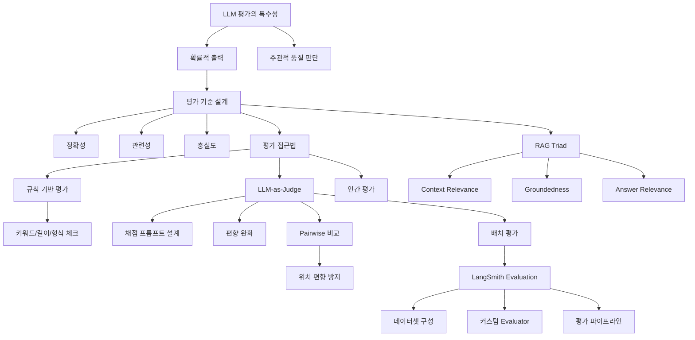

# Phase 5: 품질 관리 --- 평가하는 법

> 체계적이고 반복 가능한 평가 체계를 구축한다

## 목표

이 Phase를 마치면 다음을 할 수 있다:

- LLM 평가가 전통 소프트웨어 테스트와 다른 이유를 이해하고, 적절한 평가 기준을 설계할 수 있다
- LLM-as-Judge 패턴으로 자동 평가를 구현하고, Pairwise 비교로 모델 간 성능을 비교할 수 있다
- RAG Triad(Context Relevance, Groundedness, Answer Relevance)로 RAG 시스템을 평가할 수 있다
- LangSmith로 데이터셋 기반 체계적 평가 파이프라인을 구성할 수 있다

## 개념 관계도

## 포함된 노트

| # | 제목 | 핵심 개념 |
|---|------|-----------|
| 14 | 챗봇 평가 | LLM 평가 특수성, 평가 기준(정확성/관련성/충실도), 규칙 기반 평가, LLM-as-Judge, Pairwise 비교, RAG Triad, LangSmith Evaluation, 평가 파이프라인 |
