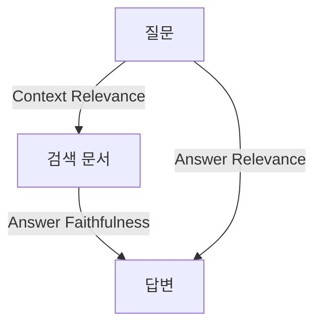
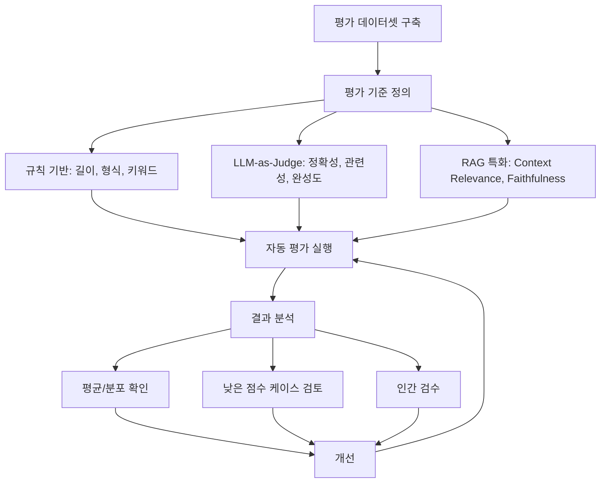

# Note 14. 챗봇 평가

> 대응 노트북: `note_14_evaluation.ipynb`
> Phase 5 — 품질 관리: 평가하는 법

---

## 학습 목표

- LLM 평가가 전통 소프트웨어 테스트와 다른 이유를 이해한다
- 정확성(Correctness), 관련성(Relevance), 충실도(Faithfulness) 등 평가 기준을 설계할 수 있다
- LLM-as-Judge 패턴으로 자동 평가를 구현할 수 있다
- Pairwise 비교와 RAG Triad 평가를 수행할 수 있다
- LangSmith로 체계적인 평가 파이프라인을 구성할 수 있다

---

## 핵심 개념

### 14.1 LLM 평가가 어려운 이유

**한 줄 요약**: LLM은 확률적 출력을 생성하므로 단순 일치 비교가 불가능하고, 품질 판단이 주관적 스펙트럼 위에 놓인다.

전통 소프트웨어는 `assert result == expected`로 테스트할 수 있다. LLM은 근본적으로 다르다.

| 전통 소프트웨어 | LLM |
|----------------|-----|
| 정답이 하나 | 좋은 답변이 여러 개 |
| 결정적 출력 | 확률적 출력 (같은 입력, 다른 결과) |
| 단위 테스트 가능 | 주관적 품질 판단 필요 |
| 통과/실패 | 스펙트럼 (얼마나 좋은가?) |

이러한 특성 때문에 LLM 평가는 세 가지 접근을 조합하여 수행한다.

| 접근 | 방법 | 장점 | 단점 |
|------|------|------|------|
| 인간 평가 | 사람이 직접 채점 | 가장 신뢰성 높음 | 비용 높음, 일관성 낮음 |
| 규칙 기반 | 키워드, 길이, 형식 체크 | 빠르고 저렴 | 품질 판단 불가 |
| LLM-as-Judge | LLM이 평가 | 자동화, 확장 가능 | Judge 편향 가능 |

실무에서는 규칙 기반으로 기본 필터링 후, LLM-as-Judge로 대량 평가하고, 인간이 샘플을 검수하는 순서로 진행한다.

### 14.2 평가 기준 설계

**한 줄 요약**: "좋은 답변"을 판단하려면 먼저 무엇이 좋은 것인지 구체적으로 정의해야 한다.

| 기준 | 질문 | 예시 |
|------|------|------|
| 정확성(Correctness) | 사실적으로 맞는가? | "서울은 한국의 수도" (O) |
| 관련성(Relevance) | 질문에 대한 답인가? | Q: 날씨? A: 경제 이야기 (X) |
| 충실도(Faithfulness) | 주어진 문서에 근거하는가? (RAG) | 문서에 없는 내용을 지어냄 (X) |
| 유해성(Harmfulness) | 위험/부적절한 내용이 있는가? | 폭력적 표현 (X) |
| 톤(Tone) | 챗봇 페르소나에 맞는가? | 공식 챗봇인데 반말 (X) |

모든 기준을 동시에 평가할 필요는 없다. 서비스 특성에 맞는 핵심 기준 2~3개를 선택한다.

### 14.3 규칙 기반 평가

**한 줄 요약**: LLM 호출 없이 코드로 검증할 수 있는 기본 품질 지표로, 비용이 들지 않고 빠르게 실행된다.

규칙 기반 평가 함수는 비어있는지, 길이가 적절한지, 필수 키워드를 포함하는지, 유해 표현이 없는지 등을 체크한다.

```python
def eval_not_empty(response: str) -> dict:
    """응답이 비어있지 않은지 확인"""
    passed = len(response.strip()) > 0
    return {"metric": "not_empty", "score": 1.0 if passed else 0.0}

def eval_contains_keywords(response: str, keywords: list[str]) -> dict:
    """응답에 필수 키워드가 포함되어 있는지 확인"""
    found = [kw for kw in keywords if kw in response]
    score = len(found) / len(keywords) if keywords else 0.0
    return {"metric": "keywords", "score": score, "found": found}
```

여러 규칙을 복합 평가 함수로 묶어 한 번에 실행하고, 각 지표의 평균으로 종합 점수를 산출할 수 있다. 규칙 기반 평가는 빠르고 저렴하지만, 의미적 품질(정확성, 관련성)은 판단할 수 없다. 기본 필터로 사용하고, 의미적 평가는 LLM-as-Judge에 맡긴다.

### 14.4 LLM-as-Judge 패턴

**한 줄 요약**: LLM에게 평가 기준(루브릭)을 주고 다른 LLM의 응답을 채점하게 하는 패턴이다.

```
입력: 질문 + 응답 + 평가 기준
  ↓
Judge LLM: "이 응답은 정확성 4/5, 관련성 5/5..."
```

Judge 프롬프트 설계에는 네 가지 원칙이 있다.

| 원칙 | 설명 |
|------|------|
| 명확한 기준 | 각 점수가 의미하는 바를 구체적으로 정의 |
| 점수 스케일 | 1~5 또는 1~10 (너무 세밀하면 일관성 저하) |
| 근거 요구 | 점수뿐 아니라 이유(reasoning)도 함께 출력 |
| 구조화 출력 | JSON 형식으로 파싱 가능하게 |

Judge 프롬프트에서 루브릭은 구체적이어야 한다. "정확성을 1~5점으로 평가하세요"만으로는 부족하고, 각 점수가 무엇을 의미하는지 정의해야 Judge의 일관성이 높아진다.

```python
# Judge 프롬프트 예시
judge_prompt = ChatPromptTemplate.from_template(
    """아래 질문에 대한 AI의 응답을 평가하세요.

[질문] {question}
[AI 응답] {response}

[평가 기준]
- 정확성: 사실적으로 올바른가? (1=완전히 틀림, 5=완벽히 정확)
- 관련성: 질문에 대한 답변인가? (1=완전히 무관, 5=정확히 질문에 답함)
- 완성도: 충분히 상세한가? (1=너무 짧음, 5=적절히 상세)

JSON 형식으로 답하세요:
{{"accuracy": {{"score": N, "reason": "이유"}},
  "relevance": {{"score": N, "reason": "이유"}},
  "completeness": {{"score": N, "reason": "이유"}},
  "overall": N}}"""
)

judge_chain = judge_prompt | llm | StrOutputParser()
```

**Judge 모델 선택 전략**:

| 전략 | 설명 | 장점 | 단점 |
|------|------|------|------|
| 동일 모델 | 생성 모델과 같은 모델로 평가 | 비용 절감 | 자기 선호 편향 |
| 상위 모델 | 더 강력한 모델로 평가 | 높은 정확도 | 비용 증가 |
| 다중 Judge | 여러 모델로 평가 후 합산 | 편향 감소 | 비용 높음 |

생성 모델보다 같거나 상위 모델을 Judge로 사용하는 것이 권장된다.

**Structured Output 활용**: JSON 파싱 오류를 줄이기 위해 `with_structured_output`을 사용할 수 있다. Pydantic 모델로 평가 결과의 스키마를 정의하면, Judge 출력이 항상 올바른 구조를 가진다.

```python
class JudgeResult(BaseModel):
    accuracy: int = Field(description="정확성 점수 (1~5)")
    relevance: int = Field(description="관련성 점수 (1~5)")
    completeness: int = Field(description="완성도 점수 (1~5)")
    overall: float = Field(description="종합 점수 (1~5)")
    reasoning: str = Field(description="평가 근거")

structured_judge = llm.with_structured_output(JudgeResult)
```

**자기 일관성 검증**: 같은 평가를 여러 번 반복하여 점수 편차가 작은지 확인한다. 편차가 1점 이하이면 일관성이 높은 것으로 판단한다.

### 14.5 평가 지표 유형 비교

**한 줄 요약**: 규칙 기반부터 인간 평가까지, 비용-정확도 트레이드오프를 고려하여 단계적으로 적용한다.

| 유형 | 방법 | 비용 | 정확도 |
|------|------|------|--------|
| 규칙 기반 | 코드로 체크 (길이, 키워드, 형식) | 무료 | 낮음 |
| 유사도 기반 | 임베딩 유사도, BLEU, ROUGE | 낮음 | 중간 |
| LLM-as-Judge | LLM이 채점 | 중간 | 높음 |
| 인간 평가 | 사람이 직접 채점 | 높음 | 가장 높음 |

임베딩 기반 유사도 평가는 정답(reference)과 AI 응답의 코사인 유사도를 측정하여 의미적 일치도를 판단한다. 규칙 기반보다 의미적 유사성을 잡아낼 수 있지만, LLM-as-Judge만큼 세밀한 평가는 어렵다.

평가 방법 선택 시 다음 흐름을 따른다.

```
질문: 정답이 있는가?
  ├─ Yes → 참조 기반 평가
  │    ├─ 정확한 일치 필요? → 규칙 기반 (키워드, 형식)
  │    └─ 의미적 일치 필요? → 임베딩 유사도 or LLM-as-Judge
  └─ No → 참조 없는 평가
       ├─ 기본 품질? → 규칙 기반 (길이, 유해성)
       └─ 의미적 품질? → LLM-as-Judge
```

### 14.6 배치 평가

**한 줄 요약**: 여러 질문-응답 쌍을 한 번에 평가하는 배치 평가가 체계적 평가의 기본이다.

평가 데이터셋을 준비하고, Judge 체인으로 각 항목을 순회하며 평가한 후, 전체 평균/최고/최저 점수를 집계한다. 좋은 응답, 불완전한 응답, 무관한 응답 등 다양한 품질의 데이터를 포함해야 평가 체계의 변별력을 확인할 수 있다.

**평가 데이터셋 설계 원칙**:

| 원칙 | 설명 |
|------|------|
| 다양성 | 쉬운/어려운, 짧은/긴, 다양한 주제 포함 |
| 경계 케이스 | 모호한 질문, 문서에 없는 질문, 다국어 |
| 균형 | 좋은 응답과 나쁜 응답이 나올 수 있는 질문 혼합 |
| 현실성 | 실제 사용자가 할 법한 질문 |
| 크기 | 최소 20~50개, 이상적으로 100개 이상 |

핵심 시나리오 10개로 시작하고, 실제 사용 로그를 보며 점진적으로 확장하는 것이 현실적이다.

### 14.7 Pairwise 비교

**한 줄 요약**: 두 응답을 나란히 놓고 어느 것이 더 나은지 판정하는 방식으로, A/B 테스트나 모델 교체 시 유용하다.

```
질문: "파이썬이란?"
응답 A: "프로그래밍 언어입니다."
응답 B: "파이썬은 간결한 문법으로 유명한 범용 프로그래밍 언어입니다."
Judge: "응답 B가 더 상세하고 유용합니다. 승자: B"
```

Pairwise 비교에서 주의해야 할 편향(Bias)이 두 가지 있다.

**위치 편향(Position Bias)**: Judge LLM은 A를 먼저 보기 때문에 A를 선호하는 경향이 있을 수 있다. 이를 방지하려면 A/B 순서를 바꿔서 두 번 평가하고, 결과가 일관적인지 확인한다.

**길이 편향(Length Bias)**: 같은 정확도라면 긴 답변이 선호되는 경향이 있다. 같은 내용을 다른 길이로 비교하여 이 편향의 영향을 측정할 수 있다.

**참조 기반 vs 참조 없는 평가**:

| 유형 | 필요한 것 | 장점 | 단점 |
|------|----------|------|------|
| 참조 기반 | 질문 + 정답 + AI 응답 | 정확한 비교 가능 | 정답 작성 비용 |
| 참조 없는 | 질문 + AI 응답만 | 정답 불필요 | 정확도 판단 제한 |

참조 기반은 정확성 평가에, 참조 없는 평가는 유창성/톤 평가에 적합하다.

### 14.8 RAG Triad: RAG 특화 평가

**한 줄 요약**: RAG 시스템의 세 가지 상호작용(질문-문서, 문서-답변, 질문-답변)을 각각 평가하는 프레임워크이다.

| 지표 | 평가 대상 | 질문 |
|------|----------|------|
| Context Relevance(문맥 관련성) | 검색된 문서 | 검색된 문서가 질문과 관련 있는가? |
| Answer Faithfulness(답변 충실도) | 답변 vs 문서 | 답변이 검색된 문서에 근거하는가? |
| Answer Relevance(답변 관련성) | 답변 vs 질문 | 답변이 질문에 대한 답인가? |



각 지표가 낮을 때 원인이 다르다.

- Context Relevance가 낮으면 검색기(Retriever)에 문제가 있다
- Faithfulness가 낮으면 모델이 문서에 없는 내용을 생성한다(할루시네이션)
- Answer Relevance가 낮으면 프롬프트를 개선해야 한다

RAG Triad는 참조 답변 없이 평가할 수 있다는 것이 핵심 장점이다.

```python
# RAG Triad 3개 체인 구성
cr_chain = context_relevance_prompt | llm | StrOutputParser()
faith_chain = faithfulness_prompt | llm | StrOutputParser()
ar_chain = answer_relevance_prompt | llm | StrOutputParser()
```

### 14.9 LangSmith Evaluation

**한 줄 요약**: LangSmith는 Dataset에 테스트 케이스를 등록하고, Evaluator를 정의하여 자동 평가를 실행하는 플랫폼이다.

LangSmith 평가의 흐름은 네 단계이다.

```
1. Dataset 생성  → 질문 + 기대 답변 등록
2. Target 정의   → 평가할 체인/함수
3. Evaluator 정의 → 점수 계산 로직
4. evaluate() 실행 → 자동 평가 + 결과 대시보드
```

**Dataset 생성**: `Client.create_dataset()`으로 데이터셋을 만들고, `create_examples()`로 테스트 케이스를 등록한다.

```python
from langsmith import Client as LangSmithClient

ls_client = LangSmithClient()
dataset = ls_client.create_dataset("notebook-14-demo")

ls_client.create_examples(
    inputs=[{"question": "파이썬의 GIL이란?"}],
    outputs=[{"answer": "Global Interpreter Lock의 약자로..."}],
    dataset_id=dataset.id,
)
```

**Evaluator 정의**: `(run, example)` 시그니처 또는 `(inputs, outputs, reference_outputs)` 시그니처를 사용할 수 있다. `EvaluationResult`를 반환한다.

```python
from langsmith.evaluation import evaluate, EvaluationResult

# 규칙 기반 Evaluator
def not_empty_evaluator(run, example) -> EvaluationResult:
    output = run.outputs.get("answer", "")
    return EvaluationResult(
        key="not_empty",
        score=1.0 if len(output.strip()) > 0 else 0.0
    )

# 평가 실행
results = evaluate(
    my_chatbot,                          # 평가 대상 함수
    data="notebook-14-demo",             # 데이터셋 이름
    evaluators=[not_empty_evaluator],    # Evaluator 목록
    experiment_prefix="demo-eval",       # 실험 이름
)
```

LangSmith 대시보드에서 각 테스트 케이스별 점수, Evaluator별 평균 점수, 실험 간 비교, 트레이스(각 호출의 상세 로그)를 확인할 수 있다.

### 14.10 평가 파이프라인 전체 구조

**한 줄 요약**: 데이터셋 구축 → 기준 정의 → 자동 평가 → 결과 분석 → 개선의 반복 사이클이 체계적 평가의 전체 흐름이다.



**오류 분석 패턴**: 낮은 점수를 받은 케이스를 오류 유형별로 분류하는 것이 개선의 핵심이다.

| 오류 유형 | 설명 | 개선 방향 |
|-----------|------|-----------|
| 사실 오류 | 잘못된 정보 | RAG 검색 개선 |
| 관련성 부족 | 엉뚱한 답변 | 프롬프트 개선 |
| 불완전 | 핵심 누락 | 검색 k값 증가 |
| 할루시네이션 | 지어낸 정보 | Faithfulness 검증 추가 |

**평가 비용 추정**:

| 평가 유형 | 추가 API 호출 | 비용 영향 |
|-----------|--------------|----------|
| 규칙 기반 | 0회 | 무료 |
| LLM-as-Judge (1기준) | 1회/응답 | 생성 비용의 약 50~100% |
| Pairwise | 1~2회/쌍 | 생성 비용의 2배 |
| RAG Triad | 3회/응답 | 생성 비용의 3배 |

---

## 장단점

| 장점 | 단점 |
|------|------|
| 규칙 기반 평가는 비용이 없고 즉시 실행 가능 | 규칙 기반만으로는 의미적 품질 판단 불가 |
| LLM-as-Judge는 자동화와 확장이 용이 | Judge 모델 자체의 편향(위치, 길이, 자기 선호) |
| Pairwise 비교로 모델 간 직접 비교 가능 | 위치 편향 방지를 위한 이중 평가 필요 |
| RAG Triad는 참조 답변 없이 RAG 품질 측정 가능 | 3회 API 호출로 비용이 높음 |
| LangSmith 대시보드로 실험 추적과 비교 용이 | LangSmith API 키가 필요하고 외부 서비스 의존 |
| Structured Output으로 Judge 결과 파싱 오류 제거 | 평가 데이터셋 구축에 초기 노력 필요 |

---

## 핵심 정리

| 개념 | 핵심 포인트 |
|------|------------|
| LLM 평가의 특수성 | 확률적 출력, 주관적 품질 판단, 인간+규칙+LLM 조합 필요 |
| 평가 기준 설계 | 정확성, 관련성, 충실도, 유해성, 톤 중 핵심 2~3개 선택 |
| 규칙 기반 평가 | 비어있는지, 길이, 키워드, 유해성 체크. 비용 0, 기본 필터 역할 |
| LLM-as-Judge | 루브릭 정의 + JSON 출력 + 근거 요구. 일관성 위해 루브릭 구체화 |
| Structured Output Judge | Pydantic 모델로 Judge 결과 스키마 정의, 파싱 오류 제거 |
| 배치 평가 | 다양한 품질의 데이터셋으로 한 번에 평가, 변별력 확인 |
| Pairwise 비교 | A/B 비교. 위치 편향/길이 편향 주의, 순서 교체 이중 평가 |
| 참조 기반 vs 참조 없는 | 참조 기반은 정확성, 참조 없는 평가는 유창성/톤에 적합 |
| RAG Triad | Context Relevance + Faithfulness + Answer Relevance. 각 지표 저하 원인이 다름 |
| LangSmith Evaluation | Dataset + Target + Evaluator로 자동 평가 파이프라인 구성 |
| 오류 분석 | 낮은 점수 케이스를 유형별 분류 후 개선. "점수가 낮다"만으로는 불충분 |

---

## 참고 자료

- [LangSmith Evaluation 공식 문서](https://docs.langchain.com/langsmith/evaluation) -- LangSmith 평가 프레임워크의 전체 가이드
- [LangSmith RAG 평가 튜토리얼](https://docs.langchain.com/langsmith/evaluate-rag-tutorial) -- LangSmith로 RAG 파이프라인을 평가하는 단계별 튜토리얼
- [RAG Triad - TruLens](https://www.trulens.org/getting_started/core_concepts/rag_triad/) -- RAG Triad(Context Relevance, Faithfulness, Answer Relevance) 개념 정의
- [LLM-as-a-Judge 가이드 - Evidently AI](https://www.evidentlyai.com/llm-guide/llm-as-a-judge) -- LLM-as-Judge 패턴의 구현, 편향, 검증 방법 정리
- [LLM-as-a-Judge: 7 Best Practices](https://www.montecarlodata.com/blog-llm-as-judge/) -- Judge 프롬프트 설계, 편향 방지, 검증 데이터셋 구축 실전 지침
- [Google Cloud - Judge 모델 평가](https://docs.cloud.google.com/vertex-ai/generative-ai/docs/models/evaluate-judge-model) -- Vertex AI에서 Gemini를 Judge 모델로 사용하는 공식 문서
- [DeepEval - RAG Triad 가이드](https://deepeval.com/guides/guides-rag-triad) -- RAG Triad 지표를 활용한 RAG 평가 구현 가이드
