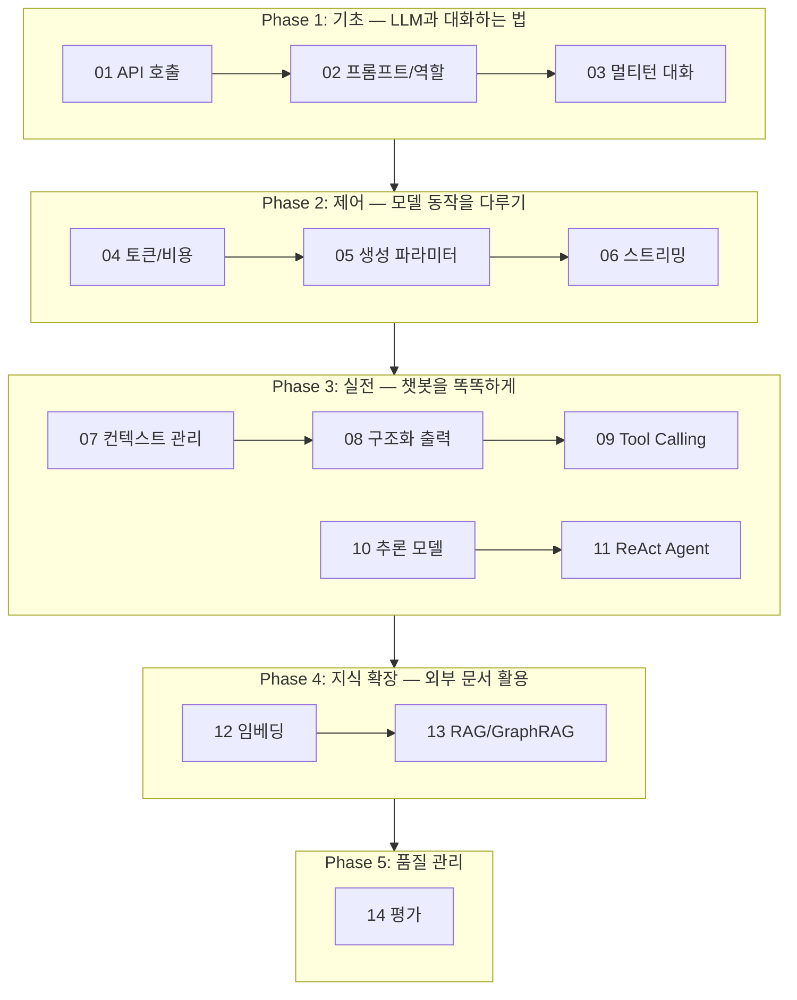
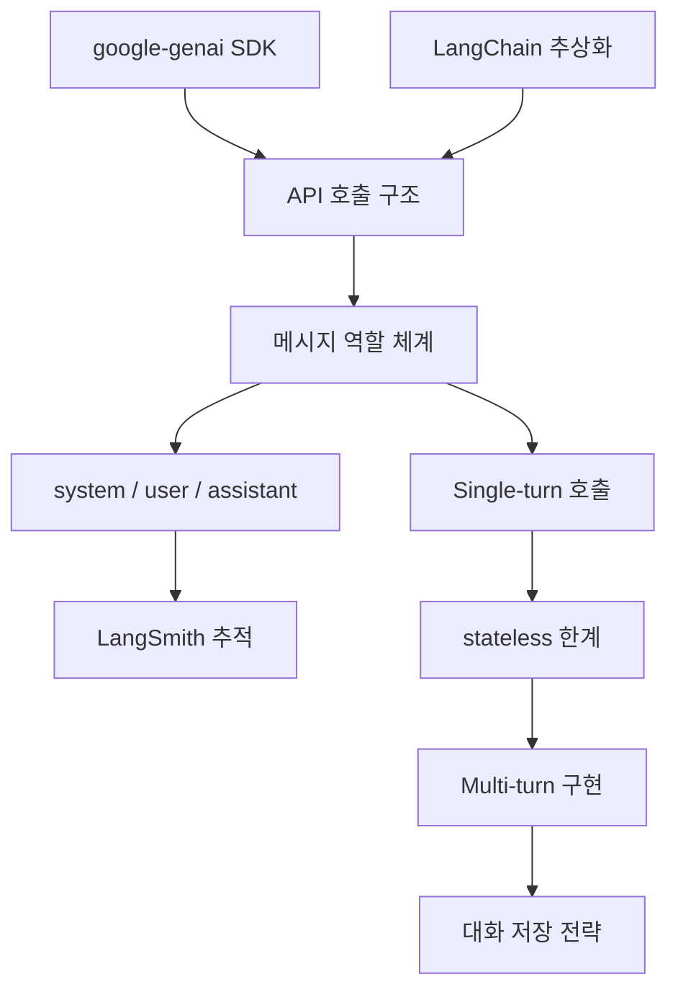
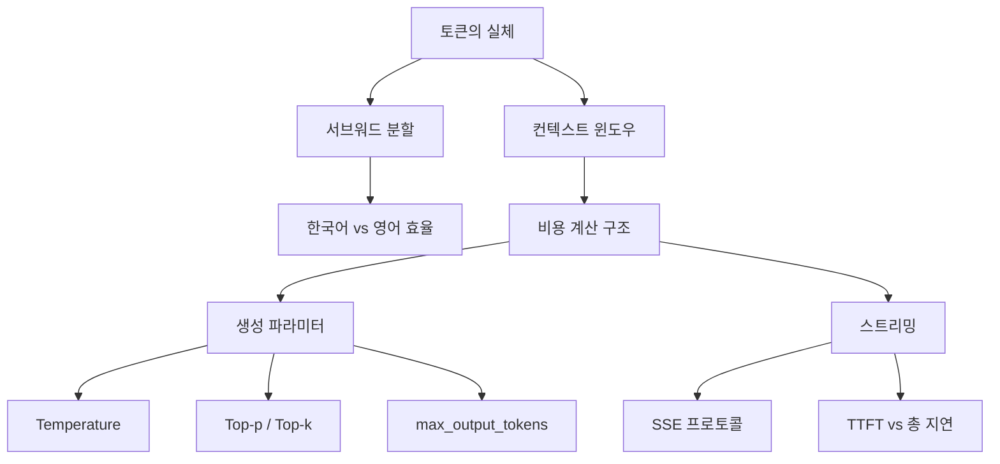

# 교안 작성 스타일 가이드

> 이 문서는 Claude Code가 교안을 작성할 때 참조하는 스타일 가이드입니다.
> 주피터 노트북(`note_01` ~ `note_14`)을 기반으로 마크다운 교안 20개를 생성합니다.

---

## 작업 범위

총 20개 파일을 생성한다.

| 파일 | 역할 |
|------|------|
| `material/README.md` | 전체 커리큘럼 개요, Phase 간 관계, 노트별 요약 |
| `material/phase{N}_{name}/README.md` | Phase별 목표, 해당 Phase 내 개념 간 관계도, 노트 요약 (5개) |
| `material/phase{N}_{name}/note_{번호}_{이름}.md` | 각 노트북의 이론적 개념 정리 교안 (14개) |

---

## 디렉토리 구조

```
material/
├── README.md                              ← 전체 커리큘럼 개요
├── phase1_basics/
│   ├── README.md                          ← Phase 1 개요 + 개념 관계도
│   ├── note_01_api_call.md
│   ├── note_02_prompt_and_langsmith.md
│   └── note_03_multi_turn.md
├── phase2_control/
│   ├── README.md                          ← Phase 2 개요 + 개념 관계도
│   ├── note_04_token_and_cost.md
│   ├── note_05_generation_params.md
│   └── note_06_streaming.md
├── phase3_techniques/
│   ├── README.md                          ← Phase 3 개요 + 개념 관계도
│   ├── note_07_context_management.md
│   ├── note_08_structured_output.md
│   ├── note_09_tool_calling.md
│   ├── note_10_thinking.md
│   └── note_11_react_agent.md
├── phase4_knowledge/
│   ├── README.md                          ← Phase 4 개요 + 개념 관계도
│   ├── note_12_embedding.md
│   └── note_13_rag.md
└── phase5_quality/
    ├── README.md                          ← Phase 5 개요 + 개념 관계도
    └── note_14_evaluation.md
```

---

## 소스 자료

### 1차 소스: 주피터 노트북

- 주피터 노트북 파일: `./material/note_*.ipynb`
- 각 노트북의 마크다운 셀과 코드 셀을 순서대로 읽고, 그 흐름에 맞춰 개념을 정리한다.
- 노트북에 없는 내용을 임의로 추가하지 않는다.
- 노트북의 설명이 부족한 경우에만 보충 설명을 추가한다.

### 2차 소스: 최신 문서 검색

교안에 포함되는 라이브러리, API, 프레임워크의 내용은 반드시 최신 버전 기준으로 작성한다.

**Context7 MCP를 적극 활용한다:**

- 교안에서 다루는 주요 라이브러리의 최신 문서를 Context7으로 조회한다.
- `resolve-library-id`로 라이브러리 ID를 확인한 후, `get-library-docs`로 해당 토픽의 최신 문서를 가져온다.
- 조회 대상 라이브러리 (노트북에서 사용하는 것 기준):

| 라이브러리 | 조회 시점 | 관련 노트 |
|-----------|----------|-----------|
| `google-genai` (Google Generative AI SDK) | API 호출, 임베딩, 토큰 관련 개념 작성 시 | 01, 04, 05, 06, 08, 10, 12 |
| `langchain` | LangChain 추상화 계층 개념 작성 시 | 01, 02, 03, 07, 08, 09, 13 |
| `langgraph` | StateGraph, ReAct 에이전트 개념 작성 시 | 11 |
| `langsmith` | 추적, 평가 개념 작성 시 | 02, 14 |
| `chromadb` | 벡터 스토어 개념 작성 시 | 13 |
| `pydantic` | Structured Output 개념 작성 시 | 08 |

- 노트북의 코드가 deprecated된 API를 사용하고 있는 경우, 교안에는 최신 권장 방식을 기준으로 설명하고, 노트북과의 차이점이 있으면 명시한다.

**웹 검색도 병행한다:**

- Context7에서 충분한 정보를 얻지 못한 경우, 공식 문서 사이트를 웹 검색으로 확인한다.
- 버전 번호, 지원 종료(EOL) 정보, 최신 변경사항 등은 웹 검색으로 교차 검증한다.

### 검증 원칙

- 노트북 내용과 최신 문서가 충돌하는 경우, 최신 문서를 우선하되 노트북과의 차이를 교안에 명시한다.
- Context7 조회 결과가 노트북의 내용을 뒷받침하면 그대로 사용한다.
- 최신 문서에서 확인할 수 없는 내용은 추측하지 않는다.

---

## README.md 작성 규칙

### 구성

```markdown
# LLM Application 개발 개념 가이드

> 이 교안은 note_01 ~ note_14 주피터 노트북의 이론적 배경을 정리한 문서입니다.
> 노트북에서 코드를 실행하면서, 이 문서에서 개념을 확인하는 방식으로 학습합니다.

## 커리큘럼 흐름

(Mermaid flowchart — Phase별 노트 간 관계)

## 노트별 요약

(테이블 — #, 제목, Phase, 핵심 키워드)
```

### 커리큘럼 흐름 Mermaid



### 노트별 요약 테이블

| # | 제목 | Phase | 핵심 키워드 |
|---|------|-------|------------|
| 01 | Gemini 직접 호출 vs LangChain | 기초 | google-genai, ChatGoogleGenerativeAI |
| 02 | System/User Prompt + LangSmith | 기초 | role, system_instruction, tracing |
| 03 | Single-turn vs Multi-turn | 기초 | stateless, 대화 저장, 메모리 |
| 04 | 토큰과 컨텍스트 윈도우 | 제어 | subword, count_tokens, 비용 계산 |
| 05 | 생성 파라미터 | 제어 | temperature, top_p, top_k |
| 06 | Streaming | 제어 | SSE, TTFT, 청크 |
| 07 | 컨텍스트 매니지먼트 | 실전 | 슬라이딩 윈도우, 요약, 토큰 절감 |
| 08 | Structured Output | 실전 | JSON schema, Pydantic, with_structured_output |
| 09 | Tool Calling | 실전 | function_call, 4단계 루프 |
| 10 | Thinking / 추론 모델 | 실전 | CoT, thinking tokens, budget |
| 11 | ReAct Agent | 실전 | LangGraph, StateGraph, 조건부 엣지 |
| 12 | Embedding | 지식 확장 | 벡터, 코사인 유사도, 차원 |
| 13 | RAG + GraphRAG | 지식 확장 | 인덱싱, 청크, 벡터 스토어, 지식 그래프 |
| 14 | 챗봇 평가 | 품질 관리 | 정확성, 관련성, LLM-as-Judge |

---

## Phase별 README.md 작성 규칙

Phase 폴더마다 README.md를 1개씩 작성한다 (총 5개).

### 구성

```markdown
# Phase {N}: {Phase명}

> {Phase의 한 줄 설명}

## 목표

이 Phase를 마치면 다음을 할 수 있다:
- 목표 1
- 목표 2
- 목표 3

## 개념 관계도

```mermaid
(Phase 내 노트 간 개념 흐름 — 노트 단위가 아니라 개념 단위로 연결)
```

## 포함된 노트

| # | 제목 | 핵심 개념 |
|---|------|-----------|
| {번호} | {제목} | {해당 노트의 핵심 개념 나열} |
```

### Phase별 정보

| Phase | 폴더명 | Phase명 | 한 줄 설명 |
|-------|--------|---------|-----------|
| 1 | `phase1_basics` | 기초 — LLM과 대화하는 법 | SDK 호출, 역할 체계, 멀티턴 구조를 익힌다 |
| 2 | `phase2_control` | 제어 — 모델 동작을 다루기 | 토큰, 생성 파라미터, 스트리밍으로 모델 동작을 제어한다 |
| 3 | `phase3_techniques` | 실전 — 챗봇을 똑똑하게 | 컨텍스트 관리, 구조화 출력, 도구 호출, 추론, 에이전트를 구현한다 |
| 4 | `phase4_knowledge` | 지식 확장 — 외부 문서 활용 | 임베딩과 RAG로 외부 지식을 LLM에 연결한다 |
| 5 | `phase5_quality` | 품질 관리 — 평가하는 법 | 체계적이고 반복 가능한 평가 체계를 구축한다 |

### 개념 관계도 작성 기준

- 노트 번호가 아니라 **개념 단위**로 노드를 구성한다.
- 해당 Phase 내에서 개념이 어떻게 쌓이고 연결되는지를 보여준다.
- 예시 (Phase 1):



- 예시 (Phase 2):



- 각 Phase의 개념 관계도는 해당 Phase의 노트북을 읽고 실제 개념 흐름에 맞게 작성한다. 위 예시는 참고용이며 그대로 복사하지 않는다.

---

## note별 교안 작성 규칙

### 파일 헤더

```markdown
# Note {번호}. {제목}

> 대응 노트북: `note_{번호}_{이름}.ipynb`
> Phase {N} — {Phase명}
```

### 구성 순서

1. **학습 목표** — 3~5개 항목
2. **핵심 개념** — 5~10개, 노트북 섹션 순서에 맞춰 작성
3. **장단점** — 테이블 형식
4. **핵심 정리** — 테이블 형식, 전체 개념 요약
5. **참고 자료** — 해당 노트 개념과 직접 관련된 링크 목록

### 핵심 개념 섹션 작성 패턴

```markdown
### {번호}.{N} {개념명}

**한 줄 요약**: ...

...설명 (2~5문단)...

(필요한 경우 핵심 코드 스니펫)

```python
# 개념 이해에 직접 필요한 최소한의 코드
```

(필요한 경우 흐름도)


```

### 장단점 섹션

```markdown
## 장단점

| 장점 | 단점 |
|------|------|
| ... | ... |
```

### 핵심 정리 섹션

```markdown
## 핵심 정리

| 개념 | 핵심 포인트 |
|------|------------|
| ... | ... |
```

### 참고 자료 섹션

```markdown
## 참고 자료

- [자료 제목](URL) — 한 줄 설명
- [자료 제목](URL) — 한 줄 설명
```

**참고 자료 수집 규칙:**

- 각 노트의 개념과 **직접적으로 관련된** 자료만 포함한다. 간접적이거나 일반적인 자료는 넣지 않는다.
- 다음 유형의 자료를 적극적으로 포함한다:
  - **공식 문서**: API 레퍼런스, 가이드, 튜토리얼 (예: Google AI 공식 문서, LangChain 공식 문서)
  - **논문**: 개념의 원본 논문 (예: RAG 논문, ReAct 논문, Attention Is All You Need)
  - **국내 블로그**: 한국어로 잘 정리된 기술 블로그 글
  - **해외 블로그**: 공식 블로그, 저명한 기술 블로그 글
- 링크는 반드시 실제 존재하는 URL이어야 한다. URL을 추측하거나 만들어내지 않는다.
- URL 확인이 불확실한 경우, 웹 검색으로 정확한 URL을 확인한 후 포함한다.
- 각 링크 옆에 한 줄 설명을 붙여 해당 자료가 무엇을 다루는지 명시한다.
- 노트당 3~8개 정도를 목표로 한다.

---

## 문체 및 포맷 규칙

### 반드시 지킨다

- 한국어로 작성한다.
- 전문 용어는 처음 등장 시 한국어 설명을 병기한다: `Temperature(온도 파라미터)`
- 이모티콘을 사용하지 않는다.
- 비유, 아날로지를 사용하지 않는다.
- 아키텍처/흐름도는 Mermaid 코드로 작성한다.
- 코드 스니펫은 개념 이해에 필요한 핵심만 포함한다. 전체 실행 코드는 넣지 않는다.
- 노트북의 섹션 순서를 따른다. 임의로 순서를 바꾸지 않는다.
- 간결하게 작성한다. 같은 내용을 반복하지 않는다.

### 사용하지 않는다

- 이모티콘
- 비유, 아날로지
- 선수 지식 섹션
- 실무 관점 / 운영 시 주의사항 섹션
- 노트북 코드와의 매핑 섹션
- 개념 간 연결 / 다음 단계 섹션

### 코드 스니펫 기준

- 노트북에 있는 코드 중 개념을 설명하는 데 핵심적인 코드만 발췌한다.
- import, 환경 설정, 출력 확인 코드는 생략한다.
- 코드 블록에는 언어 태그를 붙인다: ```python, ```json 등
- 코드 내 주석은 한국어로 작성한다.

### Mermaid 기준

- flowchart 방향: 좌→우(`LR`) 또는 상→하(`TD`)를 내용에 맞게 선택한다.
- 노드 텍스트는 간결하게 한다.
- 복잡한 흐름은 subgraph로 그룹핑한다.

---

## 작업 절차 (Claude Code용)

1. `material/` 디렉토리와 Phase별 하위 디렉토리를 생성한다.
2. 노트북 파일(`./material/note_{번호}_{이름}.ipynb`)을 순서대로 읽는다.
3. 마크다운 셀에서 개념 구조를 파악하고, 코드 셀에서 핵심 코드 스니펫을 발췌한다.
4. **각 노트에서 다루는 라이브러리에 대해 Context7 MCP로 최신 문서를 조회한다.**
5. **Context7에서 부족한 정보는 웹 검색으로 보충한다.**
6. 노트북 내용 + 최신 문서를 종합하여 note별 교안 마크다운을 작성한다 (14개).
7. 각 Phase 폴더에 Phase별 README.md를 작성한다 (5개).
8. 전체 `material/README.md`를 작성한다 (1개).
9. 총 20개 파일이 모두 생성되었는지 확인한다.